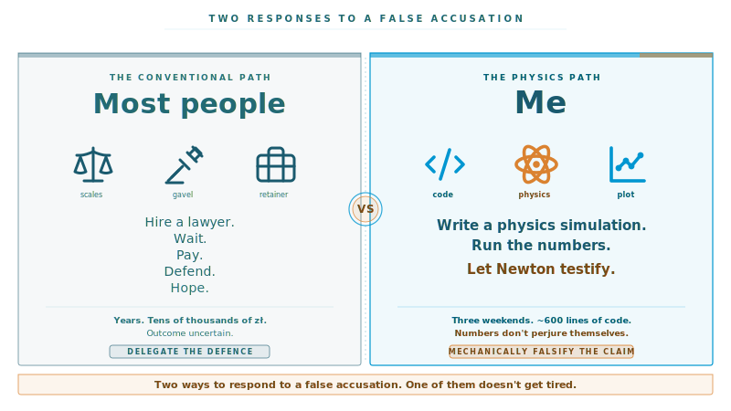
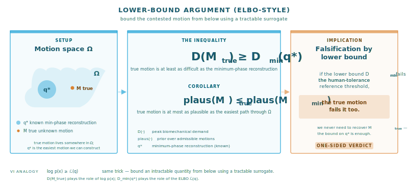
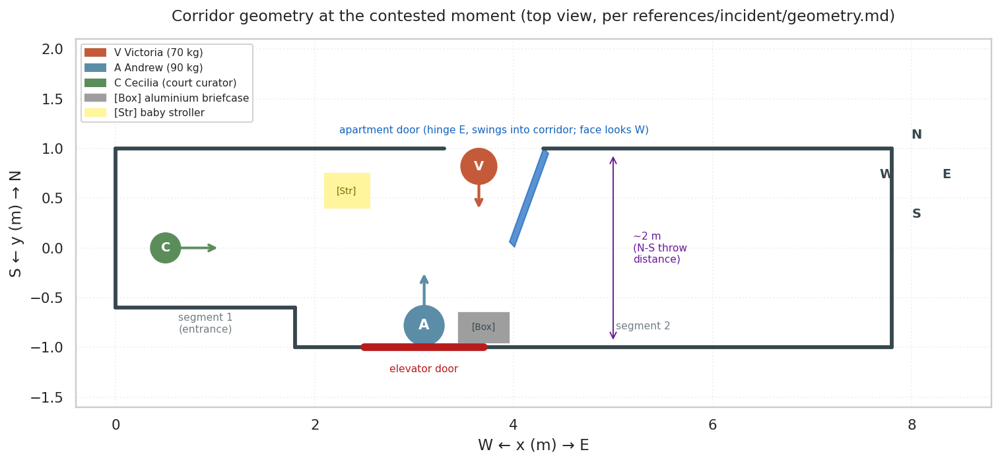

# henryk-simulations

[](https://github.com/stellarshenson/henryk-simulations/actions/workflows/build.yml)
[](https://www.paypal.com/donate/?hosted_button_id=B4KPBJDLLXTSA)

Numerical and physics-based reconstructions of contested real-world events. Built to disclose the role of forces, accelerations, momenta and biomechanical limits in things people claim happened in three seconds.

Current scene: **Mk1 - Corridor Attack Incident Reconstruction**.

Most people, when falsely accused, hire a lawyer and wait. I wrote a physics simulation.



> [!IMPORTANT]
> The event as described by the victim **did not happen**. The father is currently using science, physics, simulation, geometry and statistics to prove to the half-witted court officials that the laws of physics would have to take an unscheduled coffee break for the events to unfold the way the victim portrayed them.
>
> The father and his son are the victims of **parental alienation**. The fabricated incident is one instrument in that wider pattern; the physics-based reconstruction in this repo is one of the means the father is using to push back against it.

> [!NOTE]
> This project serves an **educational purpose**. All names of the actors have been changed so that no one involved in the underlying matter is endangered or identifiable from the repository.

[](https://www.youtube.com/watch?v=V-ooOpqg4aU)

> Click the thumbnail for the rendered simulation on YouTube.

> [!TIP]
> The narrative version of the story is on Medium: **[The 3-second throw that couldn't happen - a legal science story](https://pub.towardsai.net/the-3-second-throw-that-couldnt-happen-a-legal-science-story-8cd705a99fa1)** (Towards AI).

The core trick is to reconstruct the smallest possible motion that still admits the verbatim testimony. If even that lower bound exceeds what a body can do, every richer reading of the accusation exceeds it too.



The setup the lower-bound reconstruction runs against: a two-segment corridor with the apartment door on the north wall and the elevator door on the south wall, plus the props and starting positions Victoria, Andrew and Cecilia were in at t=0.



> Overhead corridor geometry used by the reconstruction: two-segment W-to-E layout with the S-side elevator-door elbow, apt door swinging W into segment 2, and the setup positions of Victoria (V) inside the apt-door envelope, Andrew (A) pressed flat against the elevator door, and Cecilia (C) in segment 1. [Box] is the 50x30 cm aluminium briefcase at the E edge of the elevator door; [Str] is the stroller in the NW corner of segment 2.

## What this is

The accusation is specific: three seconds in a corridor. The father was supposed to have pulled the alleged victim back, swapped places with her, thrown her back-first into the elevator door, and swapped places again. All of this in front of a court-appointed social curator who, by her own testimony, had her back turned at the precise moment of the alleged impact.

Three seconds. Two doors, two metres apart. A 70 kg adult moving as a rigid object. A 90 kg actor doing the moving.

The father is not a lawyer. He is the kind of person who reaches for `scipy.stats` and `compute_impact()` when faced with an emotional problem. So he built this repo.

At the most charitable possible interpretation of the accusation, the impact would have delivered **16 to 22 kilonewtons of peak force** and **tens of g of deceleration**, with a peak sound pressure level of **124 dB** at the phone microphone that was recording the entire visit. The medical examination afterwards documented one bruise on the right shoulder. The recording contains neither a clipping spike nor any panel-ringing acoustic signature. The third-party witness reports no loud noise of any kind.

You can decide for yourself what that means. The reconstruction cheats on the prosecution's behalf throughout - the accusation gets the friendliest possible reading - and the accusation still fails the physics.

## What's in here

Four kinds of artefacts bundled together:

- **Forensic record** - corridor topology and dimensions, five chronologically ordered versions of the alleged victim's testimony, the third-party social curator's positional and temporal account, a narrative-escalation log tracking how the story changed across filings, and the EXIF-clean audio recording of the entire visit as the acoustic ground truth
- **Physics library** - per-phase kinematic and dynamic quantities the claim implies (linear and angular velocities, peak accelerations, forces, impulses, kinetic energies, impact force on the elevator door, peak g-loading on the chest); each quantity scored against a published biomechanical reference distribution drawn from Daams, Mital, Mero, Cross, Hodgson, Plagenhoef, Viano, Cavanaugh, Stapp, Eiband, Sturdivan and Kemper, emitting a z-score and a colour-coded verdict band
- **Acoustics module** - Kirchhoff plate equation for the elevator door's flexural modes, half-wave resonance of the air gap between the two steel panels, peak sound pressure predicted at three listener positions including the phone microphone that recorded the visit; cross-checked against the actual audio waveform for the expected clipping spike and panel ringing
- **PyBullet simulation** - rigid-body render of the alleged motion as an MP4 with custom capsule mannequins, plus a dozen matplotlib figures showing per-phase demand bars, force and acceleration timelines, injury-threshold zones, the four-views-of-impact panel, and the audio signature prediction

Every number in the analysis is reproducible by running the notebook against a single `ChoreographyConfig` object; ruff-clean Python, pytest-covered, managed by `uv`.

## Aim

Stress-test the contested 3 s claim against the laws of physics and against population biomechanical references, using the verbatim testimony, the reconstructed corridor geometry, and the third-party observation as the sole inputs. Specifically:

- Compute every kinematic quantity the claim implies per phase: linear velocity (start, end, peak), linear acceleration (peak), angular velocity, angular acceleration, force, impulse, kinetic energy, torque, angular momentum, impact force and g-loading at the elevator door
- Score each quantity against a published biomechanical reference distribution and emit a z-score plus a verdict band (plausible / strained / implausible)
- Render the reconstruction in PyBullet so the geometry, the swap and the impact are visually inspectable, not just tabular
- Constrain the reconstruction to the **minimum** number of phases that still admits the verbatim claim, so the computed demand is a **lower bound** on the true required demand (the ELBO-style argument in [`references/incident/events_reconstruction.md`](references/incident/events_reconstruction.md))
- Keep all reconstruction inputs (geometry, testimonies, inconsistency log) in version control under [`references/incident/`](references/incident/) so the result is reproducible end-to-end from documents to numbers to video

## Features

### Reconstruction inputs ([`references/incident/`](references/incident/), [`data/external/event_audio/`](data/external/event_audio/))

- [`geometry.md`](references/incident/geometry.md) - corridor topology (W-to-E run, two segments, S-side elbow), dimensions (~2 m N-S width, apt door ~1 m Polish standard), actor setup positions, props ([Box] aluminium briefcase 50x30 cm at the E edge of the elevator door, [Str] stroller in segment 2 NW), apt door swing direction
- [`testimony_victim.md`](references/incident/testimony_victim.md) - five chronologically ordered versions of the victim's account (live audio exclamation, medical examination, October prosecutor filing, December court motion, March restraining-order motion)
- [`testimony_3rd_party.md`](references/incident/testimony_3rd_party.md) - court social curator's positional and temporal observations (asked to step aside, three steps and turned away, what she saw when she turned back)
- [`testimony_victoria_inconsistencies.md`](references/incident/testimony_victoria_inconsistencies.md) - narrative-escalation table across the five tellings
- [`events_reconstruction.md`](references/incident/events_reconstruction.md) - minimum-viable stage decomposition (Setup / Approach / Pull / Swap+Throw / Swap-Again / Disengage), formal ELBO-style lower-bound formulation with LaTeX, side-by-side analogy table with variational inference
- [`data/external/event_audio/event_recording.m4a`](data/external/event_audio/event_recording.m4a) - full audio recording of the visit and the contested moment; the source for both the third-party testimony and the victim's verbatim live exclamation

### Kinematic computations ([`choreography.py`](src/henryk_simulations/corridor/choreography.py))

- Structural decoupled-singularity model of the body's centre-of-mass trajectory: phase 1 (approach to the door), a decoupled impact singularity, phase 2 (return)
- Tangential acceleration is a smooth C2 trapezoid - give ramp, plateau, let-go ramp, coast - parameterised by its structural durations, not by spline knots; the give and let-go ramps are literature-pinned to the rate-of-force-development band
- Decoupled impact singularity: phase 1 ends at the closing velocity, the collision is resolved on its own millisecond timeline against five body-yield models (rigid-plastic, half-sine, smootherstep, linear spring, Hertzian)
- Kinematics envelope: `solve_envelope` returns two bracketing solutions - no-coast propels the body to the door, with-coast releases it two torso depths back to coast in; the real motion lies between them
- Seven structural free parameters, each constrained to a literature-sourced permissible range (exclusion zone) - the constraints bound the search space, they do not eliminate parameters
- Phase-2 duration floored by the 180 degree yaw rotation against a human moment of inertia and the Hodgson pivot-rate band; timeline, geometry and literature bands parameterised via `ChoreographyConfig`

### Plausibility scoring ([`plausibility.py`](src/henryk_simulations/corridor/plausibility.py), [`references.py`](src/henryk_simulations/corridor/references.py))

- Population reference distributions as `scipy.stats` objects: single-arm and two-arm peak push force (Daams 1994, Mital 1995), sprint acceleration recreational and elite (Mero 2005), overhand throw kinetic energy (Cross 2004), standing-pivot yaw angular velocity (Hodgson 2008), whole-body yaw moment of inertia (Plagenhoef 1983)
- Per-quantity z-score, percentile, verdict bands at z = 1 (strained), z = 2 (implausible), z = 3 (extreme)

### PyBullet rendering ([`sim.py`](src/henryk_simulations/corridor/sim.py))

- Custom rigid capsule mannequins built from primitives (no URDF ragdoll sprawl)
- Scripted phase motion at 60 Hz: pull, swap+throw, swap-back, plus a non-scored 1.5 s disengagement tail (V crouches and slides back through the apt doorway)
- Impact frame: elevator wall flashes yellow at the impact tick for visual confirmation
- 4.5 s MP4 output (3 s scored + 1.5 s tail), encoded with `imageio[ffmpeg]`, fixed external camera, no GUI window required

### Figures (generated inline by [`notebooks/01-kj-corridor-kinematics.ipynb`](notebooks/01-kj-corridor-kinematics.ipynb), output to [`reports/figures/`](reports/figures/))

- `01-linear-reference-model.png` - the linear prototype: piecewise-linear acceleration integrated once to velocity and again to position, three stacked panels
- `01-path-curve.png` - the curved centre-of-mass path, a 2 m arc-length Bezier carrying the corridor's diagonal offset
- `01-phase2-rotation.png` - the 180 degree yaw rotation: peak yaw rate and the phase-2 duration floor against the Hodgson standing-pivot band
- `01-kinematics-envelope.png` - the solved envelope: acceleration, velocity and position for the no-coast and with-coast bracketing solutions
- `01-corridor-sim-passive.mp4` - rendered PyBullet simulation

### Kinematics notebook ([`notebooks/01-kj-corridor-kinematics.ipynb`](notebooks/01-kj-corridor-kinematics.ipynb))

- Thin client over the `choreography` library - presents the linear prototype, the configuration, the phase-2 rotation constraint, the free parameters and constraints, and the solved kinematics envelope
- Phase-2 duration constraint settled first: the 180 degree yaw turn, with a human yaw moment of inertia, floors the phase-2 duration against the Hodgson pivot-rate band before any trajectory is solved
- Rich tables with cyan headers for the configuration, the free parameters with their exclusion zones, the constraints with their literature sources, and the envelope comparison
- Four figures generated inline; the model is exercised by 30 test guards in [`tests/test_choreography.py`](tests/test_choreography.py)

### Impact dynamics ([`impact.py`](src/henryk_simulations/corridor/impact.py), [`notebooks/02-kj-corridor-impact-dynamics.ipynb`](notebooks/02-kj-corridor-impact-dynamics.ipynb))

- Lumped-parameter back-impact model: notebook 01's closing velocity drives a 5-DOF Lobdell-style posterior-thorax chain (skin, scapula, ribcage, organ, spine) into the rigid elevator door through a Hertzian contact with an elastic-plastic yield plateau
- de Leva (1996) body-segment inertia separates the mass directly behind the back from the limbs that whip on their joints - the effective impacting mass
- Posterior contact patches: the scapulae strike first, the contact area builds up over the impact and sets the per-rib load and the contact pressure
- Computed peaks scored against literature fracture corridors - rib three-point bending, the Kemper rear-torso tolerance, vertebral compression, the AIS 3+ thoracic deflection
- Across the kinematics envelope the peak contact force is 5.5-6.4 kN against the rigid door - below the Kemper posterior-thorax injury band (6.9-10.5 kN), the per-rib load ~1 kN well under the rib-fracture force; four figures generated inline, the model exercised by 27 test guards in [`tests/test_impact.py`](tests/test_impact.py)

### Body impact sound ([`bodyfem.py`](src/henryk_simulations/corridor/bodyfem.py), [`notebooks/03-kj-sound-reconstruction-body-thump.ipynb`](notebooks/03-kj-sound-reconstruction-body-thump.ipynb))

- The acoustic signature of the impact - the thump of the body striking the rigid door, at a microphone 1 m away - computed by a finite-element model of the deforming torso
- Real 3D body mesh: the BodyParts3D skin model (decimated), with the upper torso isolated and voxelised into a tetrahedral solid of about 2,950 nodes and 13,700 tetrahedra
- scikit-fem assembles the torso's 3D linear-elastic stiffness and mass; an eigensolve gives its soft-tissue deformation modes, in the 18-36 Hz band
- The body is not a sound source - it is a moving boundary; the thorax is compressible (the air-filled lungs), so the impact squash works the chest wall as a bellows and only the air it pushes radiates
- The microphone hears two summed components - the low thump of the pushed air, and a brief broadband burst of air squeezed out of the closing wall-body gap; the uneven body surface textures both
- Peak SPL at 1 m is about 100 dB flat, about 80 dBA A-weighted - the surface texture is what lifts it into the band a meter and the ear register; six figures and a WAV generated inline, the model exercised by 22 test guards in [`tests/test_bodyfem.py`](tests/test_bodyfem.py)

### Door impact sound ([`doorfem.py`](src/henryk_simulations/corridor/doorfem.py), [`notebooks/04-kj-sound-reconstruction-door-clang.ipynb`](notebooks/04-kj-sound-reconstruction-door-clang.ipynb))

- The metallic clang of the steel door itself when the body strikes it, at the 1 m microphone - the door is the only source here, separate from the body thump
- The actual ZREMB DT37/1 leaf is tessellated as a solid: two 2 mm steel skins 51 mm apart, the welded perimeter frame, the wired-glass window as a cutout - voxelised into a tetrahedral solid of about 12,300 nodes and 39,100 tetrahedra, ~220 kg of steel
- scikit-fem assembles the box's 3D linear-elastic stiffness and mass; an eigensolve gives the leaf's flexural modes, from about 85 Hz upward - the welded box is stiff, which is what makes the door clang rather than boom
- The impact excites the modes; modal damping settles the ring; the room-side skin radiates as a baffled panel, sub-critically (every mode is below the steel coincidence frequency)
- Peak SPL at 1 m is about 89 dB flat, ~71 dBA - a brief metallic clang in the door's mode band, distinct from and quieter than the body thump; four figures and a WAV generated inline, the model exercised by 14 test guards in [`tests/test_doorfem.py`](tests/test_doorfem.py)

### Event audio augmentation ([`audiomix.py`](src/henryk_simulations/corridor/audiomix.py), [`notebooks/05-kj-event-audio-augmentation.ipynb`](notebooks/05-kj-event-audio-augmentation.ipynb))

- The two synthesized impact sounds - the body thump (notebook 03) and the door clang (notebook 04) - mixed into the real event recording, producing an augmented track that carries the impact the original capture is being tested against
- Each synthesized sound's loudest sample is aligned to a configurable moment in the event timeline (default the 15th second); the event recording and the two sounds are summed and peak-limited to stay within headroom
- m4a decode and encode use the ffmpeg binary bundled with `imageio-ffmpeg` - no system ffmpeg required
- The augmented recording is written to `reports/figures/augmented_event_recording.m4a`; the model is exercised by 13 test guards in [`tests/test_audiomix.py`](tests/test_audiomix.py)

## Headline numbers (Mk1, kinematics envelope)

The kinematics is reported as an envelope - two bracketing solutions parametrised by the release standoff. The no-coast solution propels the body all the way to the door; the with-coast solution releases it two torso depths back and lets it coast in. The real motion lies between them.

| Quantity | No coast | With coast |
|---|---|---|
| Closing velocity | 2.74 m/s | 2.36 m/s |
| Phase-1 peak acceleration | 0.21 g | 0.22 g |
| Impact kinetic energy | 262 J | 194 J |
| Impact force (Hertzian yield) | 21.9 kN | 16.2 kN |
| Impact force (rigid-plastic floor) | 8.7 kN | 6.5 kN |

The translation itself is biomechanically gentle - about a fifth of a g, well inside the population sprint-acceleration limit. The load-bearing argument is the rotation timeline: each phase needs a 180 degree rest-to-rest yaw turn, and bounded by the Hodgson standing-pivot rates the two turns alone consume 2.9 s of the 3 s budget at the elite rate and 3.6 s at the population rate - leaving almost nothing for the translation.

What the lower bound predicts the impact would have produced, set against what the actual medical, acoustic and witness record shows - the gap between the two is the forensic equivalent of a KL divergence between model and reality.


## Quick start

```bash
make install                                                                                 # uv venv + deps
make test                                                                                    # pytest
make lint                                                                                    # ruff
uv run jupyter nbconvert --to notebook --execute --inplace --ExecutePreprocessor.kernel_name=python3 notebooks/01-kj-corridor-kinematics.ipynb
uv run jupyter nbconvert --to notebook --execute --inplace --ExecutePreprocessor.kernel_name=python3 notebooks/02-kj-corridor-impact-dynamics.ipynb
uv run jupyter nbconvert --to notebook --execute --inplace --ExecutePreprocessor.kernel_name=python3 notebooks/03-kj-sound-reconstruction-body-thump.ipynb
uv run jupyter nbconvert --to notebook --execute --inplace --ExecutePreprocessor.kernel_name=python3 notebooks/04-kj-sound-reconstruction-door-clang.ipynb
uv run jupyter nbconvert --to notebook --execute --inplace --ExecutePreprocessor.kernel_name=python3 notebooks/05-kj-event-audio-augmentation.ipynb
uv run python -m henryk_simulations.corridor.sim                                              # render the MP4
```

Outputs land under `reports/figures/` (PNG figures, MP4 simulation).

## Repo layout

```
references/incident/                  geometry, testimonies, inconsistency log, methodology
notebooks/                            01 kinematics, 02 impact dynamics, 03 body thump, 04 door clang
src/henryk_simulations/corridor/      choreography, impact, injuries, bodyfem, doorfem, acoustics, sim
reports/figures/                      generated figures, the MP4 and the impact-sound WAV
data/external/body_mesh/              the body skin mesh and the isolated upper torso
```

Other Makefile targets: `make build`, `make clean`, `make format`, `make help`.

## Methodology in one paragraph

Minimum-phase decomposition with maximum time per phase gives the lowest physically achievable demand. If that lower bound already exceeds population biomechanical references, the true motion exceeds them by at least as much. Any richer reconstruction (throat-grab, defensive grab, left-side approach, strangulation attempt - all of which appear in later filings) compresses each remaining phase, pushes peak accelerations and angular velocities up, and makes the verdict strictly worse for the claim. See [`references/incident/events_reconstruction.md`](references/incident/events_reconstruction.md) for the formal lower-bound argument and the ELBO analogy.

Crash reconstruction asks did this specific impact happen. This test asks the prior question: could this story have happened at all. Four years of contested family-court litigation, substantially clarified by twenty minutes of biomechanics.

## Status

Mk1 is rendered, scored and pushed. Mk2 will refine the impact model and add the same-arms conflict analysis for the late-filing throat-grab variant.

---

> Scaffolded from [copier-data-science](https://github.com/stellarshenson/copier-data-science) v1.3.5.
