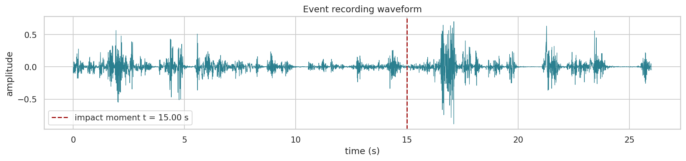

# Incident analysis - physical reconstruction of a corridor throw

## Summary

### Motivation

The subject of this analysis is a contested allegation: that Andrew threw Victoria
(70 kg) back-first into an elevator door, in a corridor about 2 m long, over about 3 s,
in the presence of a witness - Cecilia. The event was not instrumentally recorded, and
the accounts diverge - successive versions of the description escalate over time. The
analysis does not reconstruct the event moment by moment; it asks what motion is
physically the minimum necessary for the alleged throw to be feasible within the given
geometry and time, and what mechanical consequences such a throw would have to produce.

The model adopts a lower-bound assumption - it reconstructs the gentlest motion
consistent with the geometry and time, so any actual choreography can only add more
kinetic demands, ever harder to carry out within the assumed time and geometry.

### Participants

The event involves two people, in the presence of a witness:

- **Andrew** - male, 46 years old, 90 kg, 184 cm tall, normal build; the person
  performing the alleged motion
- **Victoria** - female, 38 years old, about 70 kg, about 175 cm tall, normal build;
  the potential victim
- **Cecilia** - female, about 50-65 years old, court curator; witness to the event

### The event and geometry

The corridor has an arc length of 2.0 m. The total motion time is 3.0 s, split into two
phases of 1.5 s. Each phase contains a 180-degree rotation (3.14 rad), a lateral offset
of 0.25 m, and a return translation of 0.5 m. The body was modelled as a 70 kg mass,
with a moment of inertia about the vertical axis of 1.4 kg m^2 and a thickness of
0.28 m.

The event begins shortly after the toy is released, as it passes the curator. Before
Andrew can begin the pull, he must cover 1.5-2 m of corridor, brake, and change
direction - there must be enough time for all of this.

The event recording waveform, with the time axis referenced to the moment the toy is
released - the recording timestamps are arbitrary. The shaded area is the event region,
from the toy release to the scream; the markers indicate the toy release (0 s), the
impact (+2.5 s), and the scream (+4.0 s).

The two choreography phases:

| Phase | Time | Modelled motion |
|---|---|---|
| Phase 1 - the pull and throw into the elevator door | 1.5 s | the body is pulled along the 2.0 m corridor arc and rotated 180 degrees until it strikes the elevator door back-first; the phase ends at the impact singularity |
| Phase 2 - departure and rotation | 1.5 s | the body moves 0.5 m away from the door and rotates another 180 degrees, realigning itself along the corridor |

The starting point is a linear acceleration prototype - the choreography laid out as a
simple kinematic problem along the corridor arc, in which the acceleration profile is
piecewise linear and the impact itself is left as a singularity. The prototype defines
the skeleton that the later quadratic optimisation refines.

> [!IMPORTANT]
> **Why split the phases into 1.5 s for phase 1 and 1.5 s for phase 2?**
>
> The split is not arbitrary - it follows directly from biomechanics and physics: each
> of the two phases contains a 180-degree rotation, whose duration biomechanics places
> at about 1.5 s (a value from the middle of the population-to-athlete band), so the
> two phases sum to the 3 s budget (see the model constraints below).

### Result

The physics permits such a throw within a three-second choreography. The corridor
motion is gentle; the rotations strain the time budget. The impact, coupled to a
finite-element model, predicts 2 certain injuries and 8 highly probable ones, including
a posterior rib fracture. The door clang is a loud, metallic event at a level of
120 dB.

| Physical quantity | Without free coasting | With free coasting | Model and notes |
|---|---|---|---|
| Impact velocity | 2.74 m/s | 2.35 m/s | the body's velocity at the moment of contact with the door |
| Kinetic energy | 262 J | 194 J | the energy delivered in the impact |
| Impulse | 192 N s | 165 N s | the time integral of the impact force |
| Peak deceleration | 31.9 g | 23.6 g | kinematic model, rigid wall |
| Impact force - kinematic model | 21.9 kN | 16.2 kN | impact into a rigid wall, without body compression or plasticity; an upper bound - which is why the impact was modelled separately |
| Impact force - dynamic model (FEM) | 6.42 kN | 5.51 kN | the deformable body absorbs the impact; the realistic force |
| Contact pressure | 207 kPa | 164 kPa | the pressure over the contact area of the back against the door |
| Number of engaged ribs | 6.5 | 6.5 | the ribs carrying the load |
| Chest compression | 15.7 mm | 13.4 mm | rib deflection, FEM model |
| Force at the spine interface | 4.3 kN | 3.7 kN | the load transmitted to the spine |
| Door clang | 120.2 dB SPL (107.5 dBA) | 118.7 dB SPL (105.4 dBA) | at the 1 m microphone |
| Body impact | 99.9 dB SPL (80.0 dBA) | 98.0 dB SPL (82.3 dBA) | at the 1 m microphone |

## Methodology

The procedure, step by step:

1. **The event as a sequence of phases** - model the motion with a lower-bound
   approach: reconstruct the gentlest choreography consistent with the geometry and
   time; any actual course of events only adds more kinetic demands, ever harder to
   carry out within the assumed time and geometry.
2. **Linear prototype** - lay out the choreography as a simple kinematic problem along
   the corridor arc; leave the impact as a singularity, solved separately.
3. **Smoothing** - smooth the prototype with a second-order spline; anchor the critical
   points (start, phase boundary, midpoint of the rotation, contact with the door) in
   the literature and physics, not chosen for convenience.
4. **Constraint assessment** - the model constraints (in mathematical terms: boundary
   conditions) come from two sources - the biomechanics literature and the hard limits
   of the corridor geometry and the event duration itself. The literature yields the
   motion limits: acceleration ≤ 5.5 m/s^2 (typical value 3.0), jerk ≤ 50 m/s^3, and
   the duration of the second phase - from the 180-degree rotation: the work of Hodgson
   2008 and Crenshaw 2006 places such a rotation above the pace of the general
   population but below an athlete's capability, so the model adopts a value from the
   middle of that band. The corridor geometry and the total time of 3 s, by contrast,
   are hard boundary conditions that no motion can exceed.
5. **QP optimisation** - solve again as a smooth quadratic optimisation problem;
   minimise jerk, fit the choreography into 3 s.
6. **Motion quantities** - compute the forces, velocities, pressures, and
   accelerations; plot the kinematic curves.
7. **Impact model** - pass the kinematics as input; solve the singularity with a
   five-degree-of-freedom lumped model (a chain of masses, springs, and dampers in the
   Lobdell style), integrated as a system of differential equations in time, with
   properties assigned from the literature.
8. **Injury catalogue** - cite the reference data of the injury catalogue: 30 types of
   posterior-thorax injuries, their severity grades on the AIS scale, and the
   thresholds (the prescribed onset boundary values); confront these thresholds with
   the results of the biomechanical impact analysis and classify each injury on that
   basis.
9. **Acoustic analysis - body impact** - with the finite element method (FEM; a mesh of
   the object, the dynamics equations solved within it and in time), model the sound of
   the body striking a rigid wall, in order to isolate the acoustic component arising
   from the body's own deformation and its action on the surface of the obstacle.
10. **Acoustic analysis - door** - with the same method, determine the acoustic
   response of the ZREMB door leaf and its air cavity to the impact; compute the door
   clang profile.

The constraint on the second phase duration - the 180-degree rotation - is the
load-bearing point: two rotations consume most of the 3 s budget, and the translation
must fit into the remaining time.

## Constraints

The model constraints - its boundary conditions - were established from three sources:
measurement of the scene geometry, witness testimony, and the biomechanics literature.
The geometry of the corridor and the door comes from direct measurement. The structure
of the event in time - the total time of about 3 s, the split into phases, and the
sequence of pull, throw, and rotations - was reconstructed from the testimony of
Victoria and Cecilia. Andrew's testimony was deliberately omitted: as the accused party
it is, by assumption, subject to bias. The motion limits - the permissible
acceleration, jerk, and rotation duration - come from the human performance literature.

| Constraint | Value / range | Origin | Reference |
|---|---|---|---|
| Corridor arc length | 2.0 m | geometry measurement | - |
| Lateral offset | 0.25 m | geometry measurement | - |
| Return translation | 0.5 m | geometry measurement | - |
| Total event time | 3.0 s | testimony of Victoria and Cecilia | - |
| Number and duration of phases | 2 phases of 1.5 s | witness testimony, geometry | - |
| Rotation per phase | 180° (3.14 rad) | witness testimony (the pull-throw-rotation sequence) | - |
| Body mass | 70 kg | Victoria's anthropometric data | - |
| Moment of inertia (vertical axis) | 1.4 kg m^2 | body-segment data | de Leva 1996, Plagenhoef et al. 1983 |
| Body thickness | 0.28 m | anthropometric data | Plagenhoef et al. 1983 |
| Body stopping distance (kinematic model) | 3 cm (range 2-5 cm) | favourable assumption - partial tissue deformation and door movement | - |
| Body compliance at impact | 5-degree-of-freedom chain, interface stiffnesses 200-800 N/mm, Hertz-Hunt-Crossley contact | biomechanics literature | Lobdell 1973, Stalnaker 1973 |
| Permissible acceleration | ≤ 5.5 m/s^2 (typically 3.0) | human performance | Chaffin and Andersson 1991, Mero et al. 1992, Daams 1994 |
| Permissible jerk | ≤ 50 m/s^3 | muscle force rate of development | Aagaard et al. 2002, Maffiuletti et al. 2016 |
| 180° rotation duration (phase 2) | from the middle of the population-to-athlete band | a standing pivot | Hodgson et al. 2008, Crenshaw et al. 2006 |

The geometric and temporal values are hard boundary conditions that the model cannot
exceed; the motion limits from the literature define the physiologically attainable
band within which the model searches for the gentlest choreography.

## Kinematics

The QP optimisation yields two limiting solutions that form an envelope - the corridor
course is a band, not a single curve. The translation along the corridor is gentle
(0.21 g); the demanding part is the time axis of the rotations. The envelope of the
throw into a rigid wall (energy, impulse, deceleration, force 16.2-21.9 kN) is an upper
bound of the kinematics alone; the realistic force, considerably lower, follows from
the deformable-body model.

## Impact dynamics

The impact was solved with a five-degree-of-freedom posterior-thorax chain (skin,
scapula, ribs, organs, spine) in the Lobdell style (Lobdell 1973), with segment masses
after de Leva 1996 and Hertzian contact with Hunt-Crossley damping at the skin-door
interface.

The contact area grows during the impact - from the scapulae, through the middle ribs,
to the lower chest - which sets the pressure and the number of loaded ribs.

The force coupled to the finite-element model (5.5-6.4 kN) is considerably lower than
the rigid-wall envelope (16-22 kN), because the deformable body absorbs the impact
(Kroell 1971, Cavanaugh 1990).

The model was solved for both variants of the kinematic envelope - the faster one
(without free coasting) and the slower one (with free coasting):

| Impact metric | Without free coasting | With free coasting | What it means |
|---|---|---|---|
| Impact velocity | 2.74 m/s | 2.35 m/s | the body's velocity at the moment of contact |
| Kinetic energy | 262 J | 194 J | the energy delivered in the impact |
| Peak contact force | 6.42 kN | 5.51 kN | the maximum pressure of the back against the door |
| Peak pressure | 207 kPa | 164 kPa | the pressure per unit of contact area |
| Number of engaged ribs | 6.5 | 6.5 | the ribs carrying the load |
| Chest compression | 15.7 mm | 13.4 mm | rib deflection |
| Force at the spine interface | 4.3 kN | 3.7 kN | the load transmitted to the spine |

The peak contact force is a result of the deformable model and accounts for several
factors. The effective impacting mass was limited to the torso - the limbs, joined only
at the joints, contribute nothing significant over the few tens of milliseconds of the
impact; this is an assumption favourable to the prosecution's version, as it lowers the
acting forces. The model also accounts for body compression: the skin, muscles, rib
cage, and the elastic spine chain stretch the contact in time, so the peak force is
only a fraction of that of a rigid collision. The body compliance itself is described
by the Lobdell model - a chain of masses, springs, and dampers with stiffnesses
assigned from the literature.

## Predicted injuries

The injury prediction was carried out for **both scenarios** from the kinematic
envelope - the heavier variant (without free coasting) and the lighter one (with free
coasting). Each scenario sets three metrics that drive the prediction:

| Scenario | Impact velocity | Energy | Peak force | Peak pressure |
|---|---|---|---|---|
| Without free coasting (heavier) | 2.74 m/s | 262 J | 6.42 kN | 207 kPa |
| With free coasting (lighter) | 2.35 m/s | 194 J | 5.51 kN | 164 kPa |

The threshold of each of the 30 injuries - a literature value corrected demographically
for Victoria (female, 38 years old) by a tissue tolerance factor - is compared with the
impact metric in its corresponding unit.

**Both scenarios give the same classification** - the probability ratings in the
catalogue are calibrated for the whole envelope, and the difference between the heavier
and lighter variants does not move any injury to a different probability level. AIS is
a scale of injury severity (1 minor, 6 critical).

The injury catalogue was read for a specific person - Victoria, a woman aged 38. Injury
thresholds are differentiated by sex and age: bone tolerance decreases with age, and
women's ribs break at a slightly lower force because of geometry - a thinner
cross-section - rather than a weaker bone material. **Within the envelope of the
computed kinematics and biomechanics, the predicted injuries do not differ between
sexes** - for a 38-year-old person both the female and the male variant remain at the
same probability levels. An age of 38 lowers bone tolerance by about 13% relative to a
young adult; this does not yet move any injury to a higher level, but it sits close to
the shift threshold - a person a decade older would begin to move the classification of
bone injuries toward a higher probability.

<b>Certain (2)</b>

| Injury | AIS | Threshold (female, 38 years) |
|---|---|---|
| Skin and soft-tissue contusion | 1 | 48.6 kPa |
| Deep contusion of the paraspinal muscles | 1 | 1.63 kN |

<b>Highly probable (8)</b>

| Injury | AIS | Threshold (female, 38 years) |
|---|---|---|
| Epidermal abrasion | 1 | 58.3 kPa |
| Soft-tissue haematoma | 1 | 87.4 kPa |
| Scapular (periosteal) contusion | 1 | 77.7 kPa |
| Posterior rib fracture (single) | 2 | 52 J |
| Costo-vertebral joint sprain | 1 | 1.42 kN |
| Intercostal muscle strain | 2 | 2.11 kN |
| Costochondral separation | 2 | 2.33 kN |
| Neck hyperextension (whiplash) | 1 | 38 J |

<b>Moderately probable (8)</b>

| Injury | AIS | Threshold (female, 38 years) |
|---|---|---|
| Multiple rib fracture (two or more) | 3 | 2.96 kN |
| Spinous or transverse process fracture | 2 | 2.61 kN |
| Vertebral compression fracture (T1-T8) | 2 | 2.96 kN |
| Pulmonary contusion | 3 | 3.35 kN |
| Intervertebral disc injury | 2 | 3.55 kN |
| Interspinous ligament rupture | 2 | 3.32 kN |
| Facet joint injury | 2 | 3.04 kN |
| Lung tissue injury (laceration) | 4 | 3.94 kN |

<b>Low probability (9)</b>

| Injury | AIS | Threshold (female, 38 years) |
|---|---|---|
| Flail chest (three ribs or more) | 4 | 4.79 kN |
| Pneumothorax or haemothorax | 3 | 4.43 kN |
| Vertebral burst fracture | 3 | 5.22 kN |
| Spinal cord injury | 4 | 6.34 kN |
| Costo-vertebral joint dislocation | 2 | 4.74 kN |
| Cardiac contusion | 3 | 5.91 kN |
| Trapezius or rhomboid muscle strain | 2 | 4.81 kN |
| Subscapular haematoma | 2 | 4.86 kN |
| Spinal epidural haematoma | 3 | 5.86 kN |

<b>Impossible (3)</b>

| Injury | AIS | Threshold (female, 38 years) |
|---|---|---|
| Scapular fracture | 2 | 13.05 kN |
| Aortic rupture | 5 | 4881 J |
| Spinal fracture-dislocation (unstable) | 4 | 10.44 kN |

## Acoustics

The event generates two separable sounds: the dull thud of the body impact and the
metallic clang of the door. The body sound was isolated by modelling the impact into a
rigid wall - the torso is a deformable finite-element mesh, the body is a moving
boundary, only the pushed air radiates.

The door clang was computed with a model of the ZREMB DT37/1 elevator door - a welded
steel box of two sheets on a perimeter frame, with a wired-glass window, fixed at the
frame - driven by the actual contact force from the impact dynamics model.

The body silhouette projected onto the door shows the impact point - the place where
the back strikes the leaf.

The body impact produces a low, dull sound (mode band 18-36 Hz), and the door clang is
bright and metallic (146-1381 Hz). Both sounds were computed for both variants of the
kinematic envelope - without free coasting and with free coasting:

| Sound | Without free coasting | With free coasting |
|---|---|---|
| Body impact | 99.9 dB SPL (80.0 dBA) | 98.0 dB SPL (82.3 dBA) |
| Door clang | 120.2 dB SPL (107.5 dBA) | 118.7 dB SPL (105.4 dBA) |

The two sounds overlap in time but occupy different bands, so they are physically
separable.

For comparison - typical loudness levels, helpful for a non-technical reader in placing
the values above:

| Level (dB SPL) | Reference source |
|---|---|
| 60 | ordinary conversation |
| 80 | a busy street, a vacuum cleaner |
| 100 | a jackhammer heard from a few metres |
| 110 | a chainsaw, a rock concert |
| 120 | a jet engine from a distance, the pain threshold |

The body impact (98-100 dB SPL) thus corresponds to a jackhammer heard from a few
metres, and the door clang (119-120 dB SPL) reaches the pain threshold - a level close
to a jet engine heard from some distance.

## Conclusions

The physics permits the contested throw within a three-second lower-bound choreography:
the motion along the corridor is gentle (0.21 g), and the rotations strain the time
budget.

The model, however - assuming such a throw - predicts a specific set of injuries and an
acoustic profile. The tables below compare these predictions with the picture
documented in the medical examination and with the witness accounts. Because the model
reconstructs the gentlest physically possible course of events, an actual, more violent
throw would predict heavier consequences, not lighter ones.

<b>Certain (4)</b>

| Predicted consequence | AIS | Observation / account | Concordance |
|---|---|---|---|
| Skin contusion of the posterior chest wall | 1 | a skin bruise of the right shoulder, about 12×6 cm, with swelling, was documented | concordant |
| Deep contusion of the paraspinal muscles | 1 | not documented | possible (unconfirmed) |

The acoustic profile is classified among the certain consequences - the generation of
sound is an unavoidable physical consequence of the impact and occurs in every possible
scenario.

| Predicted consequence | Observation / account | Concordance |
|---|---|---|
| Body impact - a dull thud at 98-100 dB SPL | two independent recordings of the event contain no such sound; the witness accounts do not mention it | absent |
| Door clang - a metallic clang at 119-120 dB SPL | two independent recordings of the event contain no such sound; the witness accounts do not mention it | absent |

<b>Highly probable (8)</b>

| Predicted consequence | AIS | Observation / account | Concordance |
|---|---|---|---|
| Epidermal abrasion | 1 | not documented | possible (unconfirmed) |
| Soft-tissue haematoma | 1 | shoulder swelling was documented; no haematoma was documented | possible (unconfirmed) |
| Scapular (periosteal) contusion | 1 | a bruise of the right shoulder about 12×6 cm with swelling was documented | possible (unconfirmed) |
| Posterior rib fracture (single) | 2 | not documented | absent |
| Costo-vertebral joint sprain | 1 | not documented | absent |
| Intercostal muscle strain | 2 | not documented | absent |
| Costochondral separation | 2 | not documented | absent |
| Neck hyperextension (whiplash) | 1 | full neck rotation and flexion, with mild tenderness of the cervical segment - a non-specific sign | possible (unconfirmed) |

<b>Moderately probable (8)</b>

| Predicted consequence | AIS | Observation / account | Concordance |
|---|---|---|---|
| Multiple rib fracture | 3 | not documented | absent |
| Spinous or transverse process fracture | 2 | not documented | absent |
| Vertebral compression fracture (T1-T8) | 2 | not documented | absent |
| Pulmonary contusion | 3 | not documented | absent |
| Intervertebral disc injury | 2 | not documented | absent |
| Interspinous ligament rupture | 2 | not documented | absent |
| Facet joint injury | 2 | not documented | absent |
| Lung tissue injury (laceration) | 4 | not documented | absent |

Concordance legend: concordant - the prediction is
confirmed in observation; possible (unconfirmed) -
the consequence is probable but not confirmed in the available documentation;
absent - the predicted consequence was not recorded.

The remaining predicted injuries were not identified in the medical examination, nor
did Victoria report them in her testimony. The documented consequences - a single
shoulder bruise, a shoulder X-ray with no bone changes, and full neck mobility with
mild tenderness - and the absence of a metallic clang in the recordings do not
reproduce the set of consequences the model predicts for a violent back-first throw
into an elevator door.

## References

### Contact mechanics

- Hertz 1882 - nonlinear Hertzian contact stiffness
- Hunt and Crossley 1975 - velocity-dependent contact damping

### Trajectory optimisation

- Flash and Hogan 1985 - the minimum-jerk model of human movement (the optimisation objective)
- Boyd and Vandenberghe 2004 - formulation and solution of the quadratic programming problem

### Body model and impact biomechanics

- de Leva 1996 - body-segment inertia
- Plagenhoef et al. 1983 - anatomical body-segment data
- Lobdell 1973 - thoracic impact response (the 5-degree-of-freedom chain)
- Kroell, Schneider and Nahum 1971 - chest force-deflection corridors
- Stalnaker et al. 1973 - chest tolerance, muscle-tension scaling
- Viano 1989 - thoracic injury thresholds on the AIS scale
- Cavanaugh et al. 1990 - chest deflection threshold for AIS 3+
- Kemper et al. 2014 - posterior-torso tolerance

### Human performance literature (choreography constraints)

- Daams 1994 - human force exertion
- Mital and Kumar 1995 - muscle strength
- Chaffin and Andersson 1991 - occupational biomechanics, force and acceleration budgets
- Mero, Komi and Gregor 1992 - sprint biomechanics, start acceleration
- di Prampero et al. 2005 - sprint energetics
- Cross 2004 - the physics of the overarm throw
- Atwater 1979 - overarm throw kinematics
- van den Tillaar and Ettema 2004 - throwing performance
- Hodgson et al. 2008 - turning while walking
- Crenshaw et al. 2006 - foot rotation during turning
- Marteniuk et al. 1990 - reach and grasp kinematics
- Aagaard et al. 2002 - rate of force development (the basis of the jerk constraint)
- Maffiuletti et al. 2016 - rate of force development

### Clinical sources of the injury catalogue

The thresholds and ratings of the 30 injuries come from the clinical and biomechanical
literature: StatPearls (Blunt Force Trauma NBK470338, haematoma NBK519551, cervical
sprain NBK541016, disc herniation NBK441822, flail chest NBK534090, pneumothorax
NBK441885, traumatic spinal cord injury NBK560721, blunt cardiac injury NBK532267,
spinal epidural haematoma NBK518982, scapula fracture NBK537312), review and
biomechanical papers on PMC (PMC9671306, PMC9802595, PMC9066913, PMC5175523,
PMC10121455, PMC7437871, PMC10407537, PMC3861829, PMC3705911, PMC7296362, PMC4111950,
PMC4899989), Kroell 1971 and Viano 1989 (Stapp conferences), Benedetti et al. 2000
(AJR), RadioGraphics and RSNA Radiology (cartilage and chest injuries), as well as
reviews of aortic and thoracolumbar spine injuries.

### The effect of sex and age on injury tolerance

The injury thresholds were scaled demographically based on the biomechanics literature.
Age is the dominant factor and acts on bone - the rib cortex loses about 12% of its
limit strain per decade (Frontiers 2021, PMC8181138). The difference between sexes is
geometric, not material: women's ribs are thinner and thin out faster (Holcombe et al.
2022). Chest deflection tolerance decreases with age (Kent et al. 2005).

### Data sources

- The BodyParts3D anatomical mesh (FMA7163), licensed CC BY-SA 2.1 JP - the torso skin
  mesh for the finite-element model
- The ZREMB DT37/1 elevator door - the manufacturer's specification of the welded steel
  leaf
- The AIS scale (Abbreviated Injury Scale, AAAM) - injury severity rating

## Appendix - photographic documentation

Photographs of the scene, from which the geometry of the corridor and the door was
reconstructed.

| | |
|---|---|
|  *The incident corridor, lengthwise view - the apartment door (left) opposite the elevator door (right), corridor width about 2 m* |  *The incident corridor, floor plan - the space between the apartment door and the elevator door* |
|  *The ZREMB elevator door - a steel leaf with a narrow wired-glass window and the rating plate of a passenger lift (500 kg / 6 persons)* |  *The corridor with objects - a child's stroller, a backpack, and a metal suitcase by the elevator door* |
