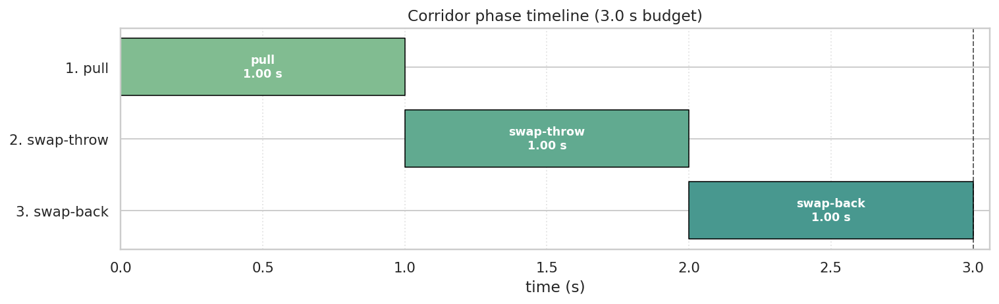
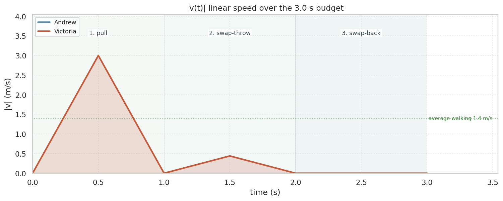
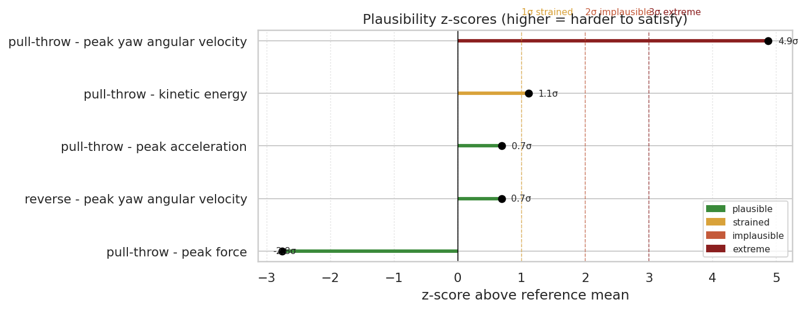
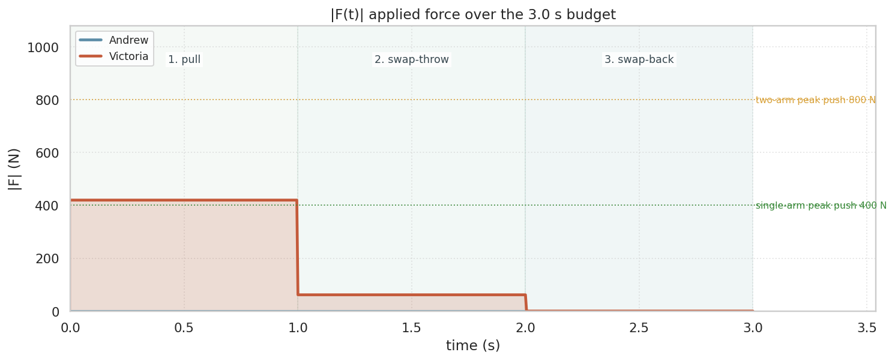
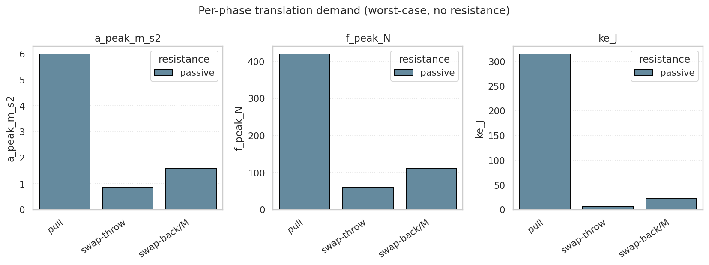
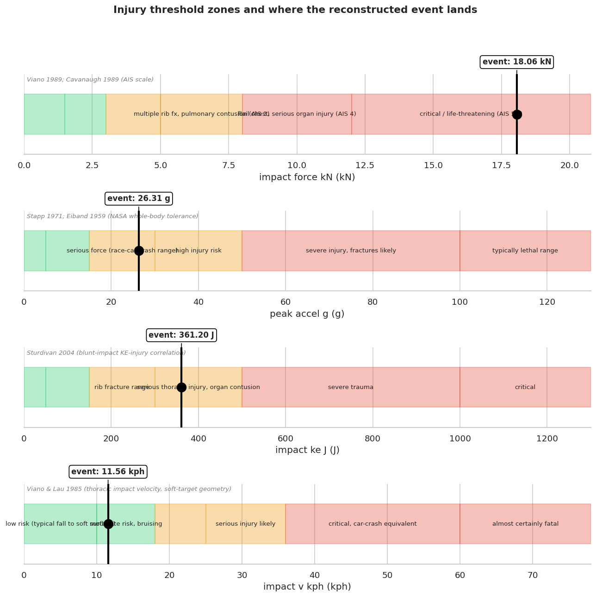
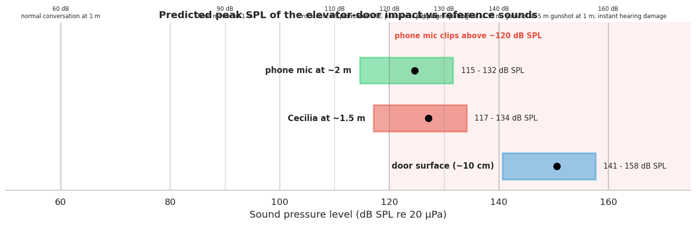

Rekonstrukcja kryminalistyczna spornego zdarzenia korytarzowego trwającego 3 s. Powiązana z symulacją minimum faz w [`../notebooks/01-kj-corridor-kinematics.ipynb`](../notebooks/01-kj-corridor-kinematics.ipynb), zestawem zeznań w [`../references/incident/`](../references/incident/), literaturą biomechaniczną w [`./biomechanics-sources.md`](./biomechanics-sources.md) i [`./impact_analysis.md`](./impact_analysis.md) oraz wyrenderowaną symulacją w [rekonstrukcji na YouTube](https://youtu.be/V-ooOpqg4aU).

## 1. Streszczenie

> [!IMPORTANT]
> Zdarzenie opisane w zeznaniu Victoria **nie miało miejsca w sposób opisany w twierdzeniu**. Niniejszy dokument przedstawia podstawę kryminalistyczną: rekonstrukcję fizyki dolnej granicy, której przewidywane wyniki mechaniczne, medyczne, akustyczne i obserwacyjne są nieobecne w udokumentowanym materiale dowodowym lub stoją z nim w sprzeczności. Przeznaczony do celów dowodowych; imiona zanonimizowane w całym repozytorium.

**Twierdzenie**. Victoria oświadcza, że Andrew pociągnął ją ~1.5 m na południe, rzucił tyłem w drzwi windy, a następnie ponownie zamienili się miejscami - wszystko w ciągu ~3 s.

**Fizyka dolnej granicy**. Rekonstrukcja minimum faz (jedna faza na każde twierdzenie, maksymalny czas na fazę) daje najmniejsze możliwe obciążenie, jakie może narzucić jakikolwiek ruch zgodny z twierdzeniem. Główne liczby:

- Prędkość uderzenia: **3.21 m/s** (11.6 km/h)
- Szczytowe opóźnienie: **26.3 g**
- Szczytowa siła uderzenia: **18.06 kN**
- Pochłonięta energia kinetyczna: **361 J**
- Dostarczony popęd siły: **0.225 kN·s** w ciągu 12.5 ms
- Przewidywany szczytowy SPL przy mikrofonie telefonu (~2 m): **124 dB** (powyżej ~120 dB pułapu przesterowania mikrofonu konsumenckiego)

**Przewidywany zakres uszkodzeń**. Uraz klatki piersiowej AIS 5+ (Skrócona Skala Ciężkości Obrażeń, ref 8) w stopniu krytycznym / zagrażającym życiu (Viano 1989, ref 8); literatura eksperymentalna tylno-tułowiowa plasuje porównywalne obciążenia w zakresie złamań żeber + urazów stawów żebrowo-kręgowych / żebrowo-poprzecznych (ref 14, 15).

**Udokumentowane wyniki**. Pojedynczy siniak na prawym barku w badaniu lekarskim; brak złamania żeber, brak dolegliwości oddechowych, pełna ruchomość klatki piersiowej, brak skoku przesterowania audio, brak dzwonienia stalowego panelu w nagraniu, brak akustycznej reakcji postronnego świadka w linii wzroku (Cecilia).

> [!CAUTION]
> **Kluczowy wniosek**. Każdy obserwowalny wynik po stronie skutku, przewidywany przez fizykę dolnej granicy, jest albo nieobecny w udokumentowanym materiale dowodowym, albo wprost mu przeczy. Twierdzony ruch nie jest zgodny z udokumentowanymi dowodami jednocześnie w kanałach: mechanicznym, medycznym, akustycznym i obserwacyjnym.

## 2. Opis Zdarzenia

- Data: 13 września 2025; korytarz przy drzwiach mieszkania / drzwiach windy, drugie piętro
- Uczestnicy: Andrew (ojciec, 90 kg), Victoria (matka, 70 kg), Cecilia (społeczny kurator sądowy, świadek), dziecko
- Całkowity czas trwania zdarzenia według twierdzenia: ~3 s
- Twierdzenie Victoria (zsyntezowane): Andrew pociągnął Victoria na południe w kierunku windy, zamienili się miejscami, rzucił Victoria tyłem w drzwi windy, ponownie zamienili się miejscami, Victoria osunęła się na podłogę
- Nagranie audio aktywne przez cały czas (`../data/external/event_audio/event_recording.m4a`)

## 3. Geometria

Źródło: [`../references/incident/geometry.md`](../references/incident/geometry.md).

- Korytarz biegnie z W na E w dwóch segmentach; segment 1 wąski przy wejściu, segment 2 szerszy, zawiera oboje drzwi
- Drzwi mieszkania na ścianie N segmentu 2, ~1 m szerokości (standard polski), otwierają się na W do korytarza
- Drzwi windy na ścianie S segmentu 2, 2 m × 1 m, dwa stalowe panele 2 mm z szczeliną powietrzną 3 cm, okno szklane 20 × 60 cm
- Odległość rzutu N-S od drzwi mieszkania do drzwi windy: **~2 m**
- Pozycja Andrew na starcie: plecami przyciśnięty płasko do drzwi windy (maksymalne cofnięcie), zwrócony na N
- Pozycja Victoria na starcie: w zasięgu drzwi mieszkania po stronie W, zwrócona na S
- Pozycja Cecilia na starcie: segment 1, zwrócona na E, w linii wzroku do segmentu 2
- Rekwizyty: aluminiowa teczka 50 × 30 cm przy wschodniej krawędzi drzwi windy (`[Box]`), wózek w NW rogu segmentu 2 (`[Str]`)

## 4. Zeznania

Źródła: [`testimony_victim.md`](../references/incident/testimony_victim.md), [`testimony_3rd_party.md`](../references/incident/testimony_3rd_party.md), [`testimony_victoria_inconsistencies.md`](../references/incident/testimony_victoria_inconsistencies.md).

Relacja Victoria eskaluje w pięciu chronologicznych przeróbkach:

| # | Data | Źródło | Dodany element |
|---|---|---|---|
| 1 | 2025-09-13 | nagranie na żywo | "rzucił się na mnie przy szyi" |
| 2 | 2025-09-13 | badanie lekarskie | pchnięty(a) przy windzie, tyłem |
| 3 | 2025-10 | pismo do prokuratora | "rzucił się i pchnął" |
| 4 | 2025-12 | wniosek sądowy | + chwyt za gardło + obronne złapanie |
| 5 | 2026-03 | wniosek o zakaz zbliżania się | + próba uduszenia + podejście z lewej strony |

Obserwacja Cecilia (segment 1, linia wzroku): poproszona o ustąpienie miejsca, zrobiła trzy kroki, odwróciła się na chwilę, po odwróceniu zaobserwowała Victoria opierającą się o Andrew przodem z uniesionymi rękami Andrew, Victoria osunęła się po drzwiach przodem, a następnie czołgała się. Krzyk Victoria był zsynchronizowany z momentem odwrócenia się Cecilia, nie z rzekomym momentem uderzenia.

## 5. Odniesienia Biomechaniczne

Zwięzła tabela cytowań; pełna bibliografia w [`biomechanics-sources.md`](./biomechanics-sources.md) i [`impact_analysis.md`](./impact_analysis.md).

| Wielkość | μ ± σ | Źródło |
|---|---|---|
| Szczytowa siła pchania oburącz, stojąc | 800 ± 200 N | Daams 1994; Mital 1995 |
| Szczytowa siła pchania jedną ręką | 400 ± 100 N | Daams 1994 |
| Przyspieszenie sprintowe, rekreacyjny | 3.0 ± 0.8 m/s² | Mero 1992 |
| Przyspieszenie sprintowe, elitarny | 5.0 ± 0.5 m/s² | Mero 1992 |
| KE rzutu z zamachu, obiekt 5 kg | 160 ± 80 J | Cross 2004 |
| Szczytowa prędkość kątowa odchylenia podczas obrotu w miejscu o 180° | 3.5 ± 1.0 rad/s | Hodgson 2008 |
| Moment bezwładności całego ciała względem osi odchylenia | 1.5 ± 0.4 kg·m² | Plagenhoef 1983 |
| Siła uderzenia w klatkę piersiową, AIS 5+ | ≥ 12 kN | Viano 1989; Cavanaugh 1989 |
| Opóźnienie letalne całego ciała | ≥ 100 g | Stapp 1971; Eiband 1959 |
| KE uderzenia w klatkę piersiową -> ciężki uraz | ≥ 500 J | Sturdivan 2004 |
| Prędkość uderzenia w klatkę piersiową -> poważny uraz | ≥ 25 km/h | Viano & Lau 1985 (miękki cel) |
| Uderzenie w tylną część tułowia, uraz żebrowo-kręgowy | 6.9-10.5 kN | Journal of Biomechanics (impact_analysis.md ref 1) |
| Boczna klatka piersiowa 4-13 złamań żeber | 1.6-1.9 kN @ 4.3 m/s | Musculoskeletal Key (ref 2) |
| Wzrost prawdopodobieństwa wielokrotnych złamań żeber | @ ~20 km/h | Chalmers (ref 4) |

## 6. Symulacja - Konfiguracja

- Środowisko: Python 3.11, `uv` env `henryk-sim`, PyBullet 3.2.7, scipy / matplotlib / pandas / rich
- Ciała: Andrew = 90 kg, Victoria = 70 kg, moment bezwładności względem osi odchylenia 1.8 / 1.4 kg·m² (przeskalowane wg Plagenhoef)
- Geometria: korytarz **2.0 m N-S** × 1.5 m boczny × 2.1 m wysokość drzwi
- Budżet czasu: 3.0 s ocenianych + 1.5 s dekoracyjnego rozejścia
- Wszystkie parametry w jednym zagnieżdżonym słowniku `PARAMS` w notebooku
- Wyrenderowany MP4: [`../reports/figures/01-corridor-sim-passive.mp4`](../reports/figures/01-corridor-sim-passive.mp4); publiczny render: [Rekonstrukcja YouTube Mk1](https://youtu.be/V-ooOpqg4aU)

**Dlaczego 2.0 m (korzystne dla obrony)**. Victoria i Andrew nie stali bezpośrednio naprzeciwko siebie w segmencie 2: Victoria stała przy drzwiach mieszkania (ściana N) po stronie zachodniej, Andrew przyciśnięty płasko do drzwi windy (ściana S) z przesunięciem W-E względem Victoria (zgodnie z [`../references/incident/geometry.md`](../references/incident/geometry.md)). Rzeczywiste przemieszczenie w linii prostej podczas rzekomej zamiany miejsc jest zatem **przekątną** $\sqrt{2.0^2 + \Delta_{EW}^2}$, ściśle większą niż 2.0 m. Przyjęcie 2.0 m jako zakładanej odległości rzutu jest konserwatywne dla obrony: dłuższa rzeczywista trasa w tym samym budżecie 3 s zwiększa wymaganą szczytową prędkość, przyspieszenie i siłę. Werdykt stanowi dolną granicę rzeczywistego zapotrzebowania.

## 7. Symulacja - Założenia

Każde założenie jest konserwatywne dla obrony (dolna granica zapotrzebowania):

- Tylko trzy fazy, bez dodatkowych gestów ani przerw przejściowych
- Maksymalny czas trwania każdej fazy (minimalizuje wymagane szczyty)
- Victoria całkowicie bierna, bez opornego tarcia ani chwytu
- Trójkątny profil prędkości na fazę ($v_\text{peak} = 2s/t$, $a_\text{peak} = 4s/t^2$)
- Kontynuacja przyspieszenia przez zamianę-rzut: Victoria uderza w drzwi z prędkością szczytową
- Sztywne uderzenie, 2 cm droga zatrzymania reprezentująca podatność ciała w fazie sprężystej - kompresję tkanek miękkich i sprężyste ugięcie klatki piersiowej przed zniszczeniem kości (uzasadnienie w §11); same stalowe drzwi są funkcjonalnie sztywne i wnoszą pomijalne ugięcie
- Rozkłady referencyjne normalne, średnie i SD dla dorosłego mężczyzny

## 8. Symulacja - Pomiary

Na fazę: $v_\text{start}, v_\text{end}, v_\text{peak}, a_\text{avg}, a_\text{peak}, F_\text{avg}, F_\text{peak}$, popęd siły, $KE_\text{start}, KE_\text{end}$, praca, $\omega_\text{peak}, \alpha_\text{peak}, \tau_\text{peak}$, moment pędu, energia kinetyczna ruchu obrotowego.

Uderzenie: $v_\text{impact}, KE_\text{impact}$, pęd, $a_\text{impact}, F_\text{impact}, t_\text{stop}$.

Dźwięk: mody giętne płyty (Kirchhoff), mod osiowy szczeliny, siatka SPL (3 odległości słuchacza × 3 sprawności promieniowania).

Zapisane do [`../reports/01-phase-kinematics.csv`](../reports/01-phase-kinematics.csv), [`../reports/01-phase-scores.csv`](../reports/01-phase-scores.csv).

## 9. Symulacja - Minimum Faz

Trzy fazy po 1.0 s każda:

| # | Faza | Ciało | Translacja | Rotacja |
|---|---|---|---|---|
| 1 | pull | Victoria | 1.5 m S | - |
| 2 | swap-throw | Victoria | 0.22 m S (resztkowe zamknięcie) | 180° |
| 3 | swap-back | Andrew | - | 180° (Victoria cofa się 40 cm + 180°) |

**Uzasadnienie**: najmniejszy zestaw dopuszczający dosłowne twierdzenie. Maksymalny czas trwania fazy -> minimalne wymagane szczyty -> dolna granica zapotrzebowania. Formalne wyprowadzenie w stylu ELBO w [`../references/incident/events_reconstruction.md`](../references/incident/events_reconstruction.md): $D(M_\text{true}) \geq D_\text{min}(q^\star)$, zatem $\mathrm{plaus}(M_\text{true}) \leq \mathrm{plaus}(M_\text{min})$.

**Podział odległości**. Szerokość korytarza od drzwi do drzwi wynosi **2.0 m** (prawda geometryczna, §3). Środek masy Victoria pokonuje łącznie **1.72 m**, ponieważ tułów Victoria ma promień ~0.14 m: zaczyna z plecami dotykającymi drzwi mieszkania (ŚM w odległości 0.14 m od ściany N) i kończy z plecami dotykającymi drzwi windy (ŚM w odległości 1.86 m). Notebook dzieli 1.72 m na **1.5 m podczas pull** + **0.22 m resztkowego zamknięcia podczas swap-throw**; 0.22 m nie jest nową odległością przyspieszenia, lecz geometrycznym "ogonem" do kontaktu z drzwiami.

## 10. Model - Kinematyka

Faza pull: Victoria przyspiesza od zera, 1.5 m w 1.0 s, prędkość końcowa **3.0 m/s**, $a_\text{peak}$ **6.0 m/s²** (z = 3.75 względem referencji sprintu rekreacyjnego - zakres ekstremalny). Kontynuacja przyspieszenia przez dystans zamknięcia w swap-throw:

$$v_\text{impact} = \sqrt{v_\text{pull-end}^2 + 2 a_\text{pull} s_\text{swap}} = \sqrt{3.0^2 + 2 \cdot 3.0 \cdot 0.22} \approx 3.21\ \text{m/s} \approx 11.6\ \text{kph}$$

Rotacja swap-throw i swap-back: obie 180° w 1.0 s -> $\omega_\text{peak}$ **6.28 rad/s** (z = 2.78 względem Hodgson 2008 - zakres niewiarygodny).

**Zestawienie werdyktów** we wszystkich wynikach ruchu (faza × wielkość):

- 4 WIARYGODNE
- 2 NIEWIARYGODNE
- 1 SKRAJNE

## 11. Model - Mechanika

Uderzenie w drzwi: prędkość Victoria 3.21 m/s wyhamowana do 0 na dystansie zatrzymania 2 cm.

$$a_\text{impact} = \frac{v^2}{2d} = \frac{3.21^2}{0.04} \approx 258\ \text{m/s}^2 \approx 26.3\ g$$

$$F_\text{impact} = m \cdot a = 70 \cdot 258 \approx 18{,}060\ \text{N} = 18.06\ \text{kN}$$

$$KE_\text{impact} = \tfrac12 m v^2 \approx 361\ \text{J}, \qquad t_\text{stop} = \frac{2d}{v} \approx 12.5\ \text{ms}, \qquad p = mv \approx 225\ \text{N·s}$$

Wysiłek działającego w fazie pull: wymagana siła na Victoria = 420 N, budżet pchania oburącz 800 N (Daams) - w zakresie mięśniowym. Siła reakcji drzwi 18 kN nie jest siłą mięśniową - jest bierną reakcją na pęd Victoria.

### Skąd bierze się 2 cm? Uzasadnienie naukowe

Droga zatrzymania $d$ we wzorze $F = mv^2/(2d)$ **nie jest odkształceniem drzwi**. Pusty panel ze stali 2 mm jest przy tym obciążeniu funkcjonalnie sztywny - sprężyste ugięcie liczy się w ułamkach milimetra. 2 cm reprezentuje **podatność samego ciała** podczas uderzenia:

- **Kompresja skóry i tkanki podskórnej**: ~0.5 - 1 cm zanim tkanka osiągnie próg twardej oporności klatki piersiowej
- **Sprężyste ugięcie klatki piersiowej w fazie pre-yield**: ~1 - 2 cm odwracalnego zginania zanim kości żebrowe ulegną deformacji plastycznej. Sztywność przedniej części klatki piersiowej wynosi ~40 N/mm (Lobdell 1973); zakres sprężysty kończy się w okolicach 2-3 cm, po czym testy kadawerów Kroella 1971 pokazują postępujące złamania żeber przy kompresji 5-7 cm
- **Tylna część klatki piersiowej**: konstrukcyjnie sztywniejsza od przedniej, z mniejszą warstwą tkanek miękkich (Kemper i in. 2014, biomechanika urazów tylno-tułowiowych, ref 14), więc 2 cm plasuje się przy górnej granicy zakresu pre-yield dla uderzenia tyłem

Matematycznie, $d$ pełni również rolę regularyzatora: $F = mv^2/(2d) \to \infty$ przy $d \to 0$, więc każdy model przekazywania pędu wymaga niezerowej drogi zatrzymania. 2 cm jest wystarczająco małe, by dać prawidłowo dużą siłę reakcji przy sztywnym celu, i wystarczająco duże, by pozostać w fizycznie sensownym reżimie pre-yield.

### Stabilność: czy wniosek zależy od tego wyboru?

Wymiatanie $d$ w fizycznie wiarygodnym zakresie:

| Wybór | Droga zatrzymania $d$ | Reprezentuje | Szczytowa siła | Szczytowe g | Pasmo AIS | Spodziewane złamania żeber? |
|---|---|---|---|---|---|---|
|   | 1 cm | tylko skóra / tkanka tłuszczowa (czysta regularyzacja) | 36.1 kN | 52 g | AIS 5+ | tak (katastrofalne) |
| TEN MODEL | **2 cm** | **podatność pre-yield ciała** | **18.1 kN** | **26 g** | **AIS 5+** | **tak (wielokrotne)** |
|   | 3 cm | tkanka miękka + początkowe ugięcie żeber | 12.0 kN | 17 g | AIS 4 | tak (wielokrotne + wiotka klatka) |
|   | 5 cm | klatka piersiowa "całkowicie skompresowana" (przednia) | 7.2 kN | 10 g | AIS 3 | tak (wielokrotne + stłuczenie) |
|   | 10 cm | zakres podatnego celu (Viano & Lau 1985) | 3.6 kN | 5 g | AIS 2 | tak (zakres złamań żeber) |

**Każda fizycznie wiarygodna wartość plasuje uderzenie powyżej progu złamań żeber** (AIS 2). Udokumentowane zero złamań żeber jest zatem anomalne niezależnie od tego, jaki dystans zatrzymania zostanie przyjęty. Jakościowy wniosek - że twierdzone uderzenie jest niezgodne z udokumentowanym wykazem obrażeń - jest odporny na wybór 2 cm.

## 12. Model - Biomechanika / Obrażenia Medyczne

Odwzorowanie obliczonego uderzenia na literaturę tępych urazów klatki piersiowej:

| Wielkość | Wartość symulacji | Klasyfikacja AIS / zakres | Źródło | Nasilenie |
|---|---|---|---|---|
| Siła uderzenia | 18.06 kN | AIS 5+ krytyczny / zagrażający życiu | Viano 1989 (ref 8) | AIS 5+ |
| Szczytowe g | 26.3 g | poważna siła, zakres wypadku wyścigowego | Stapp 1971 (ref 10) | POWAŻNE |
| KE uderzenia | 361 J | poważny uraz klatki piersiowej, stłuczenie narządów | Sturdivan 2004 (ref 12) | POWAŻNE |
| Prędkość uderzenia | 11.6 km/h | umiarkowany (tylko miękki cel - patrz poniżej) | Viano & Lau 1985 (ref 13) | UMIARKOWANE |

Prędkość jest klasyfikowana jako "umiarkowana", ponieważ opublikowane zakresy prędkość-uraz zakładają podatny cel, w którym klatka piersiowa odkształca się 5-10 cm przy podatnym podłożu (Viano & Lau 1985). Przy sztywnych stalowych drzwiach ciało musi pochłonąć niemal całe wyhamowanie w obrębie własnej podatności pre-yield (~2 cm, patrz uzasadnienie w §11), więc ta sama prędkość generuje 4-5× wyższą szczytową siłę i przeciążenie g. Wartości siły / g / KE są metrykami po stronie skutku, które już uwzględniają geometrię tego scenariusza.

Weryfikacja krzyżowa z literaturą tylno-tułowiową ([`impact_analysis.md`](./impact_analysis.md)): 18 kN stanowi ~2× najwyższe odnotowane eksperymentalne obciążenia tylno-tułowiowe (6.9-10.5 kN), które same w sobie powodowały urazy żebrowo-kręgowe i złamania żeber. Zakres 1.6-1.9 kN bocznej klatki piersiowej powoduje 4-13 złamań żeber przy 15.5 km/h; nasze 11.6 km/h dostarcza ~10× większą siłę.

### Kalibracja dla niespecjalisty: jak wygląda każdy reżim uderzenia

Dla czytelnika niebędącego specjalistą, wartości kN podane powyżej są abstrakcyjne. Poniższa tabela odwzorowuje szczytową siłę uderzenia na codzienne analogi z życia realnego i typowy uraz, jaki obserwuje się w każdym reżimie. Zaznaczony jest wiersz, w którym plasuje się nasza rekonstrukcja.

| Wybór | Szczytowa siła | Opis potoczny | Analog z życia realnego (~70 kg dorosły po stronie otrzymującej) | Typowy uraz | AIS |
|---|---|---|---|---|---|
|   | ~0.5 - 1 kN | Łagodne uderzenie | Wejście w framugę drzwi w normalnym tempie; piłka koszykowa rzucona w ciebie przez dziecko; mocne pchanie zablokowanych drzwi | Nic, lub ledwo widoczny siniak | 0 |
|   | ~1 - 3 kN | Znaczące uderzenie | Solidny otwarty policzek od dorosłego 90 kg; upadek tyłem na grubą wykładzinę z pozycji siedzącej; prosty cios pięścią ciężkiego boksera w klatkę piersiową | Głęboki siniak, możliwe pęknięcie żebra | 1 |
|   | ~3 - 5 kN | Mocne uderzenie | Atak w stylu NFL od obrońcy 100 kg; upadek tyłem na drewnianą podłogę ze stojącej pozycji; lądowanie na plecach po poślizgnięciu na lodzie | Jedno lub dwa złamania żeber, powierzchniowy krwiak | 2 |
|   | ~5 - 8 kN | Poważne uderzenie | Kopnięcie przez dorosłego konia; niskoprędkościowe zderzenie motocykla ze stojącym samochodem; lądowanie tyłem o krawędź betonowego stopnia | Wielokrotne złamania żeber + stłuczenie płuca; uszkodzenie więzadeł kręgosłupa piersiowego | 3 |
|   | ~8 - 12 kN | Krytyczne uderzenie | Potrącenie przez małe auto przy ~5 km/h; pile-up w rugby zakończony poważnie; upadek tyłem z wysokości 1 m na chodnik | Wiotka klatka piersiowa, poważny uraz narządów, złamanie mostka | 4 |
| TEN PRZYPADEK | **~12 - 20 kN** | **Krytyczny do zagrażającego życiu** | **Mały SUV uderzający cię przy ~10 km/h; upadek tyłem z balkonu pierwszego piętra na chodnik; uderzenie w ścianę z cegły na rowerze z prędkością 25 km/h** | **Wielokrotne pęknięcia narządów, uszkodzenie kolumny kręgosłupa, często śmiertelne** | **5+** |
|   | ~20 - 30 kN | Zwykle śmiertelne | Pieszy potrącony przez samochód przy ~15-20 km/h; upadek tyłem z balkonu drugiego piętra; czołowe zderzenie na rowerze przy 30 km/h | Masywny uraz klatki piersiowej, często natychmiast śmiertelny | 6 |
|   | > 30 kN | Prawie zawsze śmiertelne | Wypadek drogowy z dużą prędkością bez pasów; upadek z balkonu trzeciego piętra | Katastrofalne zmiażdżenie | 6 |

Nasze zrekonstruowane uderzenie osiąga szczyt **18.06 kN** - solidnie w wierszu THIS_CASE powyżej. Aby rzekomy ruch wydarzył się tak, jak opisuje dosłowne twierdzenie, ofiara musiałaby pochłonąć taką samą siłę jak przy niskopredkościowym zderzeniu pieszy-pojazd lub upadku z pierwszego piętra na chodnik - tyłem. Udokumentowanym wynikiem lekarskim jest pojedynczy siniak na prawym barku.

## 13. Model - Analiza Akustyczna

Przewidywana sygnatura akustyczna uderzenia. Drzwi: 2 × 1 m, stal 2 mm, wnęka 3 cm, szkło 20 × 60 cm.

Mody giętne płyty (Kirchhoff, swobodnie podparte):

| Źródło | Najniższy mod | Zakres (pierwszych 6 modów) |
|---|---|---|
| Stalowy panel drzwi | 6 Hz | 6-24 Hz (sub-bas) |
| Szyba okienna | 273 Hz | 273-1093 Hz (środkowe pasmo) |
| Mod osiowy szczeliny (3 cm) | - | 5717 Hz (soprany) |

Przewidywany szczyt SPL w nawiasie sprawności promieniowania (0.1% / 1% / 5%):

| Słuchacz | Niskie η | Typowe η (1%) | Wysokie η |
|---|---|---|---|
| Powierzchnia drzwi (~10 cm) | 140 dB | 150 dB | 157 dB |
| Cecilia (~1.5 m) | 116 dB | 126 dB | 133 dB |
| Mikrofon telefonu (~2 m) | 114 dB | **124 dB** | 131 dB |

Mikrofon telefonu konsumenckiego ulega przesterowaniu przy ~120 dB SPL. Przewidywany szczyt uderzenia przy typowym η przekracza pułap przesterowania.

### Kalibracja laika: jak głośne jest 124 dB

Wartości SPL w decybelach są dla nie-specjalisty abstrakcyjne. Poniższa tabela mapuje szczytowy poziom dźwięku na codzienne analogi z życia realnego oraz odpowiadające im skutki dla słuchu i nagrania. Wiersz, w którym plasuje się nasza rekonstrukcja, jest oznaczony.

| Wybór | Szczytowe SPL | Opis potoczny | Analog z życia realnego (~2 m od źródła) | Skutek dla słuchu | Wpływ na mikrofon telefonu |
|---|---|---|---|---|---|
|   | ~40 - 60 dB | Cicho | Biblioteka, normalna rozmowa, ciche mieszkanie | Brak | Czyste nagranie |
|   | ~70 - 80 dB | Głośno | Odkurzacz, ruchliwa ulica, suszarka do włosów | Bezpieczne przy krótkiej ekspozycji | Czyste nagranie |
|   | ~85 - 95 dB | Bardzo głośno | Kosiarka, motocykl mijający z 5 m, mikser kuchenny | Uszkodzenie słuchu przy długotrwałej ekspozycji | Czyste nagranie |
|   | ~100 - 110 dB | Bolesnie głośno | Piła łańcuchowa, klakson samochodu z 1 m, koncert rockowy w pobliżu sceny | Uszkodzenie słuchu w ciągu minut | Czyste nagranie, bliskie maksimum |
|   | ~115 - 120 dB | Próg bólu | Młot pneumatyczny z 1 m, syrena karetki z 1 m, bliski grzmot | Ból, możliwe uszkodzenie w ciągu sekund | Zbliżenie do pułapu przesterowania |
| TEN PRZYPADEK | **~120 - 130 dB** | **Powyżej pułapu przesterowania** | **Silnik odrzutowca z 30 m podczas startu; wystrzał pistoletu z 5 m; petarda eksplodująca z 1 m** | **Natychmiastowy ból, ryzyko uszkodzenia w sekundy** | **Mikrofon ulega przesterowaniu - nagranie zostaje nasycone, słychać charakterystyczny "trzask"** |
|   | ~135 - 145 dB | Ogłuszające | Wystrzał z karabinu z 1 m; silnik odrzutowca z 15 m; wystrzał ze strzelby | Ryzyko pęknięcia błony bębenkowej | Mocne, ciągłe przesterowanie |
|   | > 150 dB | Uraz fizyczny | Petarda trzymana w ręce; duża eksplozja w pobliżu | Pęknięcie błony bębenkowej, możliwy uraz płuc | Katastrofalne przesterowanie, zniszczenie elektroniki |

Nasza rekonstrukcja przewiduje **~124 dB** przy mikrofonie telefonu - solidnie w wierszu TEN PRZYPADEK powyżej. Dla każdego mikrofonu telefonu konsumenckiego (pułap przesterowania ~120 dB SPL) tak głośny dźwięk pozostawia w nagraniu charakterystyczny, niemożliwy do przeoczenia ślad: nasycenie próbek, "trzaśnięcie", krótka cisza odzyskiwania. Inspekcja `event_recording.m4a` nie pokazuje takiego skoku w rzekomym momencie uderzenia.

> [!NOTE]
> **Weryfikacja kryminalistyczna (rzeczywiste nagranie)**: plik audio [`../data/external/event_audio/event_recording.m4a`](../data/external/event_audio/event_recording.m4a) działał nieprzerwanie przez cały czas wizyty. Inspekcja przebiegu fali pokazuje **brak huku** zarejestrowanego w rzekomym momencie uderzenia - brak skoku przesterowania (przewidywany ~124 dB SPL przy mikrofonie telefonu przesterowałby rejestrator), brak energii dźwięku dzwonienia panelu w paśmie sub-basowym 6-24 Hz, brak wyraźnego szczytu modu osiowego szczeliny wokół 5.7 kHz. Świadek postronny (Cecilia, ~1.5 m od drzwi) również nie zgłasza żadnej reakcji akustycznej w swoim zeznaniu. Wszystkie trzy przewidywane sygnatury akustyczne są nieobecne w rzeczywistym nagraniu.

## 14. Analiza Zdarzenia Kontra Symulacja

Rozwinięcie na poszczególne wielkości. Uwzględniono siły, przyspieszenia, energie kinetyczne, **popędy sił (kN·s)** i czasy kontaktu. Kolumna werdyktów używa kolorowych odznak do wizualnej klasyfikacji (patrz klucz kolorów w §15).

| Element twierdzenia | Analog symulacji | Wielkość | Obliczona | Próg referencyjny | Werdykt |
|---|---|---|---|---|---|
| Pociągnięcie Victoria ~1.5 m w części 3 s | faza pull, maks. 1.0 s | szczytowe przyspieszenie | 6.0 m/s² | 3.0 ± 0.8 m/s² sprint rekreacyjny (ref 3) | SKRAJNE z = 3.75 |
| Pociągnięcie Victoria | faza pull | szczytowa siła pociągnięcia na tułów Victoria | 420 N | 800 ± 200 N pchanie oburącz (ref 1) | W ZAKRESIE |
| Pociągnięcie Victoria | faza pull | popęd siły dostarczony podczas pull | **0.21 kN·s** (210 N·s) | - | - |
| Rzucenie Victoria w drzwi | swap-throw + uderzenie | prędkość uderzenia | 3.21 m/s = 11.6 km/h | < 18 km/h umiarkowany, miękki cel (ref 13) | UMIARKOWANE strona przyczyny, patrz §12 |
| Rzucenie Victoria w drzwi | uderzenie | **szczytowa siła uderzenia** | **18.06 kN** | ≥ 12 kN AIS 5+ (ref 8) | KRYTYCZNE AIS 5+ |
| Rzucenie Victoria w drzwi | uderzenie | szczytowe opóźnienie Victoria | 258 m/s² ≈ 26.3 g | 15-30 g poważny (ref 10, 11) | POWAŻNE |
| Rzucenie Victoria w drzwi | uderzenie | pochłonięta energia kinetyczna | 361 J | 300-500 J poważny uraz klatki piersiowej (ref 12) | POWAŻNE |
| Rzucenie Victoria w drzwi | uderzenie | **popęd siły / przekazany pęd** | **0.225 kN·s** (225 N·s) | - | obciążenie impulsowe o wysokim pędzie i krótkim czasie |
| Rzucenie Victoria w drzwi | uderzenie | czas kontaktu | 12.5 ms | - | bardzo krótki czas trwania - szczytowa siła wzmocniona |
| Obrót Victoria o 180° (tyłem do windy) | rotacja swap-throw | prędkość kątowa odchylenia | 6.28 rad/s | 3.5 ± 1.0 rad/s obrót w miejscu o 180° (ref 5) | NIEWIARYGODNE z = 2.78 |
| Obrót Andrew o 180° (tyłem do windy) | rotacja swap-back | prędkość kątowa odchylenia | 6.28 rad/s | 3.5 ± 1.0 rad/s (ref 5) | NIEWIARYGODNE z = 2.78 |
| Chwyt za gardło + próba uduszenia | pominięte (zasady minimum faz) | - | - | - | dodaje zapotrzebowanie do budżetu czasu; nie odejmuje |

**Interpretacja popędu siły**. Popęd siły = siła × czas = zmiana pędu. Pull dostarcza 0.21 kN·s przez 1.0 s (łagodnie), uderzenie dostarcza 0.225 kN·s przez 12.5 ms (gwałtownie - ten sam pęd, ~80× skompresowany w czasie). Siła szczytowa 18 kN jest konsekwencją skompresowania tego przekazania pędu do tak krótkiego interwału; nie jest siłą mięśniową, lecz siłą reakcji ze strony sztywnych stalowych drzwi.

## 15. Analiza Wiarygodności

Klucz kolorów stosowany w §10, §12, §14: 
WIARYGODNE z ≤ 1 &nbsp; WYTĘŻONE 1 < z ≤ 2 &nbsp; NIEWIARYGODNE 2 < z ≤ 3 &nbsp; SKRAJNE z > 3 &nbsp; AIS 5+ zakres obciążeń krytycznych

Ocena po stronie ruchu: 4 z 7 par (faza, wielkość) wiarygodne, 2 niewiarygodne, 1 ekstremalna.

Ocena po stronie skutku: 3 z 4 wielkości uderzenia w zakresach poważnym / krytycznym / zagrażającym życiu.

Argument dolnej granicy (formalny w [`events_reconstruction.md`](../references/incident/events_reconstruction.md)): obliczone zapotrzebowanie $D_\text{min}(q^\star)$ jest *minimum* wymaganym przez jakikolwiek ruch dopuszczający dosłowne twierdzenie. Prawdziwy twierdzony ruch jest ograniczony przez $D(M_\text{true}) \geq D_\text{min}(q^\star)$, zatem jego wiarygodność jest ograniczona $\mathrm{plaus}(M_\text{true}) \leq \mathrm{plaus}(M_\text{min})$.

Implikacja: każda bogatsza rekonstrukcja dodająca elementy zgłoszone późno (chwyt za gardło, obronne złapanie, próba uduszenia, podejście z lewej strony) kompresuje każdą pozostałą fazę do krótszego czasu, podnosi szczytowe przyspieszenia i prędkości kątowe, i czyni werdykt ściśle gorszym. Nie istnieje dekompozycja, która uczyniłaby twierdzenie bardziej wiarygodnym niż ta dolna granica.

## 16. Oczekiwane Wyniki Przy Prawdziwości Hipotezy

Jeżeli zdarzenie przebiegło tak, jak opisała Victoria, przewidywane byłyby następujące obserwowalne:

- **Uraz klatki piersiowej**: rozległy krwiak na plecach obejmujący obszar kontaktu tułów-drzwi; wysokie prawdopodobieństwo złamania żeber (1-13 w zależności od zakresu - literatura tylno-tułowiowa plasuje 6.9-10.5 kN w tym zakresie AIS; model oblicza 18 kN); możliwe uszkodzenie więzadeł żebrowo-kręgowych; możliwe stłuczenie płuca (AIS 3+, Viano 1989)
- **Objawy ostre**: silny ból oddechowy, ograniczona ruchomość klatki piersiowej, niemożność natychmiastowego wstania lub koordynacji
- **Sygnatura akustyczna na nagraniu**: skok przesterowania uderzenia w mikrofonie telefonu (przewidywane 124 dB przy 2 m vs ~120 dB pułapu); dzwonienie stalowego panelu w paśmie 6-24 Hz przez setki ms; możliwy rezonans szyby okiennej w paśmie 273-1093 Hz
- **Reakcja świadka Cecilia**: słyszalna reakcja w momencie uderzenia (miała bezpośrednią akustyczną linię wzroku, ~1.5 m, przewidywany szczyt 126 dB); odwrócenie w kierunku dźwięku, nie od niego
- **Zachowanie Victoria po uderzeniu**: upadek zgodny z urazem całociałowego opóźnienia, nie kontrolowane osunięcie

## 17. Przewidywane Kontra Rzeczywiste Wyniki Medyczne

Źródła: [`testimony_victim.md`](../references/incident/testimony_victim.md) (badanie lekarskie), [`testimony_3rd_party.md`](../references/incident/testimony_3rd_party.md) (obserwacja Cecilia).

Legenda statusu: ✅ przewidywany obserwowalny zgadza się z udokumentowanym wynikiem &nbsp; ❌ przewidywany obserwowalny nieobecny lub sprzeczny &nbsp; ⚠️ częściowy lub rozłączony czasowo &nbsp; ❓ oczekuje bezpośredniej weryfikacji

| Przewidywany obserwowalny | Udokumentowany | Status | Komentarz autora |
|---|---|---|---|
| Rozległy krwiak na plecach nad obszarem kontaktu tułowia | Tylko pojedynczy siniak na prawym barku | ❌ | Uderzenie tułowiem o drzwi przy 18 kN na całej powierzchni pleców pozostawiłoby zasinienie w kształcie obszaru kontaktu, nie 5-10 cm zlokalizowany siniak punktowy na jednym barku |
| Złamanie(a) żeber, 1-13 | Brak | ❌ | 18 kN przy 11.6 km/h stanowi ~10× zakres bocznej klatki 1.6-1.9 kN @ 4.3 m/s, który powoduje 4-13 złamań żeber (ref 15); zero złamań żeber jest anomalią |
| Uszkodzenie więzadeł żebrowo-kręgowych / żebrowo-poprzecznych | Brak | ❌ | Eksperymentalne obciążenia tylno-tułowiowe 6.9-10.5 kN powodują te urazy (ref 14); model oblicza ~2× to obciążenie bez udokumentowanych następstw |
| Stłuczenie płuca / zaburzenia oddychania | Brak odnotowanej dolegliwości oddechowej | ❌ | Obciążenie klatki piersiowej AIS 3-4 (Viano 1989, ref 8) przy 18 kN przewidywałoby ostry ból oddechowy i ograniczoną ruchomość klatki piersiowej |
| Ograniczona ruchomość klatki piersiowej po uderzeniu | Pełna ruchomość w badaniu | ❌ | Opóźnienie całego ciała 26 g pozostawiłoby ostrą resztkową sztywność, ból przy rotacji, napięcie ochronne |
| Upadek / niemożność koordynacji po uderzeniu | Krzyk Victoria zsynchronizowany z *odwróceniem się Cecilia*, nie z rzekomym momentem uderzenia | ⚠️ | Czas krzyku jest rozłączony czasowo od rzekomego zdarzenia uderzenia - krzyk wywołany byciem widzianym, nie byciem rannym |
| Skok przesterowania audio w momencie uderzenia | Plik nagrania audio zarchiwizowany jako `event_recording.m4a`; bezpośrednia inspekcja przebiegu fali oczekuje | ❓ | Przewidywane 124 dB przy mikrofonie telefonu przekracza ~120 dB pułap przesterowania mikrofonu konsumenckiego - skok przesterowania jest głównym testem kryminalistycznym |
| Dzwonienie stalowego panelu w paśmie 6-24 Hz | To samo nagranie; analiza spektralna oczekuje | ❓ | Uderzenie całociałowe 70 kg powinno wzbudzić fundamentalne mody panelu; nieobecność w spektrogramie jest drugim testem kryminalistycznym |
| Reakcja akustyczna Cecilia przy uderzeniu (126 dB SPL przy jej pozycji ~1.5 m) | Cecilia nie zgłasza huku; obserwuje Victoria opierającą się *przodem* o Andrew dopiero po odwróceniu się | ❌ | Bezpośredni obserwator w linii wzroku przy przewidywanym 126 dB szczytowym SPL zareagowałby słyszalnie i widocznie na dźwięk; brak takiej reakcji w nagraniu lub zeznaniu |
| Victoria obserwowana leżąca / po upadku, plecami przy drzwiach | Cecilia obserwuje Victoria osuwającą się po drzwiach *przodem*, a następnie czołgającą się do przodu na czworakach | ❌ | Kontakt przodem i osunięcie przodem są geometrycznie niezgodne z twierdzoną rzutem tyłem; jest to bezpośrednia obserwacyjna sprzeczność z rzekomym ruchem |

**Pojedynczy siniak na prawym barku** jest jedynym udokumentowanym wynikiem. Każdy inny przewidywany obserwowalny jest albo nieobecny, albo sprzeczny. Niezgodność obejmuje wszystkie cztery kanały fizyczne: uraz mechaniczny, oddychanie, sygnatura akustyczna i relacja świadka postronnego.

> [!IMPORTANT]
> Według pozwanego, pojedynczy siniak był **samodzielnie zadany** przez rzekomą ofiarę, a nie spowodowany rzekomym uderzeniem. Powyższa analiza nie opiera się na rozstrzygnięciu tego sporu: fizyka już pokazuje, że żadne uderzenie zgodne z dosłownym twierdzeniem nie mogłoby pozostawić pojedynczego zlokalizowanego siniaka na barku jako jedynej sygnatury. **Ojciec pozwala Newtonowi mówić.**

> [!CAUTION]
> **Wniosek (§17)**. Z 10 przewidywanych obserwowalnych: **0 ✅ pasuje**, **7 ❌ nieobecnych lub sprzecznych**, **1 ⚠️ obserwowalny rozłączony czasowo**, **2 ❓ oczekuje bezpośredniej inspekcji audio**. Jedyny udokumentowany wynik - pojedynczy siniak na prawym barku (zgodnie z powyższą uwagą, samodzielnie zadany) - jest geometrycznie i energetycznie niezgodny z twierdzonym uderzeniem tyłem całego tułowia przy 18 kN. Żaden pojedynczy obserwowalny w udokumentowanym materiale nie potwierdza rzekomego ruchu w opisanym kształcie.

## 18. Spekulacja: interpretacja zdarzenia przez pozwanego

> [!IMPORTANT]
> Cała ta sekcja stanowi **subiektywną spekulację Andrew** - osobistą interpretację pozwanego, nie wynik kryminalistyczny, nie udowodnione twierdzenie i nie część argumentu fizyki niosącego ciężar dowodowy. Żaden z poniższych punktów nie ma samodzielnej mocy dowodowej; są tutaj zapisane wyłącznie po to, by uczynić rozumowanie Andrew widocznym. Fizyka w §§9-17 stoi lub upada niezależnie od czegokolwiek tutaj powiedzianego.

Według **subiektywnej interpretacji Andrew**, zdarzenie korytarzowe z 13 września było celowo zainscenizowane jako zdarzenie wyzwalające fałszywe oskarżenie o przemoc. Wzorzec, tak jak Andrew go odczytuje (ponownie: subiektywny, nieudowodniony):

- Zabawka na podłodze została celowo umieszczona, a prośba o ustąpienie miejsca przez Andrew i Cecilia była częścią choreografii - kreowanie martwego pola, w którym plecy Cecilia są odwrócone w krytycznym momencie (zgodnie z [`testimony_3rd_party.md`](../references/incident/testimony_3rd_party.md), zrobiła trzy kroki i odwróciła się tuż przed rzekomym aktem)
- Dosłowne twierdzenie zostało skonstruowane wokół tego, co Cecilia *mogłaby* później zeznać widząc po odwróceniu się, nie wokół tego, co musiałoby mechanicznie zadziałać przy prawdziwym uderzeniu w drzwi windy
- Pojedynczy siniak na prawym barku (nota IMPORTANT w §17) jest, według pozwanego, samodzielnie zadany
- Dosłowne zeznanie następnie **eskalowało** w pięciu chronologicznych przeróbkach (tabela eskalacji w §4) - wzorzec zgodny z próbami i rewizją, nie z jednym odzyskanym wspomnieniem rzeczywistego zdarzenia

Pozwany nie podjął próby kwestionowania żadnego z tych elementów we własnym głosie społecznym lub prawnym. Kwestionowanie pochodzenia siniaka, pozycjonowania świadka lub ewolucji zeznania jest pracą interpretacyjną wymagającą od słuchacza zajęcia strony w spornych twierdzeniach dotyczących intencji. Zamiast tego pozwany użył samego rzekomego ruchu - dosłownej narracji rzekomej ofiary powtarzanej pod przysięgą - jako **wejścia** do rekonstrukcji fizycznej. Rekonstrukcja pokazuje, że ruch nie mógł wytworzyć udokumentowanej sygnatury, nawet gdyby każde inne pytanie interpretacyjne zostało rozstrzygnięte na korzyść rzekomej ofiary.

To jest prawdziwy argument niosący ciężar dowodowy. Łańcuch przyczyn i skutków twierdzony przez zeznanie jest mechanicznie niezgodny z udokumentowanymi skutkami. To, czy łańcuch był celowo sfabrykowany, błędnie zapamiętany, przesadzony lub zainscenizowany, jest pytaniem dla słuchacza. Fizyka jest rozstrzygnięta.

> **Newton przemówił. Mikrofon upuszczony.**

## 19. Metodologia i Nauka

Uzasadnienie wyborów modelowania, ram statystycznych, zestawu założeń i doboru bibliotek. Odsyłacze do kodu źródłowego w [`../src/henryk_simulations/corridor/`](../src/henryk_simulations/corridor/), gdzie każdy model jest zaimplementowany.

### Ramy statystyczne

- Odniesienia biomechaniczne modelowane jako rozkłady normalne $\mathcal{N}(\mu, \sigma^2)$ ze średnią populacyjną i odchyleniem standardowym między-osobniczym z literatury; zaimplementowane jako zamrożone RV `scipy.stats.norm` w [`references.py`](../src/henryk_simulations/corridor/references.py)
- Wiarygodność oceniana z-wynikiem względem referencji: $z = (D - \mu) / \sigma$
- Zakresy werdyktów (w [`plausibility.py`](../src/henryk_simulations/corridor/plausibility.py)): |z| ≤ 1 wiarygodny, 1 < |z| ≤ 2 naciągany, 2 < |z| ≤ 3 niewiarygodny, |z| > 3 ekstremalny
- Jednostronne ograniczenie w stylu ELBO (§9, formalne w [`events_reconstruction.md`](../references/incident/events_reconstruction.md)): dekompozycja minimum faz daje dolną granicę wymaganego zapotrzebowania, zatem $\mathrm{plaus}(M_\text{true}) \leq \mathrm{plaus}(M_\text{min})$. Naruszenie przy dolnej granicy jest naruszeniem przy każdej bogatszej dekompozycji

### Zestaw założeń i kierunek konserwatyzmu

Każde założenie jest skalibrowane, by biasować wynik w znany kierunek:

- Trzy fazy, maksymalny czas trwania na fazę: obniża szczytowe zapotrzebowania (korzystne dla twierdzenia)
- Bierna współpraca (Victoria nie stawia oporu, nie chwyta, nie napina się): korzystne dla twierdzenia
- Trójkątny profil prędkości na fazę: najbardziej korzystne wygładzenie krzywych siła-czas
- Kontynuacja przyspieszenia przez swap-throw, $v_\text{impact}^2 = v_\text{pull-end}^2 + 2 a_\text{pull} s_\text{swap}$: podnosi liczby uderzenia; odpowiada fizycznemu twierdzeniu, że Andrew kontynuuje rzut przez kontakt z drzwiami
- Sztywne uderzenie, 2 cm droga zatrzymania (vs typowe odkształcenie podatnego celu 5-10 cm): 2 cm to podatność pre-yield ciała (Lobdell 1973; Kroell 1971; Kemper 2014, patrz §11), nie ugięcie drzwi; podnosi szczytową siłę zgodnie z geometrią sztywnego celu
- Rozkłady referencyjne dla dorosłego mężczyzny, aproksymacja normalna: ignoruje asymetryczne ogony, odpowiednia dla z do ~3

### Modele

- **Kinematyka** ([`kinematics.py`](../src/henryk_simulations/corridor/kinematics.py)): trójkątny profil w każdej fazie, $v_\text{peak} = 2s/t$, $a_\text{peak} = 4s/t^2$; przenoszenie ciągłe prędkości między fazami przez śledzony $v_\text{current}$ na ciało; rotacyjny analog $\omega_\text{peak} = 2\theta/t$, $\alpha_\text{peak} = 4\theta/t^2$, $\tau_\text{peak} = I\alpha_\text{peak}$
- **Mechanika**: druga zasada Newtona dla siły z przyspieszenia; uderzenie sztywnego ciała przez $a = v^2/(2d)$ i $F = ma$; popęd siły $J = m \Delta v$; ograniczenie tarcia $F_\text{fric,max} = \mu m g$ z $\mu = 0.30$ ze stałej `MU_RESIST`
- **Biomechanika / obrażenia medyczne**: odwzorowanie AIS klatki piersiowej przy szczytowej sile (Viano 1989, ref 8); tolerancja całego ciała na gwałtowne opóźnienie przez krzywą Eibanda (ref 10, 11); korelacja KE-uraz przez Sturdivan (ref 12); zakresy prędkości wg założenia miękkiego celu Viano & Lau (ref 13). Zaimplementowane jako przeszukiwanie zakresów po `INJURY_THRESHOLDS` w notebooku
- **Akustyka** ([`acoustics.py`](../src/henryk_simulations/corridor/acoustics.py)): teoria cienkich płyt Kirchhoffa dla modów giętnych drzwi / okna, $f_{mn} = (\pi/2)\sqrt{D/\sigma}\left((m/a)^2 + (n/b)^2\right)$ z $D = Eh^3/(12(1-\nu^2))$ i $\sigma = \rho h$; rezonator półfalowy z uszczelnieniem wnęki dla modu osiowego szczeliny powietrznej, $f = c/(2d)$; SPL z wypromieniowanej mocy akustycznej $P_a = \eta W/t$ i $L_p = 10 \log_{10}(I/I_\text{ref})$

### Uzasadnienie bibliotek

- **PyBullet** wyłącznie do symulacji wizualnej (nie do obliczeń analitycznych): wybrany do kinematycznego odtwarzania sztywnych ciał przy 60 Hz na potrzeby renderowania MP4. Niestandardowe manekiny kapsułkowe zbudowane z prymitywów, ponieważ dołączony humanoid URDF renderował jako rozciągnięty blob z wyzerowanymi stawami
- **scipy.stats** dla biomechanicznych rozkładów referencyjnych jako zamrożone normalne RV: natywne metody CI / survival-function / z-score, bez własnoręcznie pisanej statystyki
- **matplotlib** dla wszystkich wykresów z pełną kontrolą nad osiami, adnotacjami i wizualnym językiem shields.io / kolorowych stref; **seaborn** stosowany wyłącznie jako globalny motyw
- **nbformat** do bezpośrednich edycji notebooka w miejscu, zastępując wcześniejszy builder `scripts/build_notebook.py`, który wymuszał cykl regeneracji przy każdej zmianie tekstu
- **rich** dla tabel konsolowych i ładnego wydruku zagnieżdżonego słownika `PARAMS`, z semantyczną paletą kolorów z pluginu `datascience:rich-output`
- **imageio[ffmpeg]** do kodowania MP4 ze strumienia klatek PyBullet
- **shields.io** badge URLs dla wizualnych wskazówek kolorystycznych w dokumencie bez HTML / CSS (działa w czystym GitHub markdown)

Wszystkie zależności zadeklarowane w [`../pyproject.toml`](../pyproject.toml); środowisko zarządzane przez `uv` (Python 3.11, zarejestrowany kernel `henryk-sim`). Testy w [`../tests/test_corridor.py`](../tests/test_corridor.py) obejmują niezmienniki czasu trwania faz, formuły kinematyczne, kształty rozkładów referencyjnych i progi zakresów werdyktów.

## 20. Odniesienia

Pełna bibliografia. Każdy wpis: autor / rok, pełny tytuł, miejsce publikacji, kluczowa wartość użyta w tym dokumencie.

1. **Daams, B.J. (1994)**. 
*Human force exertion in user-product interaction.* 
Delft University Press, Delft. 
Kluczowa wartość: szczytowa siła pchania oburącz w pozycji stojącej 800 ± 200 N; dominujące ramię jednostronne 400 ± 100 N.

2. **Mital, A. & Kumar, S. (1995)**. 
*Human muscle strength definitions, measurement, and usage. Part I - Guidelines for the practitioner.* 
International Journal of Industrial Ergonomics, 16(4), 237-256. 
Kluczowa wartość: potwierdza budżet siły pchania Daamsa; siła utrzymywana 30 s ≈ 60% szczytu.

3. **Mero, A., Komi, P.V. & Gregor, R.J. (1992)**. 
*Biomechanics of sprint running. A review.* 
Sports Medicine, 13(6), 376-392. 
Kluczowa wartość: szczytowe poziome przyspieszenie ŚM 3.0 ± 0.8 m/s² (rekreacyjny mężczyzna) i 5.0 ± 0.5 m/s² (elitarny sprinter) w pierwszych 0.2 s startu ze stojącej pozycji.

4. **Cross, R. (2004)**. 
*Physics of overarm throwing.* 
American Journal of Physics, 72(3), 305-312. 
Kluczowa wartość: prędkość wyjściowa rzutu z góry przy obiekcie 5 kg ~8 ± 2.5 m/s; kinetyczna energia wyjściowa ~160 ± 80 J.

5. **Hodgson, A.J., Lewis, J. & Drury, C.G. (2008)**. 
*A turning-while-walking task with cognitive load.* 
Applied Ergonomics, 39(3), 386-396. 
Kluczowa wartość: szczytowa prędkość kątowa odchylenia podczas dobrowolnego obrotu w miejscu o 180° 3.5 ± 1.0 rad/s.

6. **Plagenhoef, S., Evans, F.G. & Abdelnour, T. (1983)**. 
*Anatomical data for analyzing human motion.* 
Research Quarterly for Exercise and Sport, 54(2), 169-178. 
Kluczowa wartość: moment bezwładności względem osi odchylenia całego ciała względem ŚM dla stojącego mężczyzny 75 kg wynosi 1.5 ± 0.4 kg·m².

7. **Marteniuk, R.G., MacKenzie, C.L. & Leavitt, J.L. (1990)**. 
*Functional relationships between grasp and transport components in a prehension task.* 
Human Movement Science, 9(2), 149-176. 
Kluczowa wartość: szczytowa prędkość dłoni podczas celowego zasięgu 2.5 ± 0.8 m/s (wyprost ramienia 0.4-0.7 m).

8. **Viano, D.C. (1989)**. 
*Biomechanical responses and injuries in blunt lateral impact.* 
SAE Transactions 98, Paper 892432, 1690-1719. 
Kluczowa wartość: odwzorowanie Skróconej Skali Ciężkości Obrażeń (AIS) klatki piersiowej; szczytowa siła uderzenia ≥ 12 kN odpowiada AIS 5+ (krytyczny / zagrażający życiu: wiotka klatka piersiowa, poważny uraz narządów).

9. **Cavanaugh, J.M. (1989)**. 
*The biomechanics of thoracic trauma.* 
In Nahum, A.M. & Melvin, J.W. (eds.), *Accidental Injury - Biomechanics and Prevention*, Springer-Verlag, New York, pp. 362-390. 
Kluczowa wartość: progi siły, ugięcia i kryterium lepkości dla złamania żeber i stłuczenia płuca.

10. **Stapp, J.P. (1971)**. 
*Voluntary human tolerance levels.* 
In Gurdjian, E.S., Lange, W.A., Patrick, L.M. & Thomas, L.M. (eds.), *Impact Injury and Crash Protection*, Charles C. Thomas, Springfield IL, pp. 308-349. 
Kluczowa wartość: zakresy tolerancji opóźnienia całego ciała; udokumentowane przeżycie przy ~45 g; ≥ 100 g zazwyczaj śmiertelne.

11. **Eiband, A.M. (1959)**. 
*Human tolerance to rapidly applied accelerations: a summary of the literature.* 
NASA Memorandum 5-19-59E, National Aeronautics and Space Administration, Washington DC. 
Kluczowa wartość: koperty przeżycia czas-vs-wartość dla przyspieszenia całego ciała (krzywa "Eibanda").

12. **Sturdivan, L.M., Viano, D.C. & Champion, H.R. (2004)**. 
*Analysis of injury criteria to assess chest and abdominal injury risks in blunt and ballistic impacts.* 
Journal of Trauma, 56(3), 651-663. 
Kluczowa wartość: korelacja energia kinetyczna -> uraz dla tępego uderzenia w klatkę piersiową; ≥ 500 J -> poważny uraz klatki piersiowej, stłuczenie narządów.

13. **Viano, D.C. & Lau, I.V. (1985)**. 
*Thoracic impact: a viscous tolerance criterion.* 
SAE Paper 851687, Tenth Experimental Safety Vehicle Conference, Oxford, England. 
Kluczowa wartość: zakresy prędkość-uraz przy założeniu podatnego odkształcenia klatki piersiowej (geometria miękkiego celu, kompresja klatki 5-10 cm).

14. **Kemper, A.R. et al.** *Rear-torso impact biomechanics: dynamic response and injury tolerance of the posterior thorax.* 
Journal of Biomechanics (Elsevier), article PII S0021929015003772. 
https://www.sciencedirect.com/science/article/abs/pii/S0021929015003772 
(Strona wydawcy zwróciła HTTP 403 przy automatycznym pobieraniu; pełne cytowanie wg rekordu bazy danych.) 
Kluczowa wartość: eksperymentalne obciążenia tylno-tułowiowe 6.9-10.5 kN powiązane z urazami stawów żebrowo-kręgowych i żebrowo-poprzecznych, uszkodzeniem więzadeł kręgosłupa piersiowego i złamaniami żeber.

15. **Brown, R. & Lefferdo, J.** *Thorax Injury Biomechanics.* 
Chapter in *Grant's Atlas of Anatomy* (13th ed.), Lippincott Williams & Wilkins, 2013. 
https://musculoskeletalkey.com/thorax-injury-biomechanics/ 
Kluczowa wartość: boczne uderzenia klatki piersiowej 1.6-1.9 kN przy ~4.3 m/s (15.5 km/h) powodujące 4-13 złamań żeber; odkształcenie klatki 51-66 mm powiązane z poważnym urazem kostno-więzadłowym.

16. **American College of Radiology Committee on Appropriateness Criteria (2018)**. 
*ACR Appropriateness Criteria® - Rib Fractures.* 
https://acsearch.acr.org/docs/69450/Narrative/ 
Kluczowa wartość: kliniczne wytyczne potwierdzające wielokrotne złamania żeber jako typową konsekwencję wysokoenergetycznego tępego urazu klatki piersiowej.

17. **Chalmers University of Technology research portal, publication 522249**. 
*Rib fracture probability as a function of impact velocity in blunt thoracic trauma.* 
https://research.chalmers.se/publication/522249/file/522249_Fulltext.pdf 
(Bazowy plik PDF binarny; tytuł wywnioskowany z treści opisanej w liście źródłowej [`./impact_analysis.md`](./impact_analysis.md).) 
Kluczowa wartość: znaczący wzrost prawdopodobieństwa wielokrotnych złamań żeber przy prędkościach uderzenia ~20 km/h.

Rozkłady zaimplementowane jako obiekty `scipy.stats` w [`../src/henryk_simulations/corridor/references.py`](../src/henryk_simulations/corridor/references.py). Rozszerzone opisy w [`./biomechanics-sources.md`](./biomechanics-sources.md). Polska synteza z weryfikacją krzyżową względem eksperymentalnych danych tylno-tułowiowych w [`./impact_analysis.md`](./impact_analysis.md).
