# Analiza zdarzenia - rekonstrukcja fizyczna rzutu w korytarzu

## Streszczenie

### Motywacja

Przedmiotem analizy jest sporny zarzut: że Andrew rzucił Victorię (70 kg) plecami
w drzwi windy, w korytarzu o długości około 2 m, w czasie około 3 s, w obecności
świadka - Cecilii. Zdarzenia nie zarejestrowano przyrządowo, a relacje są rozbieżne -
kolejne wersje opisu z czasem narastają. Analiza nie odtwarza przebiegu chwila po
chwili; pyta, jaki ruch jest fizycznie minimalnie konieczny, by zarzucany rzut był
wykonalny w zadanej geometrii i czasie, oraz jakie następstwa mechaniczne taki rzut
musiałby wywołać.

Model przyjmuje założenie dolnego ograniczenia - odtwarza najłagodniejszy ruch zgodny
z geometrią i czasem, więc każda rzeczywista choreografia może dodać tylko więcej
wymagań kinetycznych, coraz trudniejszych do zrealizowania w zakładanym czasie
i geometrii.

### Uczestnicy

Zdarzenie dotyczy dwóch osób, w obecności świadka:

- **Andrew** - mężczyzna, 46 lat, 90 kg, 184 cm wzrostu, budowa normalna; osoba
  wykonująca zarzucany ruch
- **Victoria** - kobieta, 38 lat, około 70 kg, około 175 cm wzrostu, budowa normalna;
  potencjalna ofiara
- **Cecilia** - kobieta w wieku około 50-65 lat, kurator sądowy; świadek zdarzenia

### Zdarzenie i geometria

Korytarz ma długość łuku 2,0 m. Całkowity czas ruchu to 3,0 s, podzielony na dwie fazy
po 1,5 s. Każda faza zawiera obrót o 180 stopni (3,14 rad), przesunięcie boczne 0,25 m
i translację powrotną 0,5 m. Ciało modelowano jako masę 70 kg, z momentem bezwładności
względem osi pionowej 1,4 kg m^2 i grubością 0,28 m.

Dwie fazy choreografii, za notatnikiem 01:

| Faza | Czas | Modelowany ruch |
|---|---|---|
| Faza 1 - pociągnięcie oraz rzut na drzwi windy | 1,5 s | ciało jest ciągnięte wzdłuż łuku korytarza 2,0 m i obracane o 180 stopni, aż plecami uderza w drzwi windy; faza kończy się osobliwością uderzenia |
| Faza 2 - odejście i obrót | 1,5 s | ciało odsuwa się 0,5 m od drzwi i obraca o kolejne 180 stopni, ustawiając się z powrotem wzdłuż korytarza |

Punktem wyjścia jest prototyp liniowy przyspieszeń - choreografia ułożona jako prosty
problem kinematyczny wzdłuż łuku korytarza, w którym profil przyspieszenia jest
odcinkami liniowy, a samo uderzenie pozostawiono jako osobliwość. Prototyp wyznacza
szkielet, który dopracowuje późniejsza optymalizacja kwadratowa.

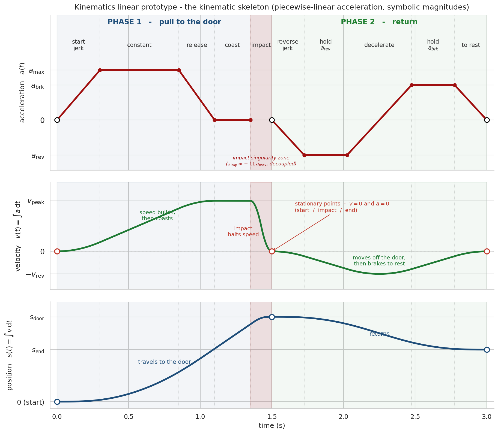

> [!IMPORTANT]
> **Dlaczego podział faz na 1,5 s faza 1 i 1,5 s faza 2?**
>
> Podział nie jest arbitralny - wynika wprost z biomechaniki i fizyki: każda
> z dwóch faz zawiera obrót o 180 stopni, którego czas biomechanika wyznacza na
> około 1,5 s (wartość ze środka pasma populacja-sportowiec), więc dwie fazy
> sumują się do budżetu 3 s (patrz niżej na ograniczenia modelu).

### Wynik

Fizyka dopuszcza taki rzut w ramach trzysekundowej choreografii. Ruch korytarzowy jest
łagodny; budżet czasu napinają obroty. Uderzenie sprzężone z modelem elementów
skończonych przewiduje 2 obrażenia pewne i 8 wysoce prawdopodobnych, w tym złamanie
tylnego żebra. Huk drzwi to głośne, metaliczne zdarzenie o poziomie 120 dB.

| Wielkość fizyczna | Bez ruchu swobodnego | Z ruchem swobodnym | Model i uwagi |
|---|---|---|---|
| Prędkość zderzenia | 2,74 m/s | 2,35 m/s | prędkość ciała w chwili kontaktu z drzwiami |
| Energia kinetyczna | 262 J | 194 J | energia dostarczona w uderzeniu |
| Popęd | 192 N s | 165 N s | całka siły uderzenia po czasie |
| Opóźnienie szczytowe | 31,9 g | 23,6 g | model kinematyczny, sztywna ściana |
| Siła uderzenia - model kinematyczny | 21,9 kN | 16,2 kN | uderzenie w sztywną ścianę, bez kompresji i plastyczności ciała; górne ograniczenie - dlatego uderzenie modelowano osobno |
| Siła uderzenia - model dynamiczny (MES) | 6,42 kN | 5,51 kN | ciało odkształcalne pochłania uderzenie; siła rzeczywista |
| Ciśnienie kontaktu | 207 kPa | 164 kPa | nacisk na powierzchni styku pleców z drzwiami |
| Liczba zaangażowanych żeber | 6,5 | 6,5 | żebra przenoszące obciążenie |
| Kompresja klatki piersiowej | 15,7 mm | 13,4 mm | ugięcie żeber, model MES |
| Siła na styku z kręgosłupem | 4,3 kN | 3,7 kN | obciążenie przekazane do kręgosłupa |
| Huk drzwi | 120,2 dB SPL (107,5 dBA) | 118,7 dB SPL (105,4 dBA) | przy mikrofonie 1 m |
| Uderzenie ciała | 99,9 dB SPL (80,0 dBA) | 98,0 dB SPL (82,3 dBA) | przy mikrofonie 1 m |

## Metodologia

Tok postępowania, krok po kroku:

1. **Zdarzenie jako sekwencja faz** - zamodelować ruch podejściem dolnego ograniczenia:
   odtworzyć najłagodniejszą choreografię zgodną z geometrią i czasem; każdy rzeczywisty
   przebieg dokłada wyłącznie więcej wymagań kinetycznych, coraz trudniejszych do
   zrealizowania w zakładanym czasie i geometrii.
2. **Prototyp liniowy** - ułożyć choreografię jako prosty problem kinematyczny wzdłuż
   łuku korytarza; uderzenie pozostawić jako osobliwość, rozwiązaną osobno.
3. **Wygładzanie** - wygładzić prototyp splajnem drugiego rzędu; punkty krytyczne
   (start, granica faz, środek obrotu, zetknięcie z drzwiami) zakotwiczyć w literaturze
   i fizyce, nie dobierać dla wygody.
4. **Ocena ograniczeń** - ograniczenia modelu (w ujęciu matematycznym: warunki
   brzegowe) pochodzą z dwóch źródeł - z literatury biomechanicznej oraz z twardych
   ograniczeń samej geometrii korytarza i czasu trwania zdarzenia. Z literatury wynikają
   limity ruchu: przyspieszenie ≤ 5,5 m/s^2 (wartość typowa 3,0), zryw ≤ 50 m/s^3,
   a czas drugiej fazy - z obrotu o 180 stopni: prace Hodgson 2008 i Crenshaw 2006
   plasują taki obrót powyżej tempa populacji ogólnej, lecz poniżej możliwości
   sportowca, więc model przyjmuje wartość ze środka tego pasma. Geometria korytarza
   i całkowity czas 3 s są natomiast sztywnymi warunkami brzegowymi, których żaden ruch
   przekroczyć nie może.
5. **Optymalizacja QP** - rozwiązać ponownie jako gładkie zadanie optymalizacji
   kwadratowej; minimalizować zryw, zmieścić choreografię w 3 s.
6. **Wielkości ruchu** - obliczyć siły, prędkości, ciśnienia i przyspieszenia;
   wykreślić krzywe kinematyczne.
7. **Model uderzenia** - przekazać kinematykę na wejście; osobliwość rozwiązać modelem
   skupionym o pięciu stopniach swobody (łańcuch mas, sprężyn i tłumików w stylu
   Lobdella), całkowanym jako układ równań różniczkowych w czasie, o właściwościach
   przypisanych z literatury.
8. **Katalog obrażeń** - przytoczyć dane referencyjne katalogu obrażeń: 30 typów
   obrażeń tylnej części klatki piersiowej, ich stopnie ciężkości w skali AIS oraz progi
   (zadane wartości brzegowe onsetu); skonfrontować te progi z wynikami analizy
   biomechanicznej uderzenia i na tej podstawie sklasyfikować każde obrażenie.
9. **Analiza akustyczna - uderzenie ciała** - metodą elementów skończonych (FEM;
   siatka obiektu, równania dynamiki rozwiązywane w jej obrębie i w czasie) zamodelować
   dźwięk uderzenia ciała w sztywną ścianę, aby wyizolować składową akustyczną
   pochodzącą z samej deformacji ciała i jego oddziaływania na powierzchnię przeszkody.
10. **Analiza akustyczna - drzwi** - tą samą metodą wyznaczyć odpowiedź akustyczną
   skrzydła drzwi ZREMB oraz jego wnęki powietrznej na uderzenie; policzyć profil huku
   drzwi.

Ograniczenie czasu drugiej fazy - obrót o 180 stopni - jest punktem nośnym: dwa obroty
zużywają większość budżetu 3 s, a translacja musi zmieścić się w pozostałym czasie.

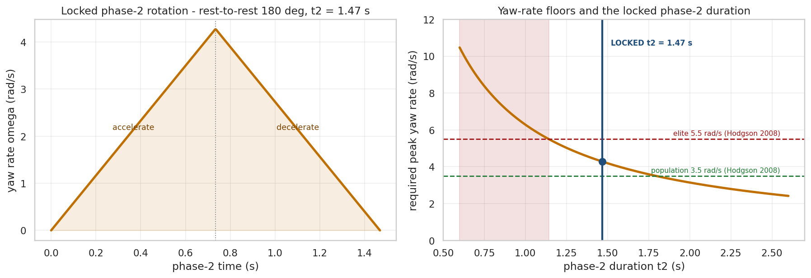

## Ograniczenia

Ograniczenia modelu - jego warunki brzegowe - ustalono z trzech źródeł: pomiaru
geometrii miejsca zdarzenia, zeznań świadków oraz literatury biomechanicznej. Geometria
korytarza i drzwi pochodzi z bezpośredniego pomiaru. Strukturę zdarzenia w czasie -
całkowity czas około 3 s, podział na fazy oraz sekwencję pociągnięcia, rzutu i obrotów -
odtworzono z zeznań Victorii i Cecilii. Zeznania Andrew świadomie pominięto: jako strona
oskarżona są z założenia obciążone stronniczością. Limity ruchu - dopuszczalne
przyspieszenie, zryw i czas obrotu - pochodzą z literatury wydolności człowieka.

| Ograniczenie | Wartość / zakres | Pochodzenie | Odniesienie |
|---|---|---|---|
| Długość łuku korytarza | 2,0 m | pomiar geometrii | - |
| Przesunięcie boczne | 0,25 m | pomiar geometrii | - |
| Translacja powrotna | 0,5 m | pomiar geometrii | - |
| Całkowity czas zdarzenia | 3,0 s | zeznania Victorii i Cecilii | - |
| Liczba i czas faz | 2 fazy po 1,5 s | zeznania świadków, geometria | - |
| Obrót na fazę | 180° (3,14 rad) | zeznania świadków (sekwencja pociągnięcie-rzut-obrót) | - |
| Masa ciała | 70 kg | dane antropometryczne Victorii | - |
| Moment bezwładności (oś pionowa) | 1,4 kg m^2 | dane segmentów ciała | de Leva 1996, Plagenhoef i in. 1983 |
| Grubość ciała | 0,28 m | dane antropometryczne | Plagenhoef i in. 1983 |
| Droga wyhamowania ciała (model kinematyczny) | 3 cm (zakres 2-5 cm) | założenie korzystne - częściowa deformacja tkanek i ruch drzwi | - |
| Podatność ciała przy uderzeniu | łańcuch 5 stopni swobody, sztywności interfejsów 200-800 N/mm, kontakt Hertza-Hunta-Crossleya | literatura biomechaniczna | Lobdell 1973, Stalnaker 1973 |
| Dopuszczalne przyspieszenie | ≤ 5,5 m/s^2 (typowo 3,0) | wydolność człowieka | Chaffin i Andersson 1991, Mero i in. 1992, Daams 1994 |
| Dopuszczalny zryw | ≤ 50 m/s^3 | tempo narastania siły mięśni | Aagaard i in. 2002, Maffiuletti i in. 2016 |
| Czas obrotu o 180° (faza 2) | ze środka pasma populacja-sportowiec | obrót w miejscu | Hodgson i in. 2008, Crenshaw i in. 2006 |

Wartości geometryczne i czasowe są twardymi warunkami brzegowymi, których model
przekroczyć nie może; limity ruchu z literatury wyznaczają pasmo fizjologicznie
osiągalne, wewnątrz którego model szuka najłagodniejszej choreografii.

## Kinematyka

Optymalizacja QP daje dwa rozwiązania graniczne tworzące obwiednię - przebieg
korytarzowy to pasmo, nie pojedyncza krzywa. Translacja wzdłuż korytarza jest łagodna
(0,21 g); wymagającą częścią jest oś czasowa obrotów. Obwiednia rzutu na sztywną ścianę
(energia, popęd, opóźnienie, siła 16,2-21,9 kN) to górne ograniczenie samej kinematyki;
siła rzeczywista, znacznie niższa, wynika z modelu odkształcalnego ciała.

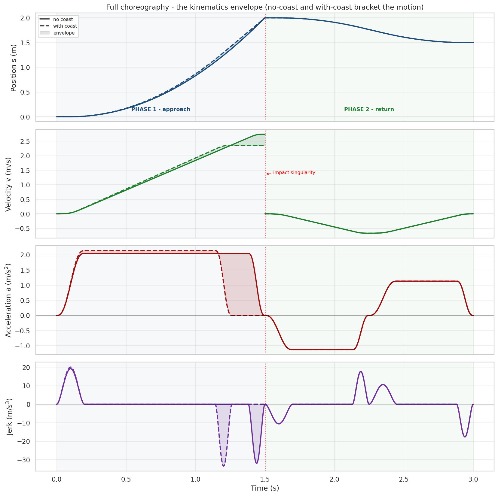

## Dynamika uderzenia

Uderzenie rozwiązano łańcuchem tylnej części klatki piersiowej o pięciu stopniach
swobody (skóra, łopatka, żebra, narządy, kręgosłup) w stylu Lobdella (Lobdell 1973),
z masami segmentów według de Leva 1996 i kontaktem Hertza z tłumieniem Hunta-Crossleya
na styku skóra-drzwi.

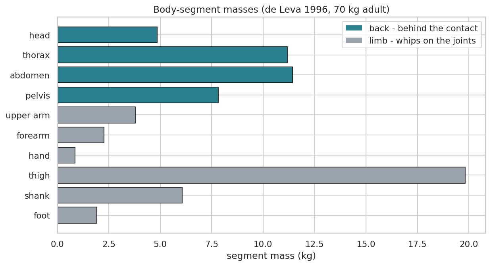

Powierzchnia kontaktu narasta w trakcie uderzenia - od łopatek, przez środkowe żebra,
po dolną część klatki - co wyznacza nacisk i liczbę obciążonych żeber.

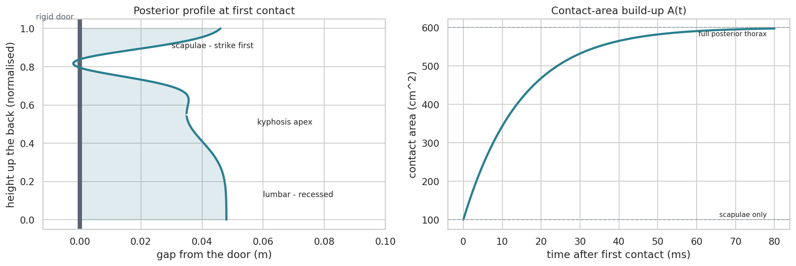

Siła sprzężona z modelem elementów skończonych (5,5-6,4 kN) jest znacznie niższa niż
obwiednia sztywnej ściany (16-22 kN), ponieważ odkształcalne ciało pochłania uderzenie
(Kroell 1971, Cavanaugh 1990).

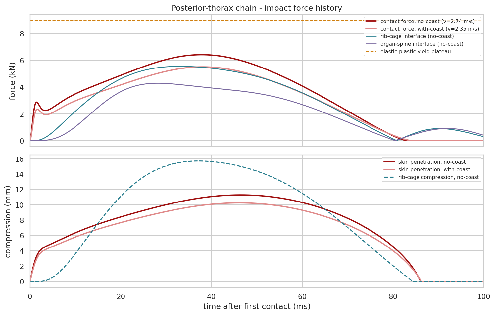

Model rozwiązano dla obu wariantów obwiedni kinematycznej - szybszego (bez ruchu
swobodnego) i wolniejszego (z ruchem swobodnym):

| Metryka uderzenia | Bez ruchu swobodnego | Z ruchem swobodnym | Co to oznacza |
|---|---|---|---|
| Prędkość zderzenia | 2,74 m/s | 2,35 m/s | prędkość ciała w chwili kontaktu |
| Energia kinetyczna | 262 J | 194 J | energia dostarczona w uderzeniu |
| Siła szczytowa kontaktu | 6,42 kN | 5,51 kN | maksymalny nacisk pleców na drzwi |
| Ciśnienie szczytowe | 207 kPa | 164 kPa | nacisk na jednostkę powierzchni styku |
| Liczba zaangażowanych żeber | 6,5 | 6,5 | żebra przenoszące obciążenie |
| Kompresja klatki piersiowej | 15,7 mm | 13,4 mm | ugięcie żeber |
| Siła na styku z kręgosłupem | 4,3 kN | 3,7 kN | obciążenie przekazane do kręgosłupa |

Siła szczytowa kontaktu jest wynikiem modelu odkształcalnego i uwzględnia kilka
czynników. Efektywną masę uderzającą ograniczono do tułowia - kończyny, sczepione
jedynie w stawach, w ciągu kilkudziesięciu milisekund uderzenia nie wnoszą istotnego
wkładu; jest to założenie korzystne dla wersji oskarżenia, gdyż obniża działające siły.
Model uwzględnia również kompresję ciała: skóra, mięśnie, klatka piersiowa i sprężysty
łańcuch kręgosłupa rozciągają kontakt w czasie, więc siła szczytowa jest jedynie
ułamkiem tej z kolizji sztywnej. Samą podatność ciała opisuje model Lobdella - łańcuch
mas, sprężyn i tłumików o sztywnościach przypisanych z literatury.

## Przewidywane obrażenia

Predykcję obrażeń przeprowadzono dla **obu scenariuszy** z obwiedni kinematycznej -
wariantu cięższego (bez ruchu swobodnego) i lżejszego (z ruchem swobodnym). Każdy
scenariusz zadaje trzy metryki napędzające przewidywanie:

| Scenariusz | Prędkość zderzenia | Energia | Siła szczytowa | Ciśnienie szczytowe |
|---|---|---|---|---|
| Bez ruchu swobodnego (cięższy) | 2,74 m/s | 262 J | 6,42 kN | 207 kPa |
| Z ruchem swobodnym (lżejszy) | 2,35 m/s | 194 J | 5,51 kN | 164 kPa |

Próg każdego z 30 obrażeń - wartość literaturowa skorygowana demograficznie dla
Victorii (kobieta, 38 lat) współczynnikiem tolerancji tkanki - porównywany jest
z metryką uderzenia w odpowiadającej mu jednostce.

**Oba scenariusze dają tę samą
klasyfikację** - oceny prawdopodobieństwa w katalogu są skalibrowane dla całej
obwiedni, a różnica między wariantem cięższym a lżejszym nie przesuwa żadnego obrażenia
do innego poziomu prawdopodobieństwa. AIS to skala ciężkości obrażeń (1 lekkie,
6 krytyczne).

Katalog obrażeń odczytano dla konkretnej osoby - Victorii, kobiety w wieku 38 lat. Progi
obrażeń różnicowane są płcią i wiekiem: tolerancja kości maleje z wiekiem, a żebra kobiet
pękają przy nieco niższej sile ze względu na geometrię - cieńszy przekrój - nie zaś
słabszy materiał kostny. **W obrębie obwiedni policzonej kinematyki i biomechaniki
przewidywane obrażenia nie różnią się między płciami** - dla 38-letniej osoby zarówno
wariant żeński, jak i męski pozostają w tych samych poziomach prawdopodobieństwa. Wiek
38 lat obniża tolerancję kości o około 13% względem młodego dorosłego; nie przesuwa to
jeszcze żadnego obrażenia do wyższego poziomu, lecz mieści się blisko progu przesunięcia
- osoba o dekadę starsza zaczęłaby przesuwać klasyfikację obrażeń kostnych ku wyższemu
prawdopodobieństwu.

<b>Pewne (2)</b>

| Obrażenie | AIS | Próg (kobieta, 38 lat) |
|---|---|---|
| Stłuczenie skóry i tkanki miękkiej | 1 | 48,6 kPa |
| Głębokie stłuczenie mięśni przykręgosłupowych | 1 | 1,63 kN |

<b>Wysoce prawdopodobne (8)</b>

| Obrażenie | AIS | Próg (kobieta, 38 lat) |
|---|---|---|
| Otarcie naskórka | 1 | 58,3 kPa |
| Krwiak tkanki miękkiej | 1 | 87,4 kPa |
| Stłuczenie łopatki (okostnej) | 1 | 77,7 kPa |
| Złamanie tylnego żebra (pojedyncze) | 2 | 52 J |
| Skręcenie stawu żebrowo-kręgowego | 1 | 1,42 kN |
| Naderwanie mięśni międzyżebrowych | 2 | 2,11 kN |
| Oddzielenie żebrowo-chrzęstne | 2 | 2,33 kN |
| Hiperekstensja szyi (smaganie) | 1 | 38 J |

<b>Umiarkowanie prawdopodobne (8)</b>

| Obrażenie | AIS | Próg (kobieta, 38 lat) |
|---|---|---|
| Złamanie wielu żeber (dwa lub więcej) | 3 | 2,96 kN |
| Złamanie wyrostka kolczystego lub poprzecznego | 2 | 2,61 kN |
| Złamanie kompresyjne kręgu (T1-T8) | 2 | 2,96 kN |
| Stłuczenie płuca | 3 | 3,35 kN |
| Uszkodzenie krążka międzykręgowego | 2 | 3,55 kN |
| Zerwanie więzadła międzykolczystego | 2 | 3,32 kN |
| Uszkodzenie stawu międzywyrostkowego | 2 | 3,04 kN |
| Uszkodzenie (rozerwanie) tkanki płuca | 4 | 3,94 kN |

<b>Niskie prawdopodobieństwo (9)</b>

| Obrażenie | AIS | Próg (kobieta, 38 lat) |
|---|---|---|
| Klatka cepowata (trzy żebra lub więcej) | 4 | 4,79 kN |
| Odma lub krwiak opłucnej | 3 | 4,43 kN |
| Złamanie wybuchowe kręgu | 3 | 5,22 kN |
| Uszkodzenie rdzenia kręgowego | 4 | 6,34 kN |
| Zwichnięcie stawu żebrowo-kręgowego | 2 | 4,74 kN |
| Stłuczenie serca | 3 | 5,91 kN |
| Naderwanie mięśnia czworobocznego lub równoległobocznego | 2 | 4,81 kN |
| Krwiak podłopatkowy | 2 | 4,86 kN |
| Krwiak nadtwardówkowy kręgosłupa | 3 | 5,86 kN |

<b>Niemożliwe (3)</b>

| Obrażenie | AIS | Próg (kobieta, 38 lat) |
|---|---|---|
| Złamanie łopatki | 2 | 13,05 kN |
| Rozerwanie aorty | 5 | 4881 J |
| Złamanie-zwichnięcie kręgosłupa (niestabilne) | 4 | 10,44 kN |

## Akustyka

Zdarzenie generuje dwa rozdzielne dźwięki: głuchy odgłos uderzenia ciała i metaliczny
huk drzwi. Dźwięk ciała wyizolowano, modelując uderzenie w sztywną ścianę - tors to
odkształcalna siatka elementów skończonych, ciało jest ruchomą granicą, promieniuje
tylko wypchnięte powietrze.

Huk drzwi policzono modelem drzwi windy ZREMB DT37/1 - spawanej skrzyni stalowej z dwóch
blach na ramie obwodowej, z oknem ze szkła zbrojonego, utwierdzonej na ramie -
napędzanym rzeczywistą siłą kontaktu z modelu dynamiki uderzenia.

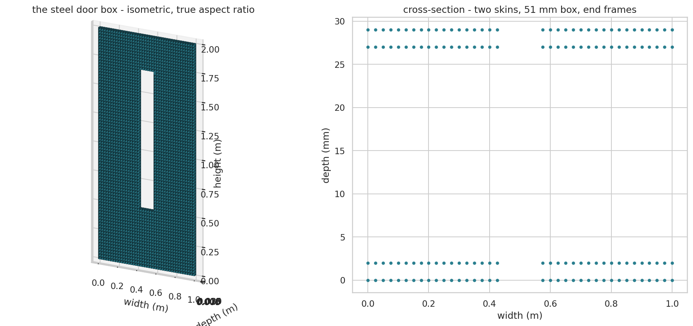

Sylwetka ciała rzutowana na drzwi pokazuje punkt uderzenia - miejsce, w którym plecy
trafiają w skrzydło.

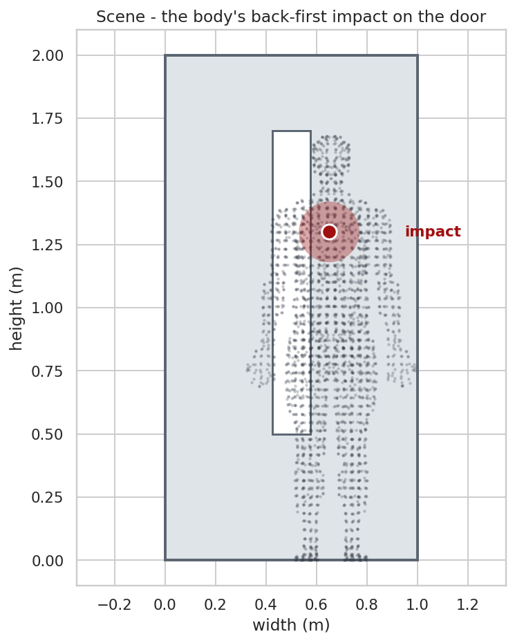

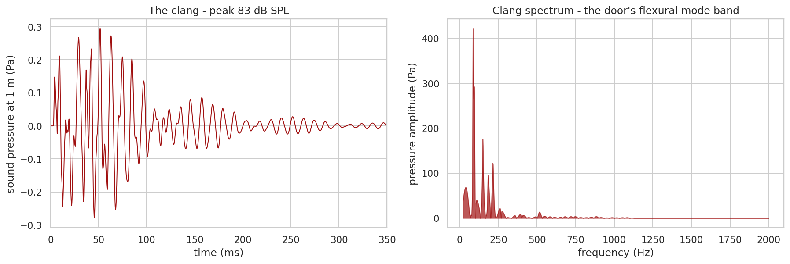

Uderzenie ciała daje niski, głuchy odgłos (pasmo modów 18-36 Hz), a huk drzwi jest
jasny i metaliczny (146-1381 Hz). Notatniki 03 i 04 liczą oba dźwięki dla obu wariantów
obwiedni kinematycznej - bez ruchu swobodnego i z ruchem swobodnym:

| Dźwięk | Bez ruchu swobodnego | Z ruchem swobodnym |
|---|---|---|
| Uderzenie ciała | 99,9 dB SPL (80,0 dBA) | 98,0 dB SPL (82,3 dBA) |
| Huk drzwi | 120,2 dB SPL (107,5 dBA) | 118,7 dB SPL (105,4 dBA) |

Oba dźwięki nakładają się w czasie, lecz zajmują różne pasma, więc są fizycznie
rozdzielne.

Dla porównania - typowe poziomy głośności, pomocne w usytuowaniu powyższych wartości
przez czytelnika nietechnicznego:

| Poziom (dB SPL) | Źródło odniesienia |
|---|---|
| 60 | zwykła rozmowa |
| 80 | ruchliwa ulica, odkurzacz |
| 100 | młot pneumatyczny słyszany z kilku metrów |
| 110 | piła łańcuchowa, koncert rockowy |
| 120 | silnik odrzutowy z oddali, próg bólu |

Uderzenie ciała (98-100 dB SPL) odpowiada zatem młotowi pneumatycznemu słyszanemu
z kilku metrów, a huk drzwi (119-120 dB SPL) sięga progu bólu - poziomu zbliżonego do
silnika odrzutowego słyszanego z pewnej odległości.

## Wnioski

Fizyka dopuszcza kwestionowany rzut w ramach trzysekundowej choreografii dolnego
ograniczenia: ruch wzdłuż korytarza jest łagodny (0,21 g), a budżet czasu napinają
obroty.

Model przewiduje jednak - przy założeniu takiego rzutu - określony zestaw
obrażeń oraz profil akustyczny. Poniższe tabele zestawiają te przewidywania z obrazem
udokumentowanym w badaniu lekarskim i z relacjami świadków. Ponieważ model odtwarza
najłagodniejszy fizycznie możliwy przebieg, rzeczywisty, gwałtowniejszy rzut
przewidywałby następstwa cięższe, nie łagodniejsze.

<b>Pewne (4)</b>

| Przewidywane następstwo | Obserwacja / relacja | Zgodność |
|---|---|---|
| Stłuczenie skóry tylnej ściany klatki piersiowej | udokumentowano zasinienie skóry prawego barku, ok. 12×6 cm, z obrzękiem | zgodne |
| Głębokie stłuczenie mięśni przykręgosłupowych | nie udokumentowano | możliwe (brak potwierdzenia) |

Profil akustyczny zaliczono do następstw pewnych - powstanie dźwięku jest
nieuniknioną fizyczną konsekwencją uderzenia i zachodzi w każdym możliwym
scenariuszu.

| Przewidywane następstwo | Obserwacja / relacja | Zgodność |
|---|---|---|
| Uderzenie ciała - głuchy huk 98-100 dB SPL | dwa niezależne nagrania zdarzenia nie zawierają takiego dźwięku; relacje świadków go nie wspominają | brak |
| Huk drzwi - metaliczny huk 119-120 dB SPL | dwa niezależne nagrania zdarzenia nie zawierają takiego dźwięku; relacje świadków go nie wspominają | brak |

<b>Wysoce prawdopodobne (8)</b>

| Przewidywane następstwo | Obserwacja / relacja | Zgodność |
|---|---|---|
| Otarcie naskórka | nie udokumentowano | możliwe (brak potwierdzenia) |
| Krwiak tkanki miękkiej | udokumentowano obrzęk barku; nie udokumentowano krwiaka | możliwe (brak potwierdzenia) |
| Stłuczenie łopatki (okostnej) | udokumentowano zasinienie prawego barku ok. 12×6 cm z obrzękiem | możliwe (brak potwierdzenia) |
| Złamanie tylnego żebra (pojedyncze) | nie udokumentowano | brak |
| Skręcenie stawu żebrowo-kręgowego | nie udokumentowano | brak |
| Naderwanie mięśni międzyżebrowych | nie udokumentowano | brak |
| Oddzielenie żebrowo-chrzęstne | nie udokumentowano | brak |
| Hiperekstensja szyi (smaganie) | rotacja i zgięcie szyi pełne, z niewielką bolesnością odcinka szyjnego - objaw niespecyficzny | możliwe (brak potwierdzenia) |

<b>Umiarkowanie prawdopodobne (8)</b>

| Przewidywane następstwo | Obserwacja / relacja | Zgodność |
|---|---|---|
| Złamanie wielu żeber | nie udokumentowano | brak |
| Złamanie wyrostka kolczystego lub poprzecznego | nie udokumentowano | brak |
| Złamanie kompresyjne kręgu (T1-T8) | nie udokumentowano | brak |
| Stłuczenie płuca | nie udokumentowano | brak |
| Uszkodzenie krążka międzykręgowego | nie udokumentowano | brak |
| Zerwanie więzadła międzykolczystego | nie udokumentowano | brak |
| Uszkodzenie stawu międzywyrostkowego | nie udokumentowano | brak |
| Uszkodzenie (rozerwanie) tkanki płuca | nie udokumentowano | brak |

Legenda zgodności: zgodne - przewidywanie potwierdzone w obserwacji; możliwe (brak potwierdzenia) - następstwo prawdopodobne, lecz nie potwierdzone w dostępnej dokumentacji; brak - przewidywanego następstwa nie odnotowano.

Pozostałych przewidywanych obrażeń nie zidentyfikowano w badaniu lekarskim ani
nie zgłosiła ich Victoria w swoich zeznaniach. Udokumentowane następstwa -
pojedyncze zasinienie barku, RTG barku bez zmian kostnych i pełna ruchomość
szyi z niewielką bolesnością - oraz brak metalicznego huku w nagraniach nie
odtwarzają zespołu następstw, jaki model przewiduje dla gwałtownego rzutu
plecami w drzwi windy.

## Odniesienia

### Mechanika kontaktu

- Hertz 1882 - nieliniowa sztywność kontaktu Hertza
- Hunt i Crossley 1975 - tłumienie kontaktu zależne od prędkości

### Optymalizacja trajektorii

- Flash i Hogan 1985 - model minimalnego zrywu ruchu człowieka (cel optymalizacji)
- Boyd i Vandenberghe 2004 - sformułowanie i rozwiązanie zadania programowania kwadratowego

### Model ciała i biomechanika uderzenia

- de Leva 1996 - bezwładność segmentów ciała
- Plagenhoef i in. 1983 - dane anatomiczne segmentów ciała
- Lobdell 1973 - odpowiedź uderzeniowa klatki piersiowej (łańcuch 5 stopni swobody)
- Kroell, Schneider i Nahum 1971 - korytarze siła-ugięcie klatki piersiowej
- Stalnaker i in. 1973 - tolerancja klatki, skalowanie napięcia mięśni
- Viano 1989 - progi obrażeń klatki piersiowej w skali AIS
- Cavanaugh i in. 1990 - próg ugięcia klatki AIS 3+
- Kemper i in. 2014 - tolerancja tylnej części tułowia

### Literatura wydolności człowieka (ograniczenia choreografii)

- Daams 1994 - siły wywierane przez człowieka
- Mital i Kumar 1995 - siła mięśniowa
- Chaffin i Andersson 1991 - biomechanika zawodowa, budżety sił i przyspieszeń
- Mero, Komi i Gregor 1992 - biomechanika sprintu, przyspieszenie startowe
- di Prampero i in. 2005 - energetyka sprintu
- Cross 2004 - fizyka rzutu zamachowego
- Atwater 1979 - kinematyka rzutu zamachowego
- van den Tillaar i Ettema 2004 - wydolność rzutu
- Hodgson i in. 2008 - obrót podczas chodzenia
- Crenshaw i in. 2006 - obrót stopy przy skręcaniu
- Marteniuk i in. 1990 - kinematyka sięgania i chwytu
- Aagaard i in. 2002 - tempo narastania siły (podstawa ograniczenia zrywu)
- Maffiuletti i in. 2016 - tempo narastania siły

### Źródła kliniczne katalogu obrażeń (notatnik 02)

Progi i oceny 30 obrażeń pochodzą z literatury klinicznej i biomechanicznej: StatPearls
(Blunt Force Trauma NBK470338, haematoma NBK519551, cervical sprain NBK541016, disc
herniation NBK441822, flail chest NBK534090, pneumothorax NBK441885, traumatic spinal
cord injury NBK560721, blunt cardiac injury NBK532267, spinal epidural haematoma
NBK518982, scapula fracture NBK537312), prace przeglądowe i biomechaniczne PMC
(PMC9671306, PMC9802595, PMC9066913, PMC5175523, PMC10121455, PMC7437871, PMC10407537,
PMC3861829, PMC3705911, PMC7296362, PMC4111950, PMC4899989), Kroell 1971 i Viano 1989
(konferencje Stapp), Benedetti i in. 2000 (AJR), RadioGraphics oraz RSNA Radiology
(urazy chrząstki i klatki piersiowej), a także przeglądy urazów aorty i kręgosłupa
piersiowo-lędźwiowego.

### Wpływ płci i wieku na tolerancję obrażeń

Progi obrażeń skalowano demograficznie w oparciu o literaturę biomechaniczną. Wiek jest
czynnikiem dominującym i działa na kość - kora żebra traci około 12% odkształcenia
granicznego na dekadę (Frontiers 2021, PMC8181138). Różnica między płciami ma charakter
geometryczny, nie materiałowy: żebra kobiet są cieńsze i szybciej się ścieńczają
(Holcombe i in. 2022). Tolerancja ugięcia klatki piersiowej maleje z wiekiem
(Kent i in. 2005).

### Źródła danych

- Siatka anatomiczna BodyParts3D (FMA7163), licencja CC BY-SA 2.1 JP - siatka skóry
  torsu dla modelu elementów skończonych
- Drzwi windy ZREMB DT37/1 - specyfikacja producenta spawanego skrzydła stalowego
- Skala AIS (Abbreviated Injury Scale, AAAM) - ocena ciężkości obrażeń

## Załącznik - dokumentacja fotograficzna

Zdjęcia miejsca zdarzenia, na podstawie których odtworzono geometrię korytarza i drzwi.

| | |
|---|---|
| 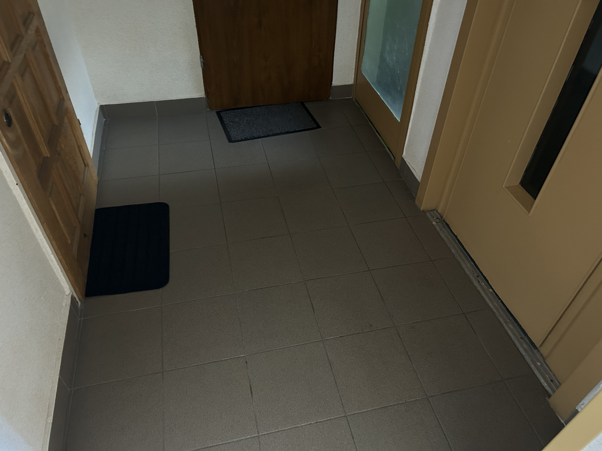 *Korytarz zdarzenia, widok wzdłuż - drzwi mieszkania (po lewej) naprzeciw drzwi windy (po prawej), szerokość korytarza około 2 m* | 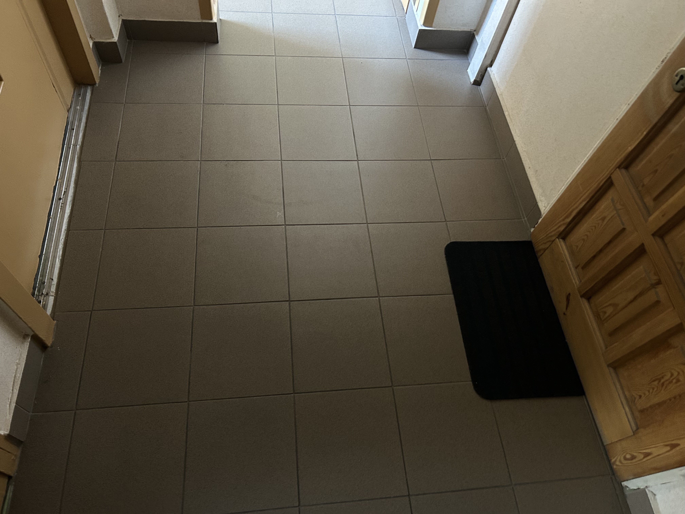 *Korytarz zdarzenia, rzut posadzki - przestrzeń między drzwiami mieszkania a drzwiami windy* |
| 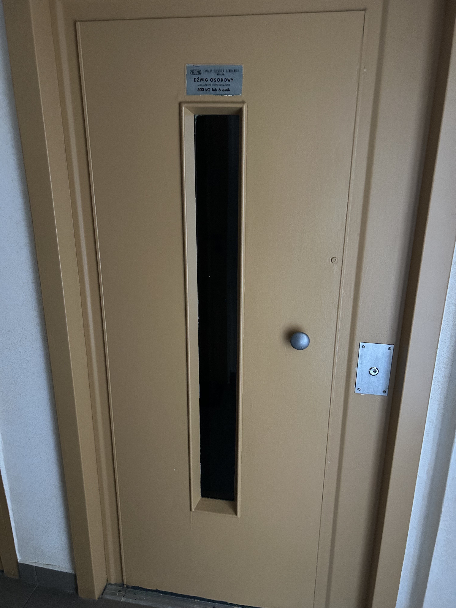 *Drzwi windy ZREMB - stalowe skrzydło z wąskim oknem ze szkła zbrojonego i tabliczką znamionową dźwigu osobowego (500 kg / 6 osób)* | 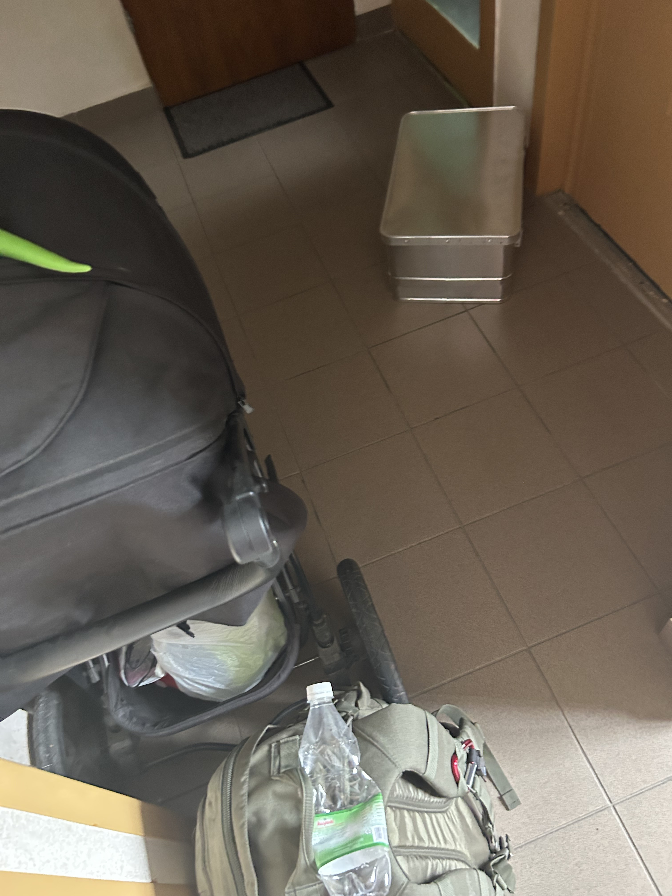 *Korytarz z przedmiotami - wózek dziecięcy, plecak i metalowa walizka przy drzwiach windy* |
