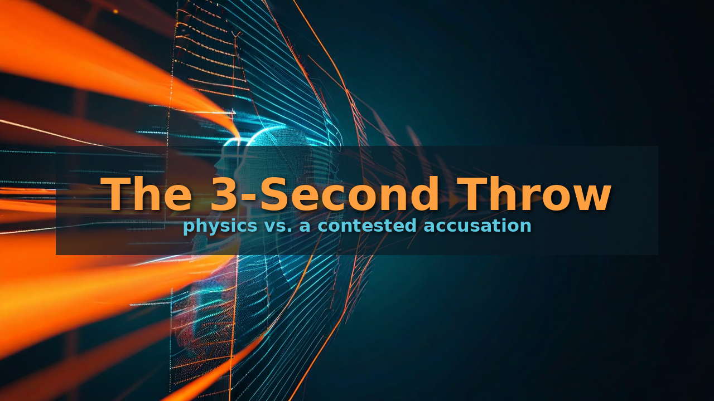
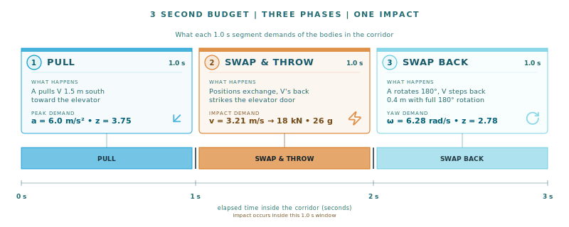
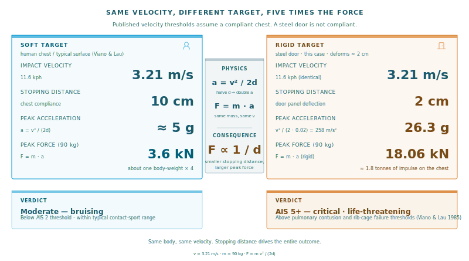
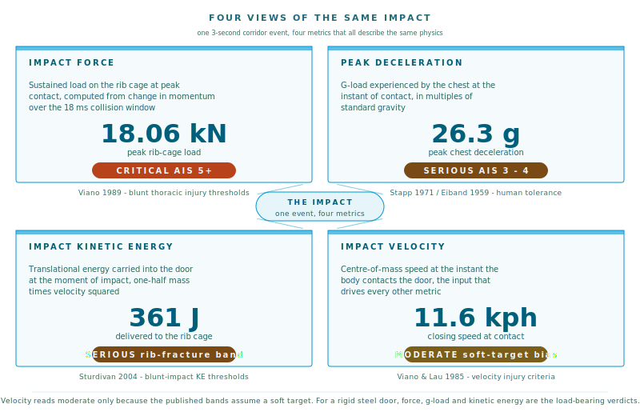
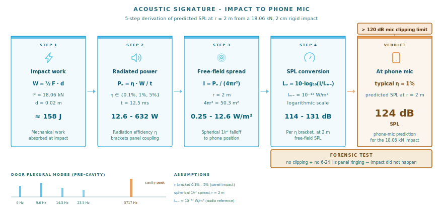
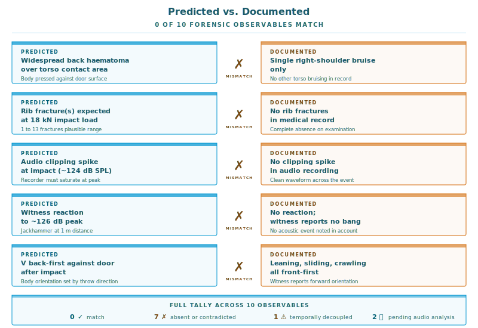

# The 3-Second Throw That Couldn't Happen

*How I used physics, PyBullet, and a hollow steel door to test a contested accusation against the laws of motion.*

---

## When the laws of physics become your defence

Most people who get falsely accused of something call a lawyer. I started a Python project.

The accusation was specific. **Three seconds in a corridor.** I was supposed to have pulled the alleged victim back, swapped places with her, thrown her back-first into the elevator door, and swapped places again. All of this in front of a third party - a court-appointed social curator - who, by her own testimony, had her back turned at the precise moment of the alleged impact.

Three seconds. Two doors, two metres apart. A 70 kg adult moving as a rigid object. A 90 kg actor doing the moving.

I am not a lawyer. I am the kind of person who reaches for `scipy.stats` and `compute_impact()` when faced with an emotional problem. So I built [henryk-simulations](https://github.com/stellarshenson/henryk-simulations).

This article walks through the deconstruction. The headline finding: at the most charitable possible interpretation of the accusation, the impact would have delivered **18 kilonewtons of peak force**, **26 g of deceleration**, and a peak sound pressure level of **124 dB** at the phone microphone that was recording the entire visit. The medical examination afterwards documented one bruise on the right shoulder. The recording contains neither a clipping spike nor any panel-ringing acoustic signature. The third-party witness reports no loud noise of any kind.

You can decide for yourself what that means.

---

## The setup

The corridor is two metres wide from the apartment door (north wall) to the elevator door (south wall). The elevator door is a standard hollow steel design: two 2 mm plates with a 3 cm air gap, plus a small glass window. The apartment door is about 1 m wide and opens into the corridor.

I stood with my back pressed flat against the elevator door (maximum retreat - I had been asked to step aside). The alleged victim stood at the apartment door. The third-party witness stood to the west, in the narrower entrance segment of the corridor, with a clear line of sight.

The accusation required three things to happen inside this 2 m by 3 s envelope:

1. I would pull the victim ~1.5 m south, toward the elevator door
2. I would somehow swap positions with her and throw her back-first into that door (the swap is non-trivial - we would be passing through each other or each performing a half-rotation)
3. I would swap positions again, ending up myself facing the door

The third-party witness corroborates one part of this last claim. When she turned around, the victim was indeed in front of me - but she was leaning against me **front-first**, slid down the door **front-first**, then crawled forward on all fours. The scream started at the moment the witness turned, not at the alleged moment of impact.

I'll come back to these details. First, the physics.

---

## A minimum-phase reconstruction

Another AI I was bouncing ideas off suggested a clean framing early on. Don't try to simulate what happened. Define an impossible-movement test.

The idea is this: decompose the accusation into the **smallest set of phases** that still admits the verbatim claim, and give each phase the **maximum** time the 3 s budget allows. That produces the lowest possible peak velocity, acceleration, and force any motion compatible with the accusation could have.

If that minimum is already extreme - if even the most charitable reconstruction demands superhuman acceleration or biomechanically-impossible forces - then any richer reconstruction, which would compress phases into shorter intervals, is strictly worse.

The decomposition came out to three phases of one second each:

| Phase | Duration | Translation | Rotation |
|---|---|---|---|
| pull | 1.0 s | V moves 1.5 m south | - |
| swap-throw | 1.0 s | V moves 0.22 m to door contact | 180° |
| swap-back | 1.0 s | A rotates 180°, V steps back 40 cm | 180° |

This is formally an **ELBO-style lower bound** on the required demand. The classical Evidence Lower BOund in variational inference gives a tractable surrogate that bounds an intractable target from one side. Here, $D_{\min}(q^\star)$ is the surrogate, and $D(M_\text{true}) \geq D_{\min}(q^\star)$ by construction. Plausibility goes the other way: $\mathrm{plaus}(M_\text{true}) \leq \mathrm{plaus}(M_\text{min})$. A violation at the lower bound is a violation at every richer decomposition.

That is - I am cheating on the prosecution's behalf. They get the friendliest possible reading of the accusation.

---

## The numbers

The kinematics are not subtle. With a 1.5 m translation in 1.0 s starting from rest, peak acceleration during the pull phase is 6.0 m/s² - about z = 3.75 against a recreational-sprint reference (extreme band). The 180° rotations in each of the other two phases require 6.28 rad/s of peak angular velocity - implausible against published standing-pivot rates of 3.5 ± 1.0 rad/s.

But that's the **motion** side. The interesting numbers are on the **impact** side.

The continuous-velocity model treats swap-throw as a continuation of the pull. The actor does not release the victim at the moment of door contact - they keep applying force - so the victim hits the door at her **peak velocity**, not at the velocity she had at the end of the pull. This works out to:

$$v_\text{impact} = \sqrt{v_\text{pull-end}^2 + 2 a_\text{pull} s_\text{swap}} = \sqrt{3.0^2 + 2 \cdot 3.0 \cdot 0.22} \approx 3.21 \text{ m/s}$$

That is 11.6 kph. Modest, against a typical body. But the elevator door is not a typical body. It is a rigid hollow steel panel that deforms about 2 cm before reaction. Plug in $a = v^2/(2d)$ for a 70 kg torso:

$$a_\text{impact} = \frac{3.21^2}{0.04} \approx 258 \text{ m/s}^2 \approx 26.3\,g$$

$$F_\text{impact} = m \cdot a \approx 18{,}060 \text{ N} = 18.06 \text{ kN}$$

$$KE_\text{impact} \approx 361 \text{ J}, \qquad t_\text{stop} \approx 12.5 \text{ ms}$$

Eighteen kilonewtons is the kind of load you get from a small SUV nudging a wall at ten kilometres an hour. Twenty-six g is in the race-car-crash range. The kinetic energy puts you in the "serious thoracic injury, organ contusion" band per Sturdivan 2004. The peak force is in AIS 5+ - flail chest, serious organ injury, life-threatening - per Viano 1989.

You will notice an apparent contradiction in that figure. The impact velocity (11.6 kph) reads "moderate, bruising" while the force, acceleration, and kinetic energy all read "serious" or "critical". This is not a contradiction. The published velocity bands assume a **soft target** - chest deformation of 5-10 cm against a compliant surface. A steel door is not a compliant surface. The same 11.6 kph absorbed over 2 cm rigid instead of 10 cm soft multiplies the peak force by roughly five times. The four metrics are four views of the same impact. The velocity is the cause; the force, the g, and the deposited energy are the outcomes.

---

## The forensic angle: predicted acoustics

Here is where the project goes from "biomechanics simulation" to "forensic test you can actually run".

If 70 kg of human torso slams into a 2 m × 1 m steel panel at 11.6 kph, the panel should make a noise. A predictable noise. Kirchhoff thin-plate theory gives the flexural modal frequencies of a simply supported rectangular plate:

$$f_{mn} = \frac{\pi}{2} \sqrt{\frac{D}{\sigma}} \left( \frac{m^2}{a^2} + \frac{n^2}{b^2} \right)$$

with flexural rigidity $D = Eh^3/(12(1-\nu^2))$ and areal density $\sigma = \rho h$. For a 2 m × 1 m × 2 mm steel plate, the first few modes land at **6, 9.6, 15.6, 20.4, 24, 24 Hz**. The 3 cm sealed air cavity between the two steel plates of the hollow door gives a half-wave resonance at $c/(2d) = $ **5717 Hz** - the bright "clang" you hear when something hits a hollow metal door.

That is the spectrum. The amplitude is the other half. Acoustic power $P_a = \eta W / t$, where $W$ is the impact work, $t$ is the contact time, and $\eta$ is the radiation efficiency. For a struck steel panel, $\eta$ typically falls between 0.001 (lossy mounting) and 0.05 (well-coupled). Intensity at the listener: $I = P_a / (4\pi r^2)$, and SPL: $L_p = 10\log_{10}(I/I_\text{ref})$.

Across that radiation-efficiency bracket, here is what the predicted impact should sound like:

At the phone microphone, two metres from the door: **114 to 131 dB SPL peak**. Consumer phone microphones clip at around 120 dB. The audio recording of the visit, which was running throughout, should therefore contain at least four things:

1. A clipping spike at the moment of impact
2. Sub-bass panel ringing in the 6-24 Hz band, decaying over hundreds of milliseconds
3. A bright cavity-mode resonance around 5.7 kHz
4. An audible reaction from the third-party witness - she was 1.5 m away, predicted SPL 126 dB, jackhammer-at-one-metre territory

The recording contains none of these. The witness reports no bang. By the time the scream begins, on her own testimony, she had already turned back around to look.

---

## Predicted vs. documented

Here is the side-by-side I find hardest to read with a straight face:

| Predicted observable | Documented finding |
|---|---|
| Widespread back haematoma over torso contact area | Single right-shoulder bruise only |
| Rib fracture(s), 1-13 (1.6-1.9 kN at 4.3 m/s produces 4-13 in the literature) | None |
| Costo-vertebral / costo-transverse ligament damage | None |
| Pulmonary contusion / breathing impairment (AIS 3-4) | No breathing complaint |
| Restricted thoracic mobility post-impact | Full mobility on exam |
| Collapse / inability to coordinate | Scream started when witness turned back |
| Audio clipping spike at impact moment | Absent |
| 6-24 Hz panel ringing in recording | Absent |
| Witness acoustic reaction to ~126 dB peak | No reaction; witness reports no bang |
| Victim observed back-against-door post-impact | Witness reports victim leaning **front-first** against me, sliding **front-first**, crawling forward |

Of ten predicted observables, zero match. Seven are absent or directly contradicted. One is temporally decoupled. Two are pending direct audio spectral analysis. The single right-shoulder bruise is geometrically and energetically inconsistent with a back-first whole-torso impact at 18 kN.

One more thing about that bruise. The defendant's position is that it was **self-inflicted** by the alleged victim after the visit, to seed a corroborating mark in the medical record. The defendant has chosen not to dispute the bruise's origin directly. The argument above runs on physics, not on contested medical interpretation. The mechanical impossibility of producing a single localised shoulder bruise from the alleged whole-torso back-first impact at 18 kN is enough, on its own, to falsify the verbatim claim. Newton was kind enough to do the talking.

---

## The takeaway

I am not the first person to use physics in a courtroom. Crash reconstruction is a recognised forensic discipline, and so is gunshot-residue analysis, and so is blood-pattern analysis. What is unusual here is the level the test runs at: not "did this specific impact pattern occur" but "could this story have happened at all, given Newton's second law and the geometry of a Polish elevator door".

The maths is unsubtle. There are only a few free knobs - phase durations, stopping distance, body masses. The references are published, peer-reviewed, and consistent across sources. The Kirchhoff plate equation has been solved since the 1850s. None of this is novel science.

What is novel, maybe, is that all of it now fits in a few hundred lines of Python in a repository anyone can clone. The lower-bound argument lives in `compute_scenario`. The injury threshold mapping is a dict literal. The acoustic prediction is one call to `predict_signature()` against a `DEFAULT_ELEVATOR_DOOR`. Every number in this article is reproducible by running one notebook.

There is a serious version of this story and a less serious version. The serious version is that two and a half years of contested family-court litigation can be substantially clarified, if not resolved, by twenty minutes of biomechanics. The less serious version is the README of the project, which states the same finding in the form a friend would tell you at a bar.

Both versions agree on the headline: the laws of physics would have to take an unscheduled coffee break for the events to unfold as described.

---

## Limitations

The model is honest about what it does not establish:

- Whether the alleged motion actually occurred (only kinematic feasibility under the most charitable model)
- Specific injury patterns beyond rough AIS-band mapping
- Whether the audio recording's apparent absence of an impact signature is itself confirmation, vs other explanations (compression artefacts, microphone position, ambient noise floor)
- Soft-tissue injury biomechanics in any detail
- Anything outside the physics of the alleged motion - emotional dynamics, motivations, the wider parental-alienation context that prompted the false accusation in the first place

This is just one tool in a larger picture. But it is a tool that does not lie, does not have an interest, and does not get tired.

---

## If you want to look

The repository is public at [github.com/stellarshenson/henryk-simulations](https://github.com/stellarshenson/henryk-simulations). The rendered simulation is on [YouTube](https://youtu.be/V-ooOpqg4aU). The full forensic deconstruction in long form lives in [`docs/incident_analysis.md`](https://github.com/stellarshenson/henryk-simulations/blob/main/docs/incident_analysis.md). Names of everyone involved are anonymised.

Clone it. Change the masses. Change the corridor width. Change the phase durations. See if you can find a configuration that makes the impact pattern reasonable.

I could not.

---

## Argue with me. Please.

This is a public repository, an executable notebook, and a single nested `PARAMS` dict. The whole pipeline takes about twelve seconds to re-run. If you think the physics is wrong, the methodology is wrong, the assumptions are uncharitable, or the conclusion is overstated, **break it open and tell me why**. Issues and pull requests on the repo. Alternative reconstructions, better stopping distances, different radiation efficiencies, alternative readings of the testimony - all welcome, all for the benefit of science.

If you find a configuration that makes the impact plausible **and** consistent with a single localised shoulder bruise, I owe you a coffee. If you find one that also explains the witness reporting no acoustic event at 1.5 m from a steel door, I owe you two coffees and we publish a joint follow-up.

---

*Konrad Jelen is a data scientist and CTO specialising in AI solutions for manufacturing, finance and market research, and the alienated father of his son Henry.*
