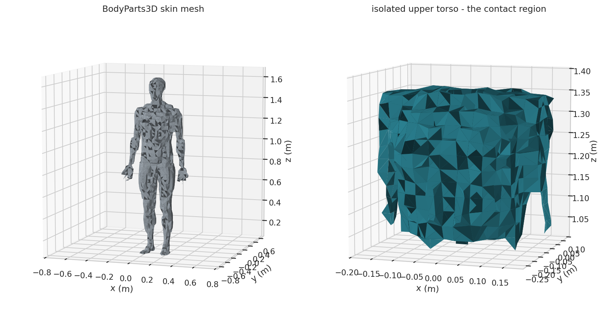

# Methodology - Corridor Throw Forensic Reconstruction

## 1. Approach

The project evaluates a contested claim - a 70 kg body thrown back-first into an
elevator door, inside a roughly 2 m corridor, over about 3 s - by reconstructing the
physics rather than the testimony. No instrumentation recorded the event, so the method
does not attempt a moment-by-moment replay. It asks a bounded question: what motion is
minimally required to fit the agreed geometry and timing, and what does that motion
mechanically imply.

The analysis rests on a lower-bound modelling philosophy. The model does not reproduce
the real choreography; it constructs the simplest, least demanding motion that still
satisfies the geometry and the time window, and treats that as a floor. Any real
sequence of pulls, turns and a throw can only add complication - extra direction
changes, extra acceleration peaks, extra energy - on top of this minimum. Solving for
the gentlest motion that fits the corridor and the 3 s window bounds what is *minimally*
possible; it is a methodological choice that keeps the reconstruction conservative.

The work is divided across four notebooks: 01 corridor kinematics, 02 impact dynamics
and the injury reference table, 03 the body-impact sound, 04 the door-clang sound. Each
notebook drives a library module and is a thin client over it.

## 2. Event model

The event is modelled as a two-phase movement sequence inside a corridor of arc length
2.0 m, completed in a total time of 3.0 s split into two phases of 1.5 s each. Each
phase contains a 180 deg (3.14 rad) rotation, a lateral offset of 0.25 m and a return
translation of 0.5 m. The moving body is parameterised as a 70 kg mass with a yaw moment
of inertia of 1.4 kg m^2 and a body thickness of 0.28 m. These are the model inputs -
the agreed geometry and the body parameters - not computed quantities.

The two phases the choreography is built from, after notebook 01:

| Phase | Duration | Modelled motion |
|---|---|---|
| Phase 1 - approach and throw | 1.5 s | the body is drawn along the 2.0 m corridor arc and turned through a 180 deg rotation, arriving back-first at the elevator door; the phase ends at the impact singularity |
| Phase 2 - departure and reposition | 1.5 s | the body moves 0.5 m back off the door and turns through a second 180 deg rotation, repositioning to face the corridor |

The choreography is reduced to a small set of structurally meaningful parameters - arc
length, phase count, rotation angle, offsets - rather than a rich free parametrisation.
This exposes the few quantities that actually drive the physics and prevents the solver
from hiding an implausible motion inside unconstrained degrees of freedom.

The terminal event - the body meeting the door - is deliberately excluded from the
kinematic model. In the prototype it is a singularity: the point where the smooth
corridor motion ends. The impact is not solved there; it is handed to the dynamics model
of notebook 02, which replaces the singularity with a deformable human mesh.

## 3. Constraints

The model's constraints - its boundary conditions - are drawn from three sources:
direct measurement of the incident geometry, witness testimony, and the biomechanics
literature. The corridor and door geometry comes from measurement. The event's
structure in time - the roughly 3 s total, the phase split, the sequence of pull, throw
and rotations - is reconstructed from the testimony of Victoria and Cecilia. Andrew's
testimony is deliberately excluded: as the accused party it is inherently biased. The
motion limits - permissible acceleration, jerk and turn duration - come from the
human-performance literature.

| Constraint | Value / range | Origin | Reference |
|---|---|---|---|
| Corridor arc length | 2.0 m | geometry measurement | - |
| Lateral offset | 0.25 m | geometry measurement | - |
| Return translation | 0.5 m | geometry measurement | - |
| Total event time | 3.0 s | testimony of Victoria and Cecilia | - |
| Phase count and duration | 2 phases of 1.5 s | witness testimony, geometry | - |
| Rotation per phase | 180 deg (3.14 rad) | witness testimony (pull-throw-turn sequence) | - |
| Body mass | 70 kg | anthropometric data for Victoria | - |
| Yaw moment of inertia | 1.4 kg m^2 | body-segment data | de Leva 1996, Plagenhoef 1983 |
| Body thickness | 0.28 m | anthropometric data | Plagenhoef 1983 |
| Braking distance (kinematic model) | 3 cm (range 2-5 cm) | charitable assumption - partial tissue and door deformation | - |
| Body compliance at impact | 5-DOF chain, interface stiffnesses 200-800 N/mm, Hertzian Hunt-Crossley contact | biomechanics literature | Lobdell 1973, Stalnaker 1973 |
| Permissible acceleration | <= 5.5 m/s^2 (typical 3.0) | human-performance literature | Chaffin & Andersson 1991, Mero 1992, Daams 1994 |
| Permissible jerk | <= 50 m/s^3 | rate of force development | Aagaard 2002, Maffiuletti 2016 |
| Phase-2 180 deg turn duration | mid-range of the population-athlete band | turn in place | Hodgson 2008, Crenshaw 2006 |

The geometric and temporal values are hard boundary conditions the model cannot
exceed; the motion limits from the literature define the physiologically attainable
band within which the model seeks the gentlest choreography.

## 4. Linear prototype

The first model is a linear reference prototype: the choreography laid out as a
straight-line kinematic problem - position, velocity and acceleration along the corridor
arc - with the impact left as the singularity. The prototype establishes the skeleton
that the smooth optimisation later refines.

The prototype motion is built by second-order spline smoothing. Critical points - the
start, the phase boundary, the rotation midpoints, the approach to the door - are pinned
by literature and by physics rather than chosen for convenience. Acceleration is
constrained under a ceiling of 5.5 m/s^2 with a typical working value of 3.0 m/s^2;
jerk is capped at 50 m/s^3. The optimisation target is to minimise jerk while fitting
the whole choreography inside the 3.0 s window - the smoothest motion the constraints
allow, which is also the least demanding, consistent with the lower-bound approach.
The acceleration, force and jerk ceilings, and the timing of the sub-movements the
choreography is built from - the reach and pull, the turn, the throw - are each bounded
by the human-performance literature listed in the references.

The duration of the second phase is not a free parameter. It is derived from the time a
person needs to execute a 180 deg turn in place. The literature on turning while walking
(Hodgson 2008) and on foot rotation during turning (Crenshaw 2006) places a deliberate
half-turn above the comfortable pace of the general population but below trained-athlete
capability; the model takes a mid-range value from that band, so the phase is neither
implausibly fast nor padded.

## 5. QP smooth optimisation

With the prototype skeleton fixed, the choreography is re-solved as a smooth optimisation
problem. The motion is expressed as a quadratic-programming (QP) problem: a quadratic
cost in jerk, minimised subject to linear constraints on position, velocity and
acceleration at the critical points and along the path. The QP re-solve turns the
piecewise prototype into a continuous, dynamically consistent trajectory and yields the
velocities, accelerations, jerks and contact pressures the motion requires. The
minimum-jerk objective follows the established minimum-jerk model of voluntary human
movement (Flash & Hogan 1985); the quadratic-programming formulation and its solution
follow standard convex-optimisation method (Boyd & Vandenberghe 2004).

The QP returns two bracketing solutions rather than a single answer, because the
choreography is slightly under-determined and a degenerate family of solutions is an
honest outcome: a no-coast solution, the faster bound, in which the body is always
accelerating or decelerating, and a with-coast solution, the slower bound, which inserts
a constant-velocity coast segment. The two together define the kinematics envelope - the
corridor motion is treated as a band, not a single curve.

The kinematics model also characterises the impact singularity as a rigid-wall envelope:
the kinetic energy, impulse, peak deceleration and rigid-wall contact force the body
would develop against a perfectly rigid wall. This rigid-wall figure is an upper bound
only - it assumes no deformation anywhere - and is passed to the deformable-body model
of notebook 02, which computes the realistic contact force.

## 6. Impact physics

Notebook 02 resolves the impact singularity. It takes the kinematics envelope as input -
the closing speed and the effective impacting mass - and computes what happens when a
deformable body, not a point mass, meets the door.

The body is represented by a 5-DOF Lobdell-style posterior-thorax chain (Lobdell 1973):
five lumped elements - skin, scapula, ribcage, organ mass, spine - connected by springs
and dampers, each tuned to the mechanical response measured in cadaver chest-impact
studies. Body-segment masses and inertias are assigned from de Leva 1996, so the
effective mass that participates in the back-first contact is anatomically grounded
rather than the full body mass. The skin-to-door interface is a Hertzian contact with
Hunt-Crossley damping - a non-linear contact stiffness that rises as the contact patch
grows, with a velocity-dependent damping term that dissipates the impact energy without
the artefacts of a linear dashpot (Hertz 1882; Hunt & Crossley 1975).

The contact patch builds up over the impact rather than appearing instantly: as the back
compresses against the door, more of the posterior thorax engages, and the model tracks
how the contact area and the number of loaded ribs grow through the event.

The chain is integrated as an ordinary differential equation over the impact window. The
model reports the contact-force history, the peak contact force and contact pressure,
the number of ribs engaged, the per-rib force, the rib-cage compression, the
spinal-interface force and the delivered kinetic energy. These metrics are the input to
the injury reference table.

## 7. Injury reference table

The impact metrics are positioned against an injury reference table: 30 discrete
posterior-thorax injuries, spanning the posterior chest wall, the thoracic spine, the
thoracic viscera, the shoulder girdle and the cervical spine. Each row carries an onset
threshold drawn from the biomechanics and clinical literature (Kroell 1971, Viano 1989,
Cavanaugh 1990, Stalnaker 1973, Kemper 2014, and the clinical sources listed in the
references), an AIS severity grade (the Abbreviated Injury Scale, 1 minor to 6 maximal),
and a cited source.

Each injury is keyed to one of three indicators:

- **energy** - the delivered kinetic energy `0.5 m v^2`, independent of the impact
  model; rib fracture has a clear energy threshold in the cadaver literature
- **force** - the peak contact force, dependent on the contact stiffness; the structural
  and bony injuries key off it
- **pressure** - governs the superficial soft-tissue injuries, anchored to the
  behind-armour blunt-trauma contact-stress scale

`predict_injuries` positions the impact's computed metrics against every row, returning
the ratio of the delivered metric to each injury's onset threshold. Each row's onset is
that injury's own threshold and so varies down the table; the delivered impact is a
single condition - the same energy, force and pressure - set against every row. The
catalogue also carries a curated probability band per injury; that assessment is applied
in the incident analysis document, not here.

`predict_injuries` also accepts the subject's sex and age. Each onset is a mixed-cadaver
literature value; before comparison it is scaled by a tissue-specific tolerance factor.
Bone tolerance falls steeply with age and is moderately lower for the female ribcage on
geometric grounds (thinner, smaller-section ribs); muscle, soft tissue, viscera and
ligament are far less sensitive. With sex unspecified and no age the factor is one. The
incident analysis document reads the table for the specific subject; the reference table
below is the un-adjusted literature catalogue.

The reference table below is the literature catalogue itself - the 30 injuries with
their region, AIS grade and un-adjusted onset threshold. No impact is applied here, so
there is neither a this-impact column nor a probability assessment; the incident
analysis document positions the delivered metrics against each onset.

| Injury | Region | AIS | Onset |
|---|---|---|---|
| skin / soft-tissue contusion | posterior chest wall | 1 | 50 kPa |
| deep paraspinal muscle contusion | posterior chest wall | 1 | 1.7 kN |
| skin abrasion | posterior chest wall | 1 | 60 kPa |
| posterior soft-tissue haematoma | posterior chest wall | 1 | 90 kPa |
| scapular contusion (periosteal) | shoulder girdle | 1 | 80 kPa |
| posterior rib fracture (single) | posterior chest wall | 2 | 60 J |
| costovertebral / costotransverse joint sprain | thoracic spine | 1 | 1.5 kN |
| intercostal muscle tear | posterior chest wall | 2 | 2.2 kN |
| costochondral separation | posterior chest wall | 2 | 2.5 kN |
| cervical hyperextension / whiplash | cervical spine | 1 | 40 J |
| multiple rib fracture (two or more) | posterior chest wall | 3 | 3.4 kN |
| thoracic spinous / transverse process fracture | thoracic spine | 2 | 3.0 kN |
| upper thoracic vertebral compression fracture (T1-T8) | thoracic spine | 2 | 3.4 kN |
| pulmonary contusion | thoracic viscera | 3 | 3.4 kN |
| thoracic intervertebral disc injury | thoracic spine | 2 | 3.8 kN |
| thoracic interspinous / supraspinous ligament rupture | thoracic spine | 2 | 3.5 kN |
| thoracic facet (zygapophyseal) joint injury | thoracic spine | 2 | 3.2 kN |
| lung laceration | thoracic viscera | 4 | 4.0 kN |
| flail chest (three or more consecutive ribs) | posterior chest wall | 4 | 5.5 kN |
| pneumothorax / haemothorax | thoracic viscera | 3 | 4.5 kN |
| thoracic vertebral burst fracture | thoracic spine | 3 | 6.0 kN |
| spinal cord injury / neurological deficit | thoracic spine | 4 | 6.5 kN |
| costovertebral joint dislocation | thoracic spine | 2 | 5.0 kN |
| cardiac contusion | thoracic viscera | 3 | 6.0 kN |
| trapezius / rhomboid muscle tear | posterior chest wall | 2 | 5.0 kN |
| subscapular haematoma | shoulder girdle | 2 | 5.0 kN |
| spinal epidural haematoma | thoracic spine | 3 | 6.0 kN |
| scapular fracture | shoulder girdle | 2 | 15 kN |
| aortic rupture / transection | thoracic viscera | 5 | 5000 J |
| thoracic fracture-dislocation (unstable spine) | thoracic spine | 4 | 12 kN |

## 8. Body-impact sound

Notebook 03 reconstructs the sound the body itself makes on impact. It is modelled to
isolate the body's own acoustic signature, a structure near-orthogonal to the sound of
the door. To isolate it cleanly the body is modelled striking a perfectly rigid wall -
the door's flexure removed - so whatever sound remains is purely the body's.

The torso is a finite-element deforming mesh built from a voxelised BodyParts3D
anatomical mesh. The governing principle is that the body is a moving boundary, not an
acoustic source in itself: flesh does not radiate sound, the air the moving flesh pushes
does. The thorax is treated as compressible - the air-filled lungs give it an effective
Poisson ratio near 0.35 - so the chest wall genuinely displaces air as it deforms.

scikit-fem assembles the torso's 3D linear-elastic stiffness and mass matrices; a
generalized eigensolve gives the soft-tissue deformation modes. The impact contact pulse
is projected onto the modes and each is time-marched as a damped oscillator; the net
volume velocity of the deforming surface radiates to a microphone as a compact monopole.

## 9. ZREMB door clang

Notebook 04 reconstructs the door's sound. The door is a ZREMB DT37/1 elevator door - a
welded steel box of two steel skins over a perimeter frame, with a wired-glass window -
modelled as a 3D linear-elastic finite-element structure with the leaf clamped at its
perimeter frame, the way the real door is mounted.

The steel volume is voxelised into a tetrahedral solid; scikit-fem assembles its
stiffness and mass matrices and a generalized eigensolve returns the leaf's flexural
modes.

The door FEM is driven by the real body-door contact force computed by the 5-DOF impact
model of notebook 02, grained by the uneven-surface texture from notebook 03 - the door
does not invent its own forcing. The contact force is projected onto the flexural modes,
each time-marched with modal damping, and the room-side skin radiates the clang to a
microphone as a baffled monopole.

## 10. Tools, solvers and methods

The simulations are implemented in Python 3.12, managed by `uv`. The numerical work uses:

- **numpy / scipy** - linear algebra and the numerical work throughout
- **scipy.integrate.solve_ivp** - the ordinary-differential-equation integrator (RK45)
  for the 5-DOF impact chain
- **quadratic programming** - the jerk-minimising smooth-choreography optimisation
- **scikit-fem** - assembly of the 3D linear-elastic stiffness and mass matrices
  (tetrahedral P1 elements) for the body and door finite-element models
- **scipy.sparse.linalg.eigsh** - the generalized eigensolver for the structural and
  acoustic modes
- **scipy.signal.lsim** - time-marching of the damped modal oscillators
- **matplotlib** - the figures

Scientific methods applied: second-order spline interpolation; jerk-minimising
quadratic-programming trajectory optimisation; Hertzian contact mechanics with
Hunt-Crossley damping; lumped-parameter mass-spring-damper modelling (the Lobdell
posterior-thorax chain); 3D linear-elastic finite-element analysis; modal superposition;
and compact-monopole acoustic radiation.

All simulations run with fixed seeds and the parameters logged inline in the notebooks,
so every figure and every number in the incident analysis is reproducible.

## 11. References

The full reference basis - the contact-mechanics sources, the biomechanics literature
behind the body model and the choreography constraints, and the clinical sources behind
the 30-injury catalogue.

### Contact mechanics

| Reference | Used for |
|---|---|
| Hertz, H. (1882). On the contact of elastic solids. Journal fur die reine und angewandte Mathematik 92, 156-171. | Hertzian non-linear contact stiffness at the skin-to-door interface |
| Hunt, K.H. & Crossley, F.R.E. (1975). Coefficient of restitution interpreted as damping in vibroimpact. Journal of Applied Mechanics 42(2), 440-445. | the velocity-dependent damping added to the Hertzian contact |

### Trajectory optimisation

| Reference | Used for |
|---|---|
| Flash, T. & Hogan, N. (1985). The coordination of arm movements: an experimentally confirmed mathematical model. Journal of Neuroscience 5(7), 1688-1703. | the minimum-jerk model of voluntary human movement - the optimisation objective |
| Boyd, S. & Vandenberghe, L. (2004). Convex Optimization. Cambridge University Press. | the quadratic-programming formulation and its solution |

### Body model, thoracic impact response and injury thresholds

| Reference | Used for |
|---|---|
| de Leva, P. (1996). Adjustments to Zatsiorsky-Seluyanov's segment inertia parameters. Journal of Biomechanics 29(9), 1223-1230. | body-segment masses, inertias and the effective impacting mass |
| Plagenhoef, S., Evans, F.G. & Abdelnour, T. (1983). Anatomical data for analyzing human motion. Research Quarterly for Exercise and Sport 54(2), 169-178. | supporting body-segment data and whole-body yaw inertia |
| Lobdell, T.E., Kroell, C.K., Schneider, D.C., Hering, W.E. & Nahum, A.M. (1973). Impact response of the human thorax. Human Impact Response: Measurement and Simulation, Plenum Press. | the structural form of the 5-DOF posterior-thorax chain |
| Kroell, C.K., Schneider, D.C. & Nahum, A.M. (1971). Impact tolerance and response of the human thorax. 15th Stapp Car Crash Conference, SAE 710851. | chest force-deflection corridors and the rib-fracture compression range |
| Stalnaker, R.L., McElhaney, J.H., Roberts, V.L. & Trollope, M.L. (1973). Human torso response to blunt trauma. Human Impact Response: Measurement and Simulation, Plenum Press. | the tensed-posterior thoracic stiffness scaling |
| Viano, D.C. (1989). Biomechanical responses and injuries in blunt lateral impact. 33rd Stapp Car Crash Conference, SAE 892432. | thoracic blunt-impact injury thresholds on the AIS scale |
| Cavanaugh, J.M. et al. (1990). Biomechanical response and injury tolerance of the thorax in twelve sled side impacts. 34th Stapp Car Crash Conference, SAE 902307. | the AIS 3+ chest-deflection threshold |
| Kemper, A.R. et al. (2014). Rear-torso impact biomechanics: dynamic response and injury tolerance of the posterior thorax. Journal of Biomechanics. | the posterior-thorax tolerance band |

### Human-performance literature (the choreography constraints)

| Reference | Used for |
|---|---|
| Daams, B.J. (1994). Human force exertion in user-product interaction. Delft University Press. | standing push and force-exertion limits |
| Mital, A. & Kumar, S. (1995). Human muscle strength definitions, measurement, and usage. International Journal of Industrial Ergonomics 16(4), 237-256. | muscle-strength limits and the fatigue qualification |
| Chaffin, D.B. & Andersson, G.B.J. (1991). Occupational Biomechanics (2nd ed.). Wiley. | ergonomic force and acceleration budgets |
| Mero, A., Komi, P.V. & Gregor, R.J. (1992). Biomechanics of sprint running. Sports Medicine 13(6), 376-392. | standing-start horizontal acceleration ceilings |
| di Prampero, P.E. et al. (2005). Sprint running: a new energetic approach. Journal of Experimental Biology 208, 2809-2816. | an energy-based cross-check on the acceleration estimate |
| Cross, R. (2004). Physics of overarm throwing. American Journal of Physics 72(3), 305-312. | throw release-velocity and kinetic-energy budget |
| Atwater, A.E. (1979). Biomechanics of overarm throwing movements and of throwing injuries. Exercise and Sport Sciences Reviews 7, 43-86. | overarm-throw kinematics |
| van den Tillaar, R. & Ettema, G. (2004). Effect of body size and gender in overarm throwing performance. European Journal of Applied Physiology 91(4), 413-418. | between-subject throwing-performance variance |
| Hodgson, A.J., Lewis, J. & Drury, C.G. (2008). A turning-while-walking task with cognitive load. Applied Ergonomics 39(3), 386-396. | the phase-2 180 deg standing-pivot yaw rate |
| Crenshaw, S.J. et al. (2006). The contributions of the foot to the body's rotation during turning. Journal of Biomechanics 39(1), 89-96. | foot-pivot mechanics during the yaw rotation |
| Marteniuk, R.G., MacKenzie, C.L. & Leavitt, J.L. (1990). Functional relationships between grasp and transport in prehension movements. Human Movement Science 9(2), 149-176. | reach-and-grasp (the pull) hand kinematics |
| Aagaard, P. et al. (2002). Increased rate of force development and neural drive of human skeletal muscle following resistance training. Journal of Applied Physiology 93(4), 1318-1326. | the rate-of-force-development floor on the start ramp and jerk |
| Maffiuletti, N.A. et al. (2016). Rate of force development: physiological and methodological considerations. European Journal of Applied Physiology 116(6), 1091-1116. | the rate-of-force-development floor on the start ramp and jerk |

### Clinical injury-catalogue sources (notebook 02)

Each of the 30 injuries draws its onset threshold and AIS grade from the clinical and
biomechanics literature below (as catalogued in `injuries.py`):

- StatPearls, Blunt Force Trauma (NBK470338); Pathology Outlines, blunt-force injuries
- experimental human muscle contusion (PMC9671306)
- Trauma Forensics in Blunt and Sharp Force Injuries (PMC9802595)
- StatPearls, haematoma (NBK519551); delayed chest-wall haematoma (PMC9066913)
- scapular fractures in blunt chest trauma (PMC5175523); StatPearls, scapula anatomy (NBK538319)
- rib fracture and pulmonary injury thresholds (PMC10121455)
- traumatic costovertebral joint injury and dislocation (PMC7437871)
- athletic injuries of the thoracic cage (RadioGraphics); intercostal muscle strain (Physiopedia)
- costal cartilage injuries in blunt chest trauma (RSNA Radiology, 2017)
- StatPearls, cervical sprain (NBK541016)
- isolated thoracic and lumbar transverse-process fractures (PMC10407537)
- biomechanics of thoracolumbar trauma (PMC3861829)
- StatPearls, disc herniation (NBK441822)
- Benedetti et al. 2000, MR imaging of spinal ligamentous injury (AJR)
- spinal facet joint biomechanics (PMC3705911)
- blunt chest wall and pulmonary injuries (PMC7296362)
- StatPearls, flail chest (NBK534090)
- StatPearls, pneumothorax (NBK441885)
- biomechanics of thoracolumbar burst fractures (PMC4111950)
- StatPearls, traumatic spinal cord injury (NBK560721)
- StatPearls, blunt cardiac injury (NBK532267)
- lower trapezius muscle avulsion (PMC4899989)
- StatPearls, spinal epidural haematoma (NBK518982)
- StatPearls, scapula fracture (NBK537312)
- blunt thoracic aortic injury, review (Springer)
- traumatic thoracolumbar spine injuries, review (RadioGraphics)

### Data sources

- BodyParts3D anatomical skin mesh (FMA7163), Database Center for Life Science; obtained
  via the Kevin-Mattheus-Moerman/BodyParts3D mirror, licensed CC BY-SA 2.1 JP - the
  body-skin surface mesh voxelised for the FEM torso
- ZREMB DT37/1 elevator door - manufacturer specification of the 1988 welded steel leaf
  - the door-box geometry for the door-clang FEM
- Abbreviated Injury Scale (AIS), Association for the Advancement of Automotive Medicine
  - the injury-severity grading used in the catalogue
