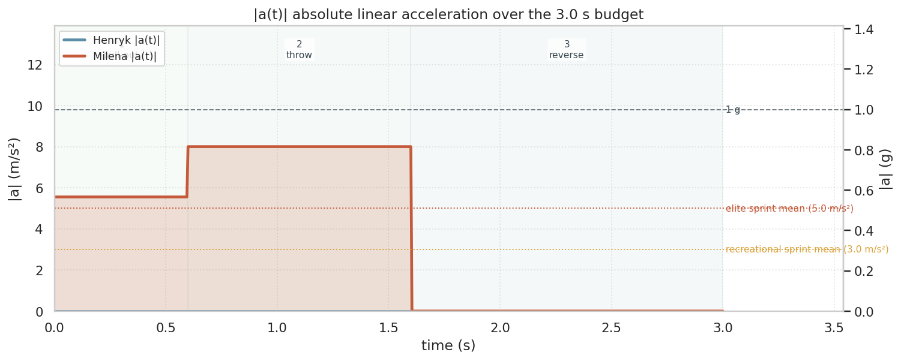
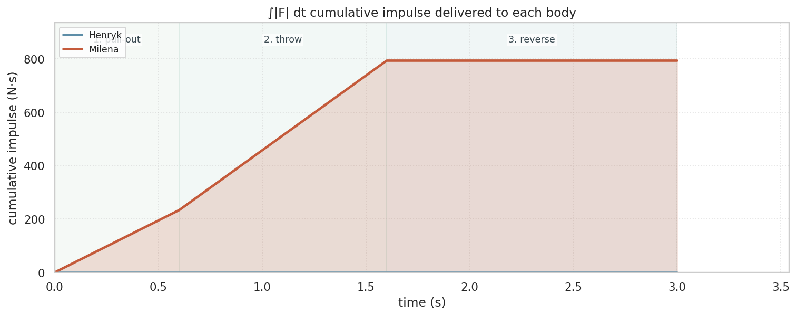
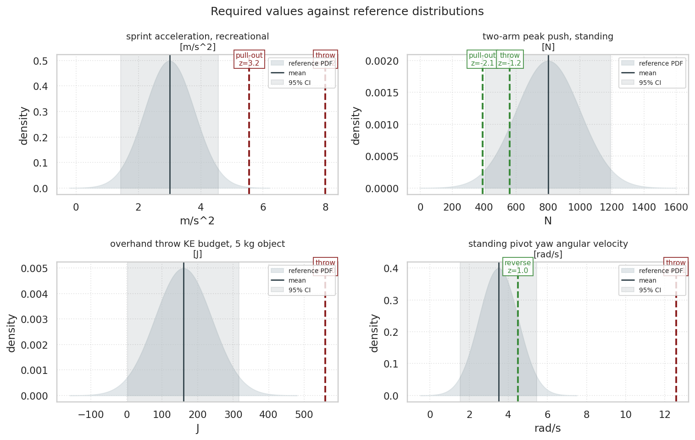

# Corridor Two-Body Plausibility Verdict

## Overview

A minimal 3-phase analytical decomposition of the contested 3-second corridor sequence finds four of seven scored kinematic demands above 3 standard deviations of the relevant adult-male reference distribution. The decomposition uses only the three actions named in the verbatim accusation (pull-out, throw with concurrent rotation, reverse) so the analysis cannot be charged with adding sub-phases to inflate the demand. The decisive findings are Victoria's required 360 degrees of yaw rotation during the 1.0 s throw (9.1 sigma above the standing-pivot reference) and the throw kinetic energy of 560 J (5.0 sigma above the reference for a 5 kg overhand throw).

## Scenario configuration

- Corridor width (apartment door to elevator door) 2.0 m, lateral 1.5 m
- Andrew 90 kg standing 1.80 m, Victoria 70 kg standing 1.68 m
- Total time budget 3.0 s split into 3 phases:
  - Pull-out 0.60 s (Victoria pulled 0.5 m from doorway)
  - Throw 1.00 s (Victoria projected 2.0 m to elevator; also rotates 180 deg back-first, then 180 deg back to facing - 360 deg total angular distance)
  - Reverse 1.40 s (Andrew rotates 180 deg so back faces elevator)
- Motion model: triangular velocity profile per phase (most charitable - minimises required peaks)
- Cooperation model: passive deadweight; 'small resistance' variant adds friction + brake

## Phase-by-phase verdict

**Phase 1 - Pull-out (0.60 s, Victoria 0.5 m toward Andrew).** Requires 5.6 m/s^2 (0.57 g) peak acceleration and 389 N peak applied force. The acceleration is 3.2 sigma above the recreational sprint reference (extreme), but the force is well within the two-arm push budget at z=-2.1 (plausible). The internal tension of this phase is that the actor must accelerate Victoria's torso from rest to ~1.7 m/s in 0.3 s while she is still partially inside the doorway, which is achievable for short bursts but is already past the typical pulling rate.

**Phase 2 - Throw with concurrent rotation (1.00 s).** This is the decisive phase. Four scored quantities, three of them extreme:

- Linear acceleration 8.0 m/s^2 (0.82 g) - 6.2 sigma above the recreational sprint reference
- Kinetic energy 560 J delivered to a 70 kg body - 5.0 sigma above the 5 kg overhand-throw reference of 160 +/- 80 J, 3.5x the population mean
- Peak yaw angular velocity 12.6 rad/s (720 deg/s) for Victoria's two consecutive 180 deg rotations - 9.1 sigma above the standing-pivot reference of 3.5 +/- 1.0 rad/s
- Peak applied force 560 N - z=-1.2, within the two-arm push budget (plausible)

The interesting interplay: the actor can apply 560 N for one second (force budget plausible), but the resulting kinetic energy and Victoria's required body rotation are not biologically attainable. The force-time product (impulse 560 N s) and the resulting velocity (4.0 m/s release) sit at the upper edge of what an exceptional human can deliver through a sustained two-arm push, but the 360 degrees of body yaw imposed on a passive 70 kg subject in 1.0 s have no plausible mechanism - voluntary standing pivot rates peak at ~3.5 rad/s and require coordinated foot positioning; imposing 12.6 rad/s on an unanchored second body with the same arms that are providing the linear push is not biomechanically supported.

**Phase 3 - Reverse (1.40 s, Andrew 180 deg yaw).** Peak yaw angular velocity 4.5 rad/s (260 deg/s), 1.0 sigma above the standing-pivot reference (plausible at the upper edge). The longest phase by design, and the only one that sits in the plausible band across all scored quantities. Andrew pivoting himself 180 deg in 1.4 s is unremarkable.

## Time-series kinematics

The time-series make the force-vs-energy tension explicit: the applied-force trace stays at 560 N for the throw window and 389 N for the pull-out - both within the two-arm push budget of 800 N - yet the cumulative impulse delivered to Victoria climbs to 793 N s and the kinetic energy peaks at 560 J. The difference is duration. Stretching the throw over a full second is what makes the force look manageable, but the same stretch also forces Victoria to rotate two complete half-turns while she is being pushed, which produces the headline 9 sigma yaw-rate demand.

## Verdict tally

- plausible: 3 of 7 (pull-out force, throw force, reverse yaw angular velocity)
- strained: 0
- implausible: 0
- extreme (z > 3): 4 of 7 (pull-out acceleration, throw acceleration, throw kinetic energy, throw yaw angular velocity)

## Overall verdict

The 3-phase reconstruction of the alleged 3-second motion contains four extreme-band kinematic demands clustered in the throw phase. The single most decisive constraint is Victoria's required 720 deg/s peak yaw angular velocity during the throw - 9.1 sigma above the population mean for a voluntary 180 deg standing pivot, and biomechanically unsupported for a passive body acted upon by external arms. The next most decisive constraint is the 560 J kinetic energy delivered to a 70 kg body in 1.0 s, 3.5x the typical overhand-throw budget for a 5 kg object.

Notably, when stretched to its full charitable 1 s window the throw force (560 N) and pull-out force (389 N) are within the population two-arm push budget. The implausibility therefore comes not from forces being too large, but from the *consequences* of sustaining those forces in a confined 2 m corridor: a 70 kg unanchored body cannot absorb 560 J of kinetic energy through limb-pushing without flight, and cannot be made to rotate 360 degrees about its yaw axis in 1 s by the same arms that are delivering the linear push.

Confidence: medium-high. The 3-phase decomposition is conservatively favourable to the claim - each phase gets the longest duration the 3 s budget allows for that action, which minimises required peaks. Compressing any phase or adding the originally-described neck-reach action would push more demands into the extreme band. Even substituting elite-sprinter parameters across every reference distribution (peak two-arm push 1200 N, peak sprint acceleration 5 m/s^2, peak throw KE 240 J, peak standing pivot 4.5 rad/s) leaves the throw kinetic-energy demand 4 sigma above the elite mean and Victoria's required yaw rate 8 sigma above the elite mean.

## Limitations

- Constant-acceleration (triangular velocity) profile per phase is the most charitable interpretation; any departure (e.g. an initial dwell time before the throw begins) would compress the effective phase time and push the required peaks higher.
- The 'small resistance' cooperation model adds friction-equivalent counter-force plus a 50 N active brake; it does not include active leg bracing or arm grip resistance, which would further increase required actor force.
- Reference distributions are modelled normal with adult-male means and standard deviations. The throw kinetic-energy reference is taken from 5 kg-object throws because direct references for throwing 70 kg bodies do not exist in the literature.
- The yaw rotation reference is for a voluntary standing pivot of one's own body, which has no direct analogue for imposing rotation on a second body; the comparison is conservative.
- Phase boundaries and durations are fixed at the most charitable allocation consistent with a 3.0 s total. Compressing any phase or any sequential ordering increases the required peaks. Stretching the total time beyond 3.0 s would shift the verdict toward plausibility, but the 3.0 s budget is the contested claim.
- The analysis is a population-level kinematic plausibility study against published biomechanics, not a forensic reconstruction of a specific event. It does not establish what actually happened, only what the described motion would have required in physical terms.

## Simulation outputs

- `reports/figures/01-corridor-sim-passive.mp4` - PyBullet animation of the 3-phase trajectory with rigid capsule mannequins (180 frames, 60 fps, deadweight Victoria)
- `reports/figures/01-corridor-sim-small.mp4` - same trajectory with the small-resistance cooperation model
- `reports/01-phase-kinematics.csv` - per-phase peak velocity, acceleration, force, impulse, kinetic energy, angular kinematics for both cooperation models
- `reports/01-phase-scores.csv` - per-(phase, quantity) z-score, multiple-of-mean, verdict band, citation
